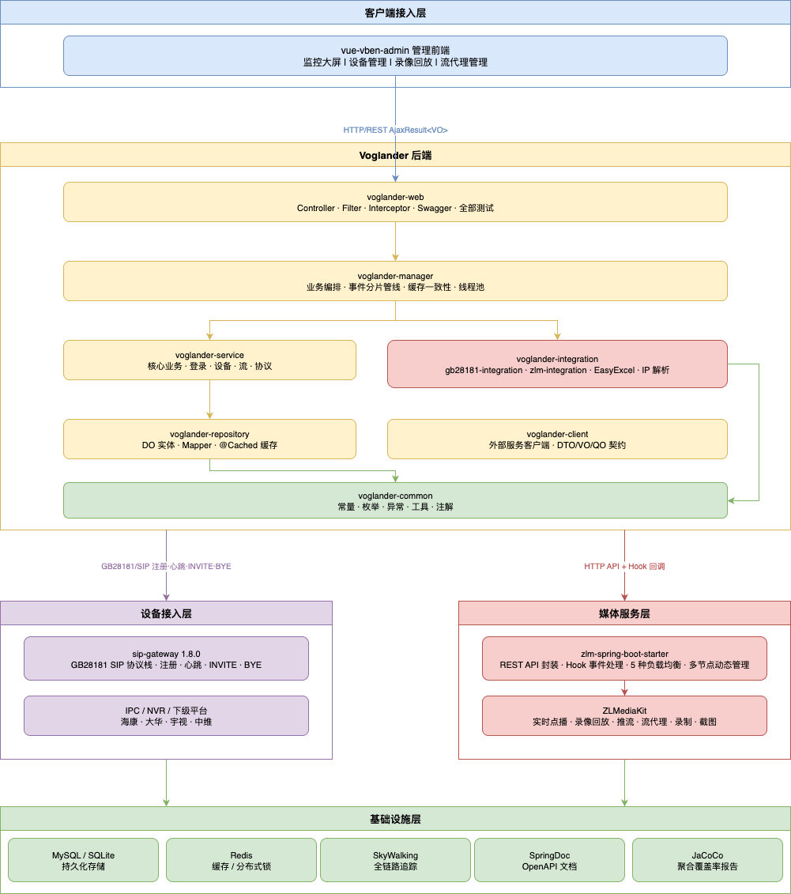
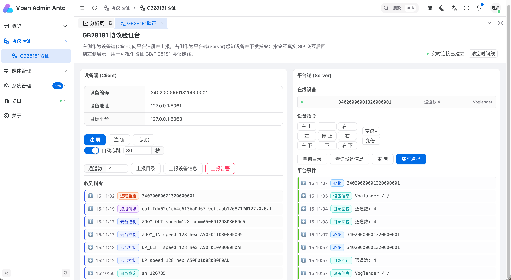

<div align="center">

# 🎥 Voglander

**企业级视频监控平台 · GB28181 / ONVIF / GT1078 全协议接入**

[](https://mvnrepository.com/artifact/io.github.lunasaw/voglander)
[](https://openjdk.java.net/projects/jdk/17/)
[](https://spring.io/projects/spring-boot)
[](LICENSE)
[](https://github.com/lunasaw/voglander/stargazers)

[📖 架构文档](doc/1.0.3/ARCHITECTURE.md) · [🚀 快速开始](#-快速开始) · [📖 接口文档](https://oiwwkhlq1a.apifox.cn/) ·[🐛 问题反馈](https://github.com/lunasaw/voglander/issues) · [📋 更新日志](CHANGELOG.md)


</div>

---

## 🌟 为什么选择 Voglander？

在视频监控领域，协议碎片化、设备兼容性差、媒体流处理复杂是三大核心痛点。Voglander 以 **生产就绪** 的工程质量，提供一站式解决方案：

| 痛点 | Voglander 的解法 |
|------|----------------|
| 多协议割裂 | 统一 GB28181 / ONVIF / GT1078 接入层，设备无感切换 |
| 高并发 SIP 风暴 | `deviceId` 哈希 16 分片，同设备串行 + 跨设备无锁并发，SIP 线程零阻塞 |
| 媒体流管理复杂 | 基于 [zlm-spring-boot-starter](https://github.com/lunasaw/zlm-spring-boot-starter) 二次封装，拉流/推流/录制/Hook 回调全链路自动化 |
| 架构混乱难维护 | 严格五层分层 + Manager 模板方法，业务边界清晰，测试覆盖完整 |

---

## ✨ 核心特性

- 🎯 **全协议支持** — GB28181（[sip-gateway](https://github.com/lunasaw/Sip-Proxy) 1.8.0）、ONVIF、GT1078，兼容海康、大华、宇视、中维等主流厂商
- 🧪 **GB28181 协议验证台** — 业界少见的「设备端 ⇄ 平台端」可视化验证平台，同进程真实 SIP 自环，注册/PTZ/目录/点播双向闭环一屏可见，零额外部署
- 📡 **SSE 实时事件总线** — 基于 Server-Sent Events 的单连接全双向事件推送，Redis Pub/Sub 跨节点扇出，15s 心跳保活、断线自动重连，设备上下线/告警/会话状态毫秒级触达前端
- ⚡ **高并发分片引擎** — 四层异步事件管线（翻译 → 分片 → 协议路由 → 协议处理），16 槽哈希分片，零锁竞争
- 🎬 **ZLM 二次封装** — 基于 [zlm-spring-boot-starter](https://github.com/lunasaw/zlm-spring-boot-starter) 封装，实时点播、录像回放、流代理、推流，Hook 驱动状态自动同步
- 🏗️ **企业级分层架构** — Web / Manager / Service / Repository / Integration 五层，Assembler 模式统一数据转换
- 🛡️ **安全可靠** — RBAC 权限体系、XSS 过滤、防重复提交、限流切面、Redis 分布式锁
- 📊 **全链路可观测** — SkyWalking 链路追踪、结构化日志、JaCoCo 聚合覆盖率报告
- 🔌 **开箱即用** — SQLite 零配置启动，平滑迁移 MySQL，Docker 友好

---

## 🏗️ 系统架构



---

## 🧪 GB28181 协议验证台（Protocol Lab）

> 一个页面，左右分栏，**左侧扮演 GB28181 设备（UA），右侧扮演平台（Server）**，所有指令都经底层**真实 SIP 报文**往返——不是 Mock。注册、心跳、PTZ、目录查询、实时点播的双向闭环，在同一屏内全程可视。



### 它解决什么问题

GB28181 联调向来痛苦：需要真实摄像头或第三方平台对接、抓包分析 SIP 报文、反复确认指令是否被正确解析。Voglander 利用进程内**同时绑定 SIP 服务端（5060）与客户端（5061）** 的既有事实，构建一条 **同进程 SIP 自环（loopback）**——左右两个 SIP 角色在同一 JVM 内通过 JAIN-SIP 协议栈真实互发报文，**零额外部署即可完整验证 GB/T 28181 协议链路**。

### 三条可视化闭环

| 场景 | 链路 | 一屏可见 |
|------|------|---------|
| **设备注册** | 左[注册] → 真实 REGISTER 5061→5060 → 401 Challenge → Digest 重发 → 200 OK | 右侧设备列表实时上线 + 时间线 `REGISTER 200 OK` |
| **PTZ 指令回显** ★ | 右[PTZ 上] → 真实 MESSAGE 5060→5061 → 设备端解析 | 左侧「收到指令」时间线展示 **hex 原文 + 解析后的方向/速度** |
| **目录查询回环** | 右[查目录] → 设备收到查询 → 回包 N 个通道 5061→5060 | 左侧展示「收到目录查询」+ 右侧通道列表实时刷新 |

### SSE 驱动的实时双向通道

验证台的实时性由 **SSE（Server-Sent Events）事件总线**支撑，这也是 Voglander 全平台的实时推送底座：

- **单连接全事件**：前端只建一条 `GET /api/v1/stream/events?topics=...&token=` 长连接，按 topic 前缀订阅，`device.*` / `clientcmd.*` / `session.*` / `alarm.*` 全部事件分流到对应时间线
- **跨节点扇出**：`RedisBackedSseEventBus` 经 Redis Pub/Sub 广播，多节点部署下任意节点产生的事件都能推达任意前端连接
- **生产级健壮**：15s 心跳保活、断线 3s 自动重连、前端 `(topic, ts, seq)` 去重，JWT 鉴权（`?token=`）不放宽
- **解耦推送**：协议处理器经 `ApplicationEventPublisher` 发 `common` 层领域事件，由 `@EventListener` 转 `SseEventBus`，严守 `integration → service` 依赖方向

```text
┌────────────── 浏览器（一个页面，左右分栏）──────────────┐
│  左：设备 UA 控制台              右：平台控制台              │
│  [注册][心跳][上报目录][告警]    设备列表(实时) [PTZ][点播][查目录] │
│  收到指令时间线 ◀────────┐      平台事件时间线 / SIP 阶梯图   │
└──────│REST──────│SSE─────┼────────│REST──────│SSE──────────┘
       ▼          ▲        │        ▼          ▲
┌──────────────────────────┴──────────────────────────────────┐
│        voglander-web（REST 控制器 + SseController）            │
│  ClientCommandSender(发指令)  │  ServerCommandSender(发指令)    │
│  + Lab*Listener(收指令)       │  + VoglanderBusinessNotifier(收上报) │
│       SIP:5061 ──────── 真实 UDP/TCP SIP ──────── SIP:5060     │
└──────────────────────────────────────────────────────────────┘
```

> 🔒 **生产安全**：验证台的所有端点与监听器统一受 `voglander.protocol-lab.enabled` 门控，**生产 profile 不激活**，杜绝「任意触发设备指令」风险。

```bash
# 启动验证台（dev,repo,inte,lab 四 profile）
mvn spring-boot:run -pl voglander-web -Dspring-boot.run.profiles=dev,repo,inte,lab
# 浏览器访问前端 /protocol-lab/gb28181
```

---

## 🔧 技术栈

| 类别 | 选型 | 版本 |
|------|------|------|
| 语言 & 运行时 | Java | 17 |
| 核心框架 | Spring Boot | 3.5.3 |
| ORM | MyBatis-Plus | 3.5.5 |
| 多数据源 | dynamic-datasource | 4.3.1 |
| 生产数据库 | MySQL | 8.2.0 |
| 开发/测试数据库 | SQLite | 内嵌 |
| 缓存 & 分布式锁 | Redis | 6.0+ |
| SIP 网关 | sip-gateway-spring-boot-starter | 1.8.0 |
| 媒体服务 | ZLMediaKit-Starter | 1.0.10 |
| JSON | FastJSON2 | latest |
| 链路追踪 | SkyWalking | 9.1.0 |
| API 文档 | SpringDoc OpenAPI | 2.8.9 |
| 测试覆盖率 | JaCoCo 聚合 | 0.8.11 |

---

## 🚀 快速开始

### 环境要求

- JDK 17+
- Maven 3.6+
- MySQL 8.0+（可选，默认 SQLite 零配置）
- Redis 6.0+（可选，多节点部署必须）

### 一键启动（SQLite 模式）

```bash
# 克隆项目
git clone https://github.com/lunasaw/voglander.git
cd voglander

# 编译
mvn clean compile

# 启动（自动创建 app.db，真正开箱即用）
mvn spring-boot:run -pl voglander-web
```

启动后访问：
- **应用地址**: http://localhost:8081
- **API 文档**: http://localhost:8081/swagger-ui.html

### 切换 MySQL（生产推荐）

```bash
# 1. 建库
mysql -u root -p -e "CREATE DATABASE voglander;"

# 2. 初始化表结构
mysql -u root -p voglander < sql/voglander.sql

# 3. 修改数据源配置
# 编辑 voglander-web/src/main/resources/application-repo.yml
```

### 多节点部署

```yaml
# application-inte.yml
gateway:
  node-id: node-1                    # 每个节点唯一
  gb28181:
    store:
      type: redis                    # 多节点必须改为 redis（跨节点 INVITE 回包路由）

sip:
  server:
    external-ip: <VIP>               # 多节点必须配置

voglander:
  event:
    shard:
      enabled: true
      count: 16
```

---

## 📡 GB28181 出站命令速查

所有出站命令通过 `dispatchEnvelope` 统一下发，`cmdType` 格式为 `protocol.Group.Name`：

| 业务场景 | cmdType | 关键字段 |
|---------|---------|---------|
| 设备目录查询 | `gb28181.Query.Catalog` | — |
| 实时点播 | `gb28181.Invite.Play` | `mediaIp`, `mediaPort`, `streamMode` |
| 录像回放 | `gb28181.Invite.Playback` | `startTime`, `endTime` |
| PTZ 控制 | `gb28181.Control.Ptz` | `cmdCode`, `horizonSpeed`, `verticalSpeed` |
| 终止会话 | `gb28181.Invite.Bye` | `callId` |

---

## 🧪 测试

```bash
# 运行所有测试
mvn test

# 单个测试类
mvn test -Dtest=DeviceManagerTest

# Redis 集成测试（自动探测，不可用则跳过）
brew services start redis
mvn test -Dtest=MediaNodeCacheIntegrationTest

# 生成 JaCoCo 聚合覆盖率报告
./generate-coverage-report.sh
# 输出: voglander-coverage-report/target/site/jacoco-aggregate/index.html
```

| 层级 | 测试类型 | 策略 |
|------|---------|------|
| Controller / Service | 纯单元（Mockito） | 快速、无 Spring 上下文 |
| Manager / Repository | 集成（`@SpringBootTest`） | 真实 DB + 事务回滚 |
| HTTP API / 异步 Hook | 集成（无事务） | `TestRestTemplate` + 手动清理 |

---

## 📋 配置说明

| Profile | 文件 | 用途 |
|---------|------|------|
| 主配置 | `application.yml` | 端口 8081、SpringDoc、XSS |
| `dev` | `application-dev.yml` | Token、本地 SIP/ZLM 参数 |
| `repo` | `application-repo.yml` | 数据源、HikariCP、Redis、MyBatis-Plus |
| `inte` | `application-inte.yml` | SIP server/client、ZLM servers、`gateway:` 段 |

---

## 🗃️ 核心数据模型

| 领域 | 实体 | 表名 |
|------|------|------|
| 设备 | `DeviceDO` | `tb_device` |
| 通道 | `DeviceChannelDO` | `tb_device_channel` |
| 媒体会话 | `MediaSessionDO` | `tb_media_session` |
| 媒体节点 | `MediaNodeDO` | `tb_media_node` |
| 流代理 | `StreamProxyDO` | `tb_stream_proxy` |
| 推流代理 | `PushProxyDO` | `tb_push_proxy` |
| 权限 | `UserDO / RoleDO / MenuDO / DeptDO` | RBAC 主体 |

> 所有业务表统一包含：`id`（BIGINT）、`create_time` / `update_time`（自动填充）、`enabled`（开关）、`extend`（JSON 扩展）。

---

## ⚠️ 重要约束

| # | 约束 | 违反后果 |
|---|------|---------|
| 1 | `ApplicationWeb` 必须标注 `@EnableSipServer` | GB28181 整条管线静默关闭 |
| 2 | `VoglanderBusinessNotifier.notify()` 必须 `@Async` | 同步阻塞 → 设备 SIP 超时重传 |
| 3 | 禁止继承 `AbstractProtocolBusinessNotifier` | 其 `notify()` 为 `final`，`@Async` 代理失效 |
| 4 | 出站命令走 `dispatchEnvelope`，禁止直调 `ServerCommandSender` | 绕过 payload schema 校验 |
| 5 | SDP IP 字段名为 `mediaIp`（非 `sdpIp`） | 命令下发失败 |
| 6 | `spring-boot-dependencies` 必须在 `sip-gateway-bom` 前 import | Spring Boot 被降级 |
| 7 | 多节点必须配置 `store.type: redis` 和 `external-ip` | 跨节点 INVITE 回包失败 |

---

## 🤝 贡献指南

欢迎任何形式的贡献！

1. Fork 本仓库
2. 创建特性分支：`git checkout -b feature/your-feature`
3. 提交变更：`git commit -m 'feat: add your feature'`
4. 推送分支：`git push origin feature/your-feature`
5. 提交 Pull Request

请确保代码通过 `mvn test` 且符合项目编码规范。

---

## 📄 许可证

本项目基于 [Apache-2.0](LICENSE) 开源发布，欢迎在遵守许可证的前提下自由使用。

---

## 👥 维护者

**Luna** — [GitHub @lunasaw](https://github.com/lunasaw) · iszychen@gmail.com

## 🔗 相关项目

- [sip-proxy](https://github.com/lunasaw/sip-proxy) — GB28181 SIP 协议通信框架（本项目的 SIP 基础层）
- [zlm-spring-boot-starter](https://github.com/lunasaw/zlm-spring-boot-starter) — ZLMediaKit Spring Boot 封装，本项目媒体流能力的底层依赖
- [vue-vben-admin](https://github.com/vbenjs/vue-vben-admin) — 配套前端管理界面

---

## ⭐ Star History

[](https://star-history.com/#lunasaw/voglander&Date)

<div align="center">

**如果这个项目对您有帮助，请给我们一个 ⭐ Star！这是对开源最好的支持。**

</div>
