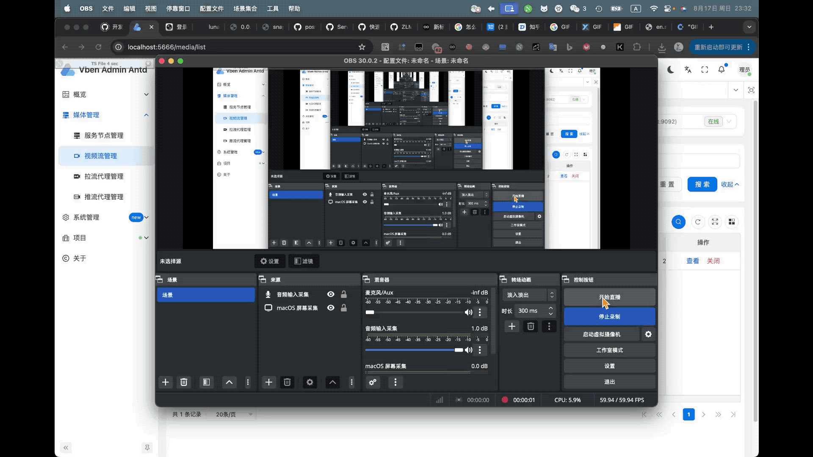

# Voglander 视频监控平台

[](https://mvnrepository.com/artifact/io.github.lunasaw/voglander)
[](https://raw.githubusercontent.com/lunasaw/voglander/master/LICENSE)
[](https://openjdk.java.net/projects/jdk/17/)
[](https://spring.io/projects/spring-boot)

[🌐 项目主页](http://lunasaw.github.io) | [📖 文档中心](#) | [🚀 快速开始](#快速开始)

## 📋 项目介绍

Voglander 是一个基于 Spring Boot 3 和 Java 17 构建的企业级视频监控平台，专注于提供高性能、高可用、易扩展的视频监控解决方案。



### ✨ 核心特性

- 🎯 **多协议支持** - 支持 GB28181、GT1078、ONVIF 等主流视频监控协议
- 🏭 **设备兼容** - 兼容海康、大华、宇视、中维等主流监控设备厂商
- 🔧 **模块化架构** - 采用多模块设计，支持集群化部署
- 📊 **实时监控** - 支持实时视频流处理和设备状态监控
- 🚀 **高性能** - 基于异步处理和缓存优化，支持大规模并发
- 🛡️ **安全可靠** - 提供完善的权限控制和数据安全保障

### 🎯 应用场景

- 🏢 **企业园区监控** - 办公楼宇、工厂园区安防监控
- 🏫 **教育机构** - 学校、培训机构视频监控管理
- 🏥 **医疗机构** - 医院、诊所安防监控系统
- 🏪 **商业场所** - 商场、超市、门店监控管理
- 🏘️ **社区物业** - 住宅小区、物业管理监控系统

## 🏗️ 系统架构

### 整体架构图

```
                          ┌───────────────────────────┐
                          │   前端 (vue-vben-admin)    │
                          │   管理后台 / 监控大屏      │
                          └─────────────┬─────────────┘
                                        │ HTTP/REST (AjaxResult)
                                        ▼
        ┌───────────────────────────────────────────────────────────┐
        │                    Voglander 后端 (本工程)                  │
        │                                                             │
        │   ┌──────────┐   GB28181/SIP    ┌─────────────────────┐    │
        │   │  SIP 网关 │◀────────────────▶│  IPC / NVR / 下级平台 │    │
        │   │(sip-gw1.8)│   注册/心跳/INVITE└─────────────────────┘    │
        │   └──────────┘                                              │
        │                                                             │
        │   ┌──────────┐   HTTP API/Hook  ┌─────────────────────┐    │
        │   │ ZLM 集成  │◀────────────────▶│   ZLMediaKit 媒体服务 │    │
        │   └──────────┘   拉流/推流/回调  └─────────────────────┘    │
        │                                                             │
        │   ┌─────────────────┐   ┌─────────┐   ┌────────────────┐   │
        │   │ MySQL / SQLite  │   │  Redis  │   │  SkyWalking    │   │
        │   └─────────────────┘   └─────────┘   └────────────────┘   │
        └───────────────────────────────────────────────────────────┘
```

### 模块架构

```
voglander/
├── voglander-common/          # 共享：常量、枚举、异常、工具、注解
├── voglander-client/          # 对外服务接口契约 + DTO/VO/QO
├── voglander-repository/      # 数据访问：DO 实体、Mapper、缓存
├── voglander-manager/         # 业务编排：Manager 模板、事件分片管线、异步、线程池
├── voglander-service/         # 领域服务：登录注册、流业务、设备协议
├── voglander-integration/     # 外部集成：GB28181、ZLM、EasyExcel、IP 解析
├── voglander-web/             # 应用主模块：Controller、过滤器、拦截器、启动类、全部测试
├── voglander-test/            # 测试配置与多环境 profile
└── voglander-coverage-report/ # JaCoCo 跨模块聚合覆盖率
```

依赖方向：`web → service → manager → repository → common`；`integration → manager`（回调时直调 Manager 落库）。

全部测试集中在 `voglander-web/src/test/java/`，其他模块不放测试。

## 🔧 技术栈

### 后端技术栈

| 技术                 | 版本    | 说明      |
|--------------------|-------|---------|
| **核心框架**           |       |         |
| Java               | 17    | 开发语言    |
| Spring Boot        | 3.5.3 | 微服务框架   |
| **数据访问**           |       |         |
| MyBatis Plus       | 3.5.5 | ORM框架   |
| Dynamic DataSource | 4.3.1 | 动态数据源   |
| MySQL              | 8.2.0 | 关系数据库   |
| SQLite             | -     | 嵌入式数据库  |
| HikariCP           | -     | 数据库连接池  |
| **缓存中间件**          |       |         |
| Redis              | -     | 分布式缓存   |
| Spring Cache       | 3.3.1 | 缓存抽象层   |
| **消息队列**           |       |         |
| RabbitMQ           | -     | 消息中间件   |
| RocketMQ           | 2.3.0 | 分布式消息系统 |
| **视频协议**           |       |         |
| sip-gateway        | 1.8.0 | GB28181 协议网关（starter 一键接入） |
| ZLMediaKit-Starter | 1.0.10-SNAPSHOT | 流媒体服务器  |
| **工具库**            |       |         |
| Luna Common        | 2.6.7-SNAPSHOT | 通用工具库   |
| EasyExcel          | 4.0.1 | Excel处理 |
| FastJSON2          | -     | JSON处理  |
| **监控与追踪**          |       |         |
| SkyWalking         | 9.1.0 | 链路追踪    |
| Swagger            | 3.0.0 | API文档   |
| **其他**             |       |         |
| Lombok             | -     | 代码生成    |
| Apache Commons     | -     | 通用工具    |

### 前端技术栈

| 技术           | 版本  | 说明      |
|--------------|-----|---------|
| Vue.js       | 3.x | 前端框架    |
| Vue Router   | 4.x | 路由管理    |
| Pinia        | 2.x | 状态管理    |
| Element Plus | -   | UI组件库   |
| Axios        | -   | HTTP客户端 |

## 🚀 快速开始

### 环境要求

- **Java**: JDK 17+
- **Maven**: 3.6+
- **MySQL**: 8.0+ (可选，默认使用SQLite)
- **Redis**: 6.0+ (可选)
- **Node.js**: 16+ (前端开发)

### 📥 克隆项目

```bash
git clone https://github.com/lunasaw/voglander.git
cd voglander
```

### 🔧 后端启动

1. **编译项目**

```bash
mvn clean compile
```

2. **初始化数据库**

```bash
# 使用SQLite (默认)
# 数据库文件会自动创建为 app.db

# 或使用MySQL
# 1. 创建数据库: CREATE DATABASE voglander;
# 2. 执行SQL脚本: sql/voglander.sql
# 3. 修改配置文件中的数据库连接信息
```

3. **启动应用**

```bash
mvn spring-boot:run -pl voglander-web
```

4. **访问应用**

```
应用地址: http://localhost:8081
API文档: http://localhost:8081/swagger-ui.html
```

### 🎨 前端启动

```bash
cd voglander-frontend
npm install
npm run serve
```

前端访问: http://localhost:8080

### 🐳 Docker 部署 (规划中)

```bash
# 构建镜像
docker build -t voglander:latest .

# 运行容器
docker-compose up -d
```

## 📡 GB28181 接入方案

Voglander 自 v1.8.0 起，GB28181 协议栈接入由原先直接依赖 `gb28181-client` / `gb28181-server` 切换为 [sip-gateway](https://github.com/lunasaw/sip-proxy/tree/master/sip-gateway) 父聚合提供的 Spring Boot Starter。业务侧只需引入一个 starter、写一个 `BusinessNotifier`、调一个 envelope 端点，即可接入完整的 GB/T 28181-2016/2022 信令能力。

### 架构总览

```
┌──────────────────────────────────────────────────────────────┐
│                       业务层 (Voglander)                      │
│  Web Controller → Manager → DeviceRegisterService / ...      │
│         ▲                                ▼                   │
│         │                      VoglanderBusinessNotifier     │
│         │                       (异步分发 GatewayEvent)       │
│         │ POST /gateway/command          ▲                   │
│ envelope GatewayCommand                  │ GatewayEvent       │
│  ▼                                       │                   │
├──────────────────────────────────────────┴───────────────────┤
│              sip-gateway-spring-boot-starter (1.8.0)         │
│  gateway-core           gateway-gb28181                      │
│  ├─ DispatchController  ├─ Gb28181CommandSpecs (~39 cmdType) │
│  ├─ CommandHandler SPI  ├─ Gb28181EventForwarder (35 emit)   │
│  ├─ BusinessNotifier    ├─ InviteContextStore (Redis 可选)    │
│  └─ Envelope 模型        └─ @CommandMapping 白名单            │
├──────────────────────────────────────────────────────────────┤
│                  sip-common / sip-gb28181 (协议栈)            │
│  SipLayer / Dialog / SipListener / FromDevice/ToDevice       │
└──────────────────────────────────────────────────────────────┘
```

- **入站**：设备 SIP 请求 → 协议栈 → `Gb28181EventForwarder` 转 `GatewayEvent` → `BusinessNotifier#notify`（异步）→ Voglander Manager。
- **出站**：业务 Manager 构造 `GatewayCommand` → `POST /gateway/command` 或进程内 `CommandHandlerRegistry` → 协议栈下行。

### 1️⃣ 引入依赖

主 `pom.xml` 新增 BOM 导入：

```xml
<properties>
    <sip-gateway.version>1.8.0</sip-gateway.version>
</properties>

<dependencyManagement>
    <dependencies>
        <dependency>
            <groupId>io.github.lunasaw</groupId>
            <artifactId>sip-gateway-bom</artifactId>
            <version>${sip-gateway.version}</version>
            <type>pom</type>
            <scope>import</scope>
        </dependency>
    </dependencies>
</dependencyManagement>
```

`voglander-integration/pom.xml` 引入 starter（替代旧的 `gb28181-client` / `gb28181-server`）：

```xml
<dependency>
    <groupId>io.github.lunasaw</groupId>
    <artifactId>sip-gateway-spring-boot-starter</artifactId>
</dependency>
```

### 2️⃣ 启用 SIP 协议栈

启动类（`VoglanderApplication`）添加 `@EnableSipProxy`（亦可使用别名 `@EnableSipServer`），监听点由 starter 根据 `sip.server.*` / `sip.client.*` 配置自动注册，无需手写 `CommandLineRunner`：

```java
@SpringBootApplication
@EnableSipProxy
public class VoglanderApplication {
    public static void main(String[] args) {
        SpringApplication.run(VoglanderApplication.class, args);
    }
}
```

### 3️⃣ 配置 application.yml

```yaml
# sip-gateway 配置
gateway:
  node-id: ${local.gateway.node-id:node-1}
  # 多节点部署时填写各节点 HTTP 地址；单节点可省略
  nodes:
    node-1: http://10.0.0.1:8080
    node-2: http://10.0.0.2:8080
  forward-timeout-ms: 3000
  gb28181:
    invite-context-ttl-ms: 30000        # INVITE 上下文 TTL，超时后回包返回 410
    invite-idempotency-window-ms: 5000  # UDP 重传幂等窗口

# SIP 协议栈配置（保留 Voglander 原有结构）
sip:
  enable: true
  server:
    enabled: true
    ip: 0.0.0.0
    port: 5060
    external-ip: ${local.sip.server.external-ip:}   # ⚠️ 多节点 + VIP 部署必填
    domain: 34020000002000000001
    serverId: 34020000002000000001
    serverName: GB28181-Server
  client:
    enabled: false
    clientId: 34020000001320000001
    port: 5061
    realm: 34020000
```

### 4️⃣ 实现 BusinessNotifier（统一事件回调）

1.0.3 采用**四层入站管线**（翻译 → 分片 → 协议路由 → 协议处理），`VoglanderBusinessNotifier` 仅做轻量翻译并投入分片队列，重活由 `ShardDispatcher` 的 16 个槽并行处理：

```
设备 SIP 报文
   ▼ ① 框架回调
VoglanderBusinessNotifier.notify()   @Async("sipNotifierExecutor")
   │   仅翻译 GatewayEvent → DeviceEvent（O(1)，不做反序列化/DB 写）
   ▼ ② 分片调度
ShardDispatcher  —— deviceId 哈希到 16 个 EventShard，同设备串行
   ▼ ③ 协议路由
InboundEventDispatcher  —— 按 event.protocol() 路由到对应处理器
   ▼ ④ 协议处理
Gb28181ProtocolHandler  —— 此处才做 FastJSON2 反序列化 + 业务调用
```

> ⚠️ **禁止继承 `AbstractProtocolBusinessNotifier`**：其 `notify()` 为 `final` 且内部自调用，`@Async` 代理失效。实现直接 `implements BusinessNotifier`。

完整事件类型 35 个，覆盖 `Lifecycle`（5）/ `Notify`（7）/ `Session`（7）/ `Response`（16）四类。灰度开关：`voglander.event.shard.enabled=false` 可跳过分片直调 Dispatcher（调试用）。

### 5️⃣ 下行命令调用（envelope 模式）

业务侧通过统一 envelope 端点向设备下发命令，type 采用三段式 `protocol.Group.Name`：

```http
POST /gateway/command HTTP/1.1
Content-Type: application/json

{
  "type": "gb28181.Query.Catalog",
  "deviceId": "34020000001320000001",
  "payload": {},
  "requestId": "voglander-trace-abc-123"
}
```

响应：

```json
{ "correlationId": "1234567890", "type": "gb28181.Query.Catalog", "nodeId": "node-1" }
```

| 业务场景 | cmdType | payload 关键字段 |
|---|---|---|
| 设备目录查询 | `gb28181.Query.Catalog` | — |
| 设备信息查询 | `gb28181.Query.DeviceInfo` | — |
| 录像查询 | `gb28181.Query.RecordInfo` | `startTime` / `endTime` / `type` |
| 实时点播 | `gb28181.Invite.Play` | `ssrc` / `mediaServer` / `port` |
| 录像回放 | `gb28181.Invite.Playback` | `startTime` / `endTime` / `ssrc` |
| 语音对讲 | `gb28181.Invite.Talk` | `ssrc` / `mediaServer` |
| PTZ 控制 | `gb28181.Control.Ptz` | `cmdCode` / `horizonSpeed` / `verticalSpeed` / `zoomSpeed` |
| 预置位 | `gb28181.Control.Preset` | `cmdCode` / `presetId` |
| 设备重启 | `gb28181.Control.Reboot` | — |
| 录像控制 | `gb28181.Control.Record` | `recordCmd` |
| 终止会话 | `gb28181.Invite.Bye` | callId（envelope 顶层 `deviceId` 留空） |

完整 ~39 个 cmdType 见 [sip-gateway 文档](../sip-proxy/sip-gateway/README.md)。

### 6️⃣ 错误码契约

| HTTP | 场景 | 业务侧动作 |
|---|---|---|
| 400 | payload 字段缺失/类型错误 | 修正请求 |
| 404 | type 不存在 | 修正 type 字符串 |
| 410 | 事务已终止/超时（INVITE/订阅） | **禁止重试**，重新发起原始命令 |
| 502 | 跨节点路由 nodeAddressMap 暂未刷新 | 200ms × 3 短重试 |
| 503 | 转发失败 / store 后端不可达 | 短重试 |

### 7️⃣ 多节点部署

> ⚠️ 多节点必填 `sip.server.external-ip: <VIP>`，否则设备回包绕过 VIP 导致源 IP 哈希失效。
> ⚠️ 生产环境必须用 Redis 实现替换默认的 `InMemoryInviteContextStore`，否则跨节点 INVITE 回包失败。

```java
@Component
@RequiredArgsConstructor
public class RedisInviteContextStore implements InviteContextStore {

    private final StringRedisTemplate redisTemplate;

    @Override
    public void save(String callId, InviteContext value, long ttlMs) {
        redisTemplate.opsForValue().set("sip:invite:ctx:" + callId,
            value.nodeId() + ":" + value.ctxKey(),
            Duration.ofMillis(ttlMs));
    }

    @Override
    public InviteContext find(String callId) {
        String value = redisTemplate.opsForValue().get("sip:invite:ctx:" + callId);
        if (value == null) return null;
        int sep = value.indexOf(':');
        return new InviteContext(value.substring(0, sep), value.substring(sep + 1));
    }

    @Override
    public void remove(String callId) {
        redisTemplate.delete("sip:invite:ctx:" + callId);
    }
}
```

### 8️⃣ 关键约束

- ⚠️ **必须与 sip-proxy 同 JVM**：`SipTransactionRegistry`、`Dialog` 都是进程内对象，跨进程无法回包。
- ⚠️ **`BusinessNotifier#notify` 必须异步**：建议配独立 `sipNotifierExecutor` 线程池，加监控。
- ⚠️ **多节点必须 Redis**：`InMemoryInviteContextStore` 仅单机演示用。
- ⚠️ **设备供应器保留**：[VoglanderServerDeviceSupplier](voglander-integration/src/main/java/io/github/lunasaw/voglander/intergration/wrapper/gb28181/supplier/VoglanderServerDeviceSupplier.java) / [VoglanderClientDeviceSupplier](voglander-integration/src/main/java/io/github/lunasaw/voglander/intergration/wrapper/gb28181/supplier/VoglanderClientDeviceSupplier.java) 仍为业务 ↔ 协议栈的设备转换层，starter 通过 SPI 调用。

## 📖 配置说明

### 核心配置文件

- `application.yml` - 主配置文件
- `application-dev.yml` - 开发环境配置
- `application-repo.yml` - 数据库配置
- `application-inte.yml` - 集成配置

### 关键配置项

```yaml
# 数据库配置
spring:
  datasource:
    dynamic:
      primary: master
      datasource:
        master:
          url: jdbc:mysql://localhost:3306/voglander
          username: root
          password: your_password

# Redis配置
  data:
    redis:
      host: localhost
      port: 6379
      password: your_password

# sip-gateway 配置（GB28181 协议网关）
gateway:
  node-id: node-1
  gb28181:
    invite-context-ttl-ms: 30000

# SIP 协议栈配置
sip:
  enable: true
  server:
    enabled: true
    ip: 0.0.0.0
    port: 5060
    external-ip: <VIP>          # 多节点 + VIP 部署必填
    domain: 34020000002000000001
    serverId: 34020000002000000001
```

## 📚 API 文档

### 设备管理 API

```http
# 获取设备列表
GET /api/device/list

# 获取设备详情
GET /api/device/{id}

# 添加设备
POST /api/device/add

# 更新设备
PUT /api/device/update

# 删除设备
DELETE /api/device/{id}
```

### 通道管理 API

```http
# 获取设备通道
GET /api/channel/list/{deviceId}

# 通道控制命令
POST /api/channel/control
```

完整 API 文档请访问: [Swagger UI](http://localhost:8081/swagger-ui.html)
访问这个链接: [Swagger API](http://localhost:8081/v3/api-docs)
## 🧪 测试

### 运行单元测试

```bash
mvn test
```

### 运行集成测试

```bash
mvn verify -P integration-test
```

### 测试覆盖率

```bash
./generate-coverage-report.sh
# 输出：voglander-coverage-report/target/site/jacoco-aggregate/index.html
```

## 📈 性能特性

- **高并发**: 支持万级并发连接
- **低延迟**: 毫秒级响应时间
- **高可用**: 99.9% 服务可用性
- **可扩展**: 水平扩展支持

## 🤝 贡献指南

1. Fork 本仓库
2. 创建特性分支 (`git checkout -b feature/AmazingFeature`)
3. 提交更改 (`git commit -m 'Add some AmazingFeature'`)
4. 推送到分支 (`git push origin feature/AmazingFeature`)
5. 打开 Pull Request

## 📄 许可证

本项目基于 [MIT License](LICENSE) 开源协议发布。

## 👥 开发团队

- **Luna** - *项目维护者* - [GitHub](https://github.com/lunasaw)
- **Email**: iszychen@gmail.com

## 🔗 相关链接

- [项目主页](http://lunasaw.github.io)
- [问题反馈](https://github.com/lunasaw/voglander/issues)
- [更新日志](CHANGELOG.md)
- [开发文档](docs/)

## ⭐ Star History

[](https://star-history.com/#lunasaw/voglander&Date)

---

<p align="center">
  <b>如果这个项目对您有帮助，请给我们一个 ⭐️ Star!</b>
</p>