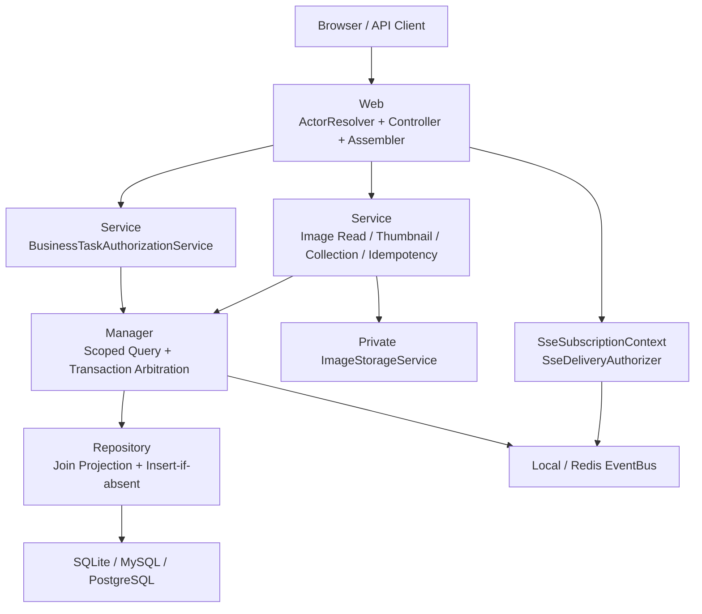
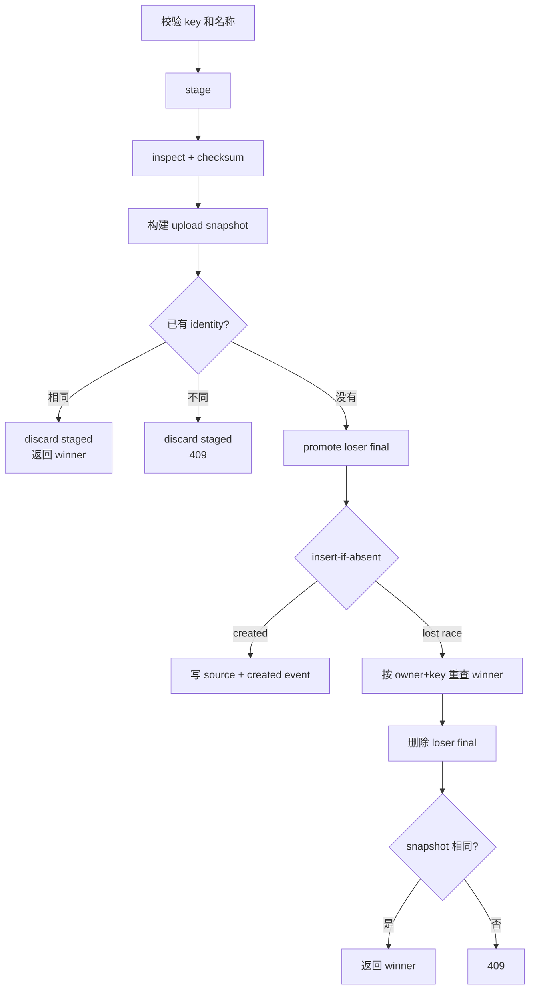

# 图像资产与图像采集后端完整技术方案

> 版本：1.0.11
>
> 日期：2026-07-22
>
> 状态：设计已确认，待文档审阅后按 TDD 实施
>
> 需求输入：`doc/1.0.11/IMAGE-ASSET-COLLECTION-BACKEND-GAP-PLAN.md`
>
> 代码基线：`voglander` / `dev` / `2fdc49c`

---

## 1. 目标与范围

本方案完整覆盖缺口计划中的 B0-B4，包括所有 P0 和 P1 项。目标不是新增一套平行的图像或任务体系，而是在现有图像资产、Durable Business Task、SSE 和存储抽象之上补齐安全、正确性、并发和发布证据。

交付目标：

1. Business Task、Execution、Event 和 SSE 均按可信权限与任务类型范围访问。
2. IMAGE_COLLECTION 的所有控制操作同时满足双权限、capability、状态和乐观锁版本。
3. 提供固定 `table`、`gallery` profile 的私有 Thumbnail 端点，并建立资源上限。
4. 资产来源、任务版本、capabilities、active execution 和结果字段满足前端契约。
5. 资产/source、task/config 查询在数据库分页前完成关联过滤，消除 N+1。
6. 上传与任务创建对相同内容稳定重放、不同内容稳定冲突，并正确处理数据库竞争。
7. Local/Redis SSE 使用相同的注册和逐事件授权规则。
8. 通过 Gate 0-Gate 4，形成可复现的测试和发布证据。

### 1.1 本期不做

- 不新增数据库列、业务表或 Thumbnail 持久化表。
- 不新增任意尺寸图片变换、公共 URL、query token 图片访问、CDN 或跨会话派生缓存。
- 不修改 GB28181、SIP、ZLM 建流或设备/通道标识规则。
- 不实现前端 Blob 管理、SSE 合并刷新、响应式布局或路由 alias。
- 不删除历史 `Image:Asset:Download` 菜单权限码，只调整 1.0.11 二进制端点的实际授权语义。

### 1.2 兼容性约束

- 保留现有 API 路径和 `{ total, items }` 分页响应形状。
- `Idempotency-Key` 对历史调用保持可选；图像前端调用必须发送。
- `ImageAssetVO` 保留旧的扁平来源字段，同时新增嵌套 `source`。
- `capturedAt`、`ingestedAt` 保持既有字段名和 Unix 毫秒语义。
- capabilities 表示 Handler 固有能力，不按当前状态或当前用户权限裁剪。
- 非图像历史业务错误的 HTTP 兼容行为不因本方案改变。

---

## 2. 现状确认与设计原则

代码核对确认以下事实仍成立：

| 领域 | 当前事实 | 目标原则 |
| --- | --- | --- |
| Task 查询 | Controller 使用 `BizTaskAccessScopeDTO.global()` | 授权服务生成可信 scope，Manager/SQL 强制应用 |
| Task 控制 | 仅检查 `Task:Control` | IMAGE_COLLECTION 强制双权限 |
| SSE | 只校验 token，Emitter 只保存 userId/topics | 注册授权和逐事件授权使用同一上下文 |
| Thumbnail | 端点和服务均不存在 | 固定 profile、有界派生、私有缓存、无原图降级 |
| Collection 查询 | task 分页后在内存过滤 config | task/config 先 join、过滤、count、page |
| 资产查询 | 逐行查询 source | asset/source 一次映射 |
| 幂等 | 按 key 早返回 | 比较 canonical 业务内容并由唯一键最终裁决 |
| 错误 | 二进制状态被折叠为 404 | 权限通过后区分 404/409/410/503 |

实施遵循以下原则：

1. Web 只处理认证适配、权限前置、Req/VO 转换和 HTTP 响应。
2. Service 处理领域策略、资源限制、canonical 内容和外部 I/O 编排。
3. Manager 处理可信查询 scope、事务和数据库竞争裁决，对外只暴露 DTO。
4. Repository 处理 DO、组合投影、Mapper 和数据库方言 SQL。
5. 所有测试位于 `voglander-web/src/test/java/io/github/lunasaw/voglander`。
6. 每个工作包执行红-绿-重构，上一工作包门禁通过后再推进下一工作包。

---

## 3. 总体架构



### 3.1 工作包顺序

采用纵向工作包交付：

```text
B0 资源授权与安全边界
  -> B1 Thumbnail 与来源契约
  -> B2 DTO、控制矩阵与关联查询
  -> B3 幂等、竞争与错误契约
  -> B4 SSE 主题、性能与发布证据
```

B1 的纯 Thumbnail transformer 单元开发可以与 B0 并行准备，但任何环境联调和发布分支合入必须先完成 B0。B2 和 B3 都修改任务创建或返回契约，必须在同一发布分支完整回归。

### 3.2 核心新增边界

| 组件 | 层 | 职责 | 不负责 |
| --- | --- | --- | --- |
| `AuthenticatedUserResolver` | Web | 从已验证 token 获取稳定 UserDTO | 不决定业务资源范围 |
| `BusinessTaskAuthorizationService` | Service | 权限组合、操作策略、可信 task scope | 不解析 HTTP token |
| `ImageAssetReadService` | Service | 资产可读状态和原始对象读取语义 | 不生成 HTTP ResponseEntity |
| `ImageThumbnailService` | Service | ETag、缓存、有界派生和结果模型 | 不决定用户权限 |
| `CanonicalFingerprintService` | Common/Service | 明确字段的 canonical JSON 和 SHA-256 | 不反射序列化任意 DTO |
| `SseSubscriptionContext` | Service | 保存连接生命周期内的授权快照 | 不进入 Redis 广播消息 |
| `SseDeliveryAuthorizer` | Service | Local/Redis 统一逐事件判断 | 不读取数据库或刷新权限 |

---

## 4. 共享契约

### 4.1 Task 访问范围

扩展 `BizTaskAccessScopeDTO`：

- `global` 只表达 owner/organization 是否全局。
- `allowedTaskTypes == null` 表示不限制任务类型，仅允许由可信授权服务构造。
- `allowedTaskTypes` 非空时，Manager 和 Repository 必须使用 `task_type IN (...)`。
- 空集合不得进入 Manager；无任何允许类型时在 Service 层直接拒绝。
- 用户请求中的 taskType 只能进一步收窄 scope，不能扩大 scope。

Task 查询权限生成规则：

| 用户权限 | 可信 scope |
| --- | --- |
| `Task:Query` | 允许授权范围内的全部任务类型 |
| 仅 `Image:Collection:Query` | 仅 `IMAGE_COLLECTION` |
| 两者都有 | 全部任务类型；图像页仍显式收窄为 `IMAGE_COLLECTION` |
| 两者都没有 | 查询前返回 403 |

Task 控制规则：

| 任务类型 | 必需权限 |
| --- | --- |
| `IMAGE_COLLECTION` | `Task:Control` + `Image:Collection:Control` |
| 其他任务类型 | `Task:Control` |

ID 操作不能先全局查询任务再返回 403。类型受限用户通过带 `allowedTaskTypes` 的单次 SQL 查找；out-of-scope 与未知 ID 使用相同拒绝语义。只有拥有完整范围的用户才区分真实的 404。

### 4.2 资产权限与状态

| API | 权限 | 权限通过后的状态语义 |
| --- | --- | --- |
| constraints/statistics/page | `Image:Asset:Query` | 正常元数据查询 |
| detail | Query + View | 404 或返回详情 |
| thumbnail/content/download | View | 404/409/410/503 |
| upload | Upload | owner 取认证用户 |
| delete/delete:retry | Delete | 保持现有 CAS |

无 View 权限时，存在与不存在的 assetId 均在资产查询前返回 403。

### 4.3 新错误码

| 枚举 | 数值 | HTTP | 场景 |
| --- | ---: | ---: | --- |
| `IDEMPOTENCY_KEY_REUSED` | 600007 | 409 | 相同 identity 对应不同 canonical 内容 |
| `IMAGE_ASSET_GONE` | 710009 | 410 | 已删除资产的私有二进制请求 |
| `IMAGE_THUMBNAIL_PROFILE_INVALID` | 710010 | 400 | profile 缺失或不是精确 table/gallery |
| `IMAGE_THUMBNAIL_UNAVAILABLE` | 710013 | 503 | 队列满、超时或派生无法满足安全限制 |

既有 `IMAGE_ASSET_NOT_FOUND`、`IMAGE_ASSET_STATE_CONFLICT`、`IMAGE_STORAGE_READ_FAILED` 分别用于 404、409、503。

### 4.4 Idempotency-Key

已提供的 key 必须匹配：

```text
[\x21-\x7E]{1,128}
```

即 1-128 个可见 ASCII 字符，不允许空格、控制字符或 Unicode。key 只用于数据库条件和内存比较，不进入业务日志、审计事件、指标 tag 或异常 detail。

### 4.5 Canonical JSON

canonical 工具只接收调用方显式构造的字段 Map：

1. 对象 key 按字典序递归排序。
2. 数组保持业务顺序。
3. 数字转为无多余尾零的十进制形式。
4. 布尔和 null 保持 JSON 语义。
5. 字符串由各领域在放入 Map 前完成 trim/null 规范化。
6. 使用 FastJSON2 输出 UTF-8，再以 SHA-256 计算完整摘要。

不允许直接序列化整个 Req、DTO、DO 或带运行态字段的对象计算指纹。

---

## 5. B0：资源授权与安全边界

覆盖：SEC-01、SEC-02、SEC-03、SEC-04，以及 SSE-02、SSE-04 的安全部分。

### 5.1 认证用户解析

新增 Web 级 `AuthenticatedUserResolver`：

```text
Authorization Bearer header 或既有 SSE token
  -> 校验格式
  -> AuthService.getUserByToken
  -> 要求 UserDTO.id 非空
  -> 返回 UserDTO
```

`ImageActorResolver` 委托该组件并保留现有公开方法，避免一次性破坏图像 Controller 测试。`BusinessTaskController` 和 `SseController` 不再自行截取 token 或调用 `JwtUtils` 推导 userId。

### 5.2 Task 查询授权

`BusinessTaskAuthorizationService` 提供清晰的操作入口：

- `queryScope(actor, requestedTaskType)`
- `imageCollectionQueryScope(actor)`
- `requireControl(actor, taskType)`
- `controlLookupScope(actor)`
- `sseContext(actor, topics)`

Controller 修改：

1. Task page/detail/statistics/constraints 接收 Authorization。
2. Execution page/detail 和 Event timeline 接收 Authorization。
3. Controller 先获得 scope，再调用 Manager。
4. Execution/Event Mapper 通过 INNER JOIN task 强制 scope。
5. 任何 Controller 都不得重新创建 `BizTaskAccessScopeDTO.global()`。

### 5.3 Task 控制授权

控制顺序固定：

```text
认证
  -> 构建允许控制的 taskType scope
  -> scoped task lookup
  -> 任务类型所需权限
  -> payloadVersion Handler capability
  -> 状态
  -> expectedVersion
  -> Manager CAS
  -> accepted/rejected audit
```

IMAGE_COLLECTION 的 pause、resume、cancel、manual retry 和 reschedule 使用同一双权限策略。权限失败或 scoped lookup 失败不得写 accepted audit，也不得改变任何状态。

### 5.4 资产授权

`ImageAssetController` 的顺序统一为：

```text
resolve actor -> require permissions -> query asset -> classify state -> execute operation
```

- detail 从仅 Query 调整为 Query + View。
- download 从独立 Download 权限调整为 View。
- content 保持 View。
- thumbnail 使用 View。
- 权限收敛上线前审计自定义角色，原来只有 Download 的角色按产品决定补授 View。

### 5.5 SSE 注册授权

新增不可变 `SseSubscriptionContext`，字段固定为：

- 随机 `emitterId`，不得包含 userId 或 token。
- 稳定 `userId`。
- 标准化后的不可变 topics。
- `taskQueryAllowed`。
- `imageCollectionQueryAllowed`。
- `imageAssetQueryAllowed`。
- `allowedTaskTypes`。

topic 处理：去空白、去重、拒绝空集合、拒绝未知根域和任意字符串前缀。允许项：

| topic 根域 | 注册条件 | 投递条件 |
| --- | --- | --- |
| `business.task` | Task Query 或 Collection Query | 后者只接收 IMAGE_COLLECTION |
| `image.asset` | Asset Query | 只接收图像资产刷新事件 |
| `device` | 有效登录，兼容现状 | 精确/子主题匹配 |
| `live` | 有效登录，兼容现状 | 精确/子主题匹配 |
| `alarm` | 有效登录，兼容现状 | 精确/子主题匹配 |

`SseEventBus.register` 改为接收 context。Local 和 Redis 的 holder 都只保存 context 与 emitter。

### 5.6 SSE 逐事件授权

`SseDeliveryAuthorizer.allow(context, event)` 先做 topic 匹配，再做领域过滤：

- `business.task.*` 从 allowlisted data 中读取 `taskType`；缺失 taskType 时拒绝给只有 Collection Query 的订阅者。
- `image.asset.*` 要求 Asset Query。
- legacy topic 按注册时显式允许的根域处理。
- Redis 广播只发送业务事件和 originId，不发送任何用户权限或 subscription context。

Local `publishLocal` 和 Redis `publishLocal/handleRemote` 调用同一个 authorizer，防止本地正确而跨节点越权。

### 5.7 B0 TDD

先新增失败测试：

- `BusinessTaskAuthorizationServiceTest`
- `BusinessTaskControllerAuthorizationTest`
- `BusinessTaskControlControllerTest` 双权限参数化用例
- `BizTaskManagerTaskTypeScopeTest`
- `BizTaskExecutionTaskTypeScopeTest`
- `SseSubscriptionAuthorizationTest`
- `SseDeliveryAuthorizerTest`
- `SseEventBusAuthorizationTest`，参数化 Local/Redis remote delivery
- `ImageControllerPermissionTest`

关键断言：无权限时 Manager/Repository 未调用；out-of-scope task/execution 不返回事实；拒绝控制无状态变化、无 accepted audit；任何 emitterId、日志和 Redis JSON 都不含 token。

---

## 6. B1：Thumbnail 与来源契约

覆盖：THM-01、THM-02、SRC-01、SRC-02。

### 6.1 Profile

新增 `ThumbnailProfile`：

| 值 | 最大盒 | 最大响应 | 输出 |
| --- | --- | ---: | --- |
| `table` | 112x84 | 64 KiB | JPEG |
| `gallery` | 320x240 | 256 KiB | JPEG |

解析只接受精确小写值。缺失、大小写错误和其他值返回 710010/400。

### 6.2 配置

`ImageProperties` 新增 `thumbnail`：

| 配置 | 默认值 | 校验 |
| --- | ---: | --- |
| enabled | true | boolean |
| algorithmVersion | thumb-v1 | 非空、长度受限 |
| workerCount | `min(availableProcessors, 4)` | 1 到 CPU*2 |
| queueCapacity | 64 | 1-1024 |
| timeoutMillis | 3000 | 100-30000 |
| cacheMaxBytes | 64 MiB | 大于 gallery 上限 |
| cacheMaxEntries | 512 | 1-10000 |
| cacheTtlSeconds | 300 | 1-3600 |
| maxWorkingPixels | 8,000,000 | 大于 gallery 像素，小于输入上限 |

配置在启动时校验，线程池、队列和缓存均不得无界。关闭 `enabled` 时端点保持存在并返回 710013/503，不回退原图。

### 6.3 读取状态

新增 `ImageAssetReadService` 统一 content/download/thumbnail 的资产状态：

| 事实 | 结果 |
| --- | --- |
| 不存在 | 404 / IMAGE_ASSET_NOT_FOUND |
| DELETED | 410 / IMAGE_ASSET_GONE |
| DELETING、DELETE_FAILED | 409 / IMAGE_ASSET_STATE_CONFLICT |
| AVAILABLE | 允许继续 |
| 存储读取失败 | 503 / IMAGE_STORAGE_READ_FAILED |

权限由 Controller 在调用此服务前完成。Service 返回 DTO、`ImageContent` 或派生结果，不构造 HTTP 响应。

### 6.4 ETag 与缓存

派生 ETag：

```text
derivedHash = SHA-256(asset.checksum + "\n" + profile + "\n" + algorithmVersion)
ETag = "sha256:" + derivedHash
```

请求流程：

```text
View 权限
  -> profile
  -> asset state
  -> derived ETag
  -> If-None-Match
  -> memory cache
  -> bounded transform
  -> cache put
  -> response
```

304 在 storage.open、decode 和 encode 之前返回。缓存 key 为完整 ETag；即使缓存命中，每次请求仍先执行权限和资产状态检查。

`ThumbnailMemoryCache` 使用线程安全的 access-order LRU，按 TTL、总字节和条目数三重淘汰。单项超过 profile 上限不得进入缓存。

### 6.5 有界变换

`ImageThumbnailService` 把变换提交到独立 `ThreadPoolExecutor`：

- 固定 worker 数。
- `ArrayBlockingQueue`。
- `AbortPolicy`，队列满映射为 710013。
- `Future.get(timeout)`，超时取消并映射为 710013。
- 中断状态必须恢复。
- 所有 InputStream、ImageInputStream、ImageReader、ImageWriter 和临时缓冲均在异常路径关闭或释放。

Transformer 步骤：

1. 使用 ImageIO/TwelveMonkeys 选择可信 reader，不相信客户端 contentType。
2. 在完整 decode 前读取尺寸和 EXIF orientation。
3. 校验原始字节数、总像素和工作像素。
4. 根据目标盒计算安全 subsampling，限制解码工作集。
5. 按 EXIF 1/3/6/8 校正方向。
6. 居中裁剪为 4:3。
7. 缩放因子不得大于 1，小图保持有效分辨率。
8. 透明输入先合成固定中性背景 `#F2F0EA`。
9. 按固定 JPEG 质量档位 0.85、0.75、0.65、0.55 编码。
10. 所有档位仍超过 profile 上限时返回 710013，不继续缩到不可预测尺寸，也不返回原图。

### 6.6 HTTP 响应

200 响应包含：

- `Content-Type: image/jpeg`
- `Content-Length`
- `ETag`
- `Cache-Control: private, max-age=300`
- `Vary: Authorization`
- `X-Content-Type-Options: nosniff`
- `Content-Disposition: inline`

304 只有缓存验证 header 和空 body。错误继续使用统一 JSON 错误结构。

### 6.7 来源 VO

新增：

- `ImageAssetSourceVO`
- `ImageAssetSourceMetadataVO`

metadata 只允许：

- deviceId
- channelId
- deviceName
- channelName

`ImageAssetWebAssembler` 从 JSONObject 显式读取白名单字段。protocol、nodeServerId、streamId、storageKey 和未知扩展字段永不进入 VO。

`ImageCollectionTaskHandler` 从 `ImageCollectionConfigDTO` 写入非空 device/channel 名称快照，同时保留既有内部诊断字段。USER_UPLOAD 不伪造 camera 字段。

### 6.8 B1 TDD

先新增失败测试：

- `ThumbnailProfileTest`
- `ImageThumbnailServiceTest`
- `ImageThumbnailTransformerTest`
- `ThumbnailMemoryCacheTest`
- `ImageAssetThumbnailControllerTest`
- `ImageAssetSourceWebContractTest`
- 扩展 `ImageCollectionTaskHandlerContractTest`

覆盖 JPEG、PNG、WEBP、透明图、横图、竖图、正方形、小图、EXIF 1/3/6/8、ETag 稳定性、304 零读取、缓存淘汰、队列满、超时、编码超限和所有资产状态。

---

## 7. B2：DTO、控制矩阵与关联查询

覆盖：DTO-01、DTO-02、DTO-03、CTL-01、CTL-02、QRY-01、QRY-02、QRY-03。

### 7.1 资产/source 组合查询

Repository 新增 `ImageAssetWithSourceDO` 投影和关联 resultMap：

- asset 列统一使用 `a_` 前缀。
- source 列统一使用 `s_` 前缀。
- asset 到 source 由唯一 asset_id 保证最多一条。
- 默认隐藏 DELETED 的语义保持不变。
- source、device、channel 过滤在 SQL WHERE 中执行。
- 排序固定为 `captured_at DESC, asset_id DESC`。

`ImageAssetManager.getEnrichedPage/getEnrichedDetail` 转换为 `ImageAssetEnrichedDTO`，Controller 不再调用 `getSourceByAssetId` 循环补齐。

### 7.2 Task/config 组合查询

Repository 新增 `ImageCollectionTaskDO` 和 `ImageCollectionTaskQueryCondition`，查询：

```sql
tb_biz_task t
INNER JOIN tb_image_collection_config c ON c.task_id = t.task_id
```

条件包括：

- task_type 固定 IMAGE_COLLECTION。
- taskName、taskMode、state。
- deviceId、channelId。
- owner/organization scope。
- allowedTaskTypes scope。

count 和 page 使用完全相同的 join/where。排序固定 `t.create_time DESC, t.task_id DESC`。异常 task 缺 config 时按 INNER JOIN 排除并记录数据一致性告警，不允许 total 与 items 长期不一致。

`ImageCollectionConfigManager` 使用组合 Mapper，不再循环 `getByTaskId`。`ImageCollectionApplicationService` 不再分页后过滤。

### 7.3 Task/Collection 字段

`BusinessTaskVO` 和 `BusinessTaskDetailVO` 增加任务行 `version`，Assembler 从 `BizTaskDTO.version` 映射。

`ImageCollectionVO` 增加：

- version
- scheduleVersion
- capabilities
- lastExecutionId
- resultRefType/resultRefId/resultSummary
- cancelledCount
- progressMessage/progressRevision

`version` 只来自 `tb_biz_task.version`，不得被 scheduleVersion 或 config.version 覆盖。

capabilities 根据 taskType + payloadVersion 从 Handler registry 获取。`ImageCollectionApplicationService` 使用请求内 `Map<Integer, List<String>>` 按 payloadVersion 复用解析结果，不发起逐行数据库查询。

resultSummary 继续通过 `BusinessTaskDataSanitizer`，不得包含 payload、存储路径或堆栈。

### 7.4 Active execution

Task 详情读取 task 后，使用同一 access scope 按 `lastExecutionId` 查询 execution：

- PENDING、RUNNING、RETRY_WAIT：返回 activeExecution。
- 终态、不存在、out-of-scope：返回 null。

不新增固定前 100 条 execution 接口；历史继续使用分页端点。

### 7.5 控制矩阵

| 操作 | 状态 | capability | 版本 | 图像权限 |
| --- | --- | --- | --- | --- |
| pause | SCHEDULED/RUNNING | PAUSE | 必填 | 双权限 |
| resume | PAUSED | PAUSE | 必填 | 双权限 |
| reschedule | PAUSED + FIXED_RATE | RESCHEDULE | 必填 | 双权限 |
| manual retry | FAILED | MANUAL_RETRY | executionId + key | 双权限 |
| cancel | SCHEDULED/RUNNING/PAUSED | CANCEL | 必填 | 双权限 |

缺 expectedVersion 返回参数错误 400；CAS 失败、旧版本、状态不匹配返回 TASK_STATE_CONFLICT/409。CANCELLING 和所有完成态禁止控制。

`ImageCollectionApplicationService.reschedule` 在状态检查前根据 payloadVersion 获取 Handler 并验证 RESCHEDULE。`BizTaskCreateService.manualRetry` 只对 IMAGE_COLLECTION 收紧到 FAILED，其他类型保留现有兼容策略。

### 7.6 B2 TDD

先新增失败测试：

- `ImageAssetEnrichedMapperIntegrationTest`
- `ImageCollectionTaskMapperIntegrationTest`
- `ImageCollectionQueryCorrectnessTest`
- `ImageCollectionWebAssemblerTest`
- 扩展 `BusinessTaskWebAssemblerTest`
- `BusinessTaskActiveExecutionTest`
- `ImageCollectionControlMatrixTest`

构造匹配项位于原全量第二页的 fixture，断言过滤后的第一页仍返回且 total 正确。使用 test-only MyBatis statement counter 断言 0/1/24 条资产和 0/1/20 条 Collection 的查询次数为常数，不依赖日志文本判断。

---

## 8. B3：幂等、竞争与错误契约

覆盖：IDM-01、IDM-02、IDM-03、IDM-04、ERR-01、ERR-02。

### 8.1 上传 canonical snapshot

上传 snapshot 字段：

- ownerType/ownerId/organizationId
- 文件 SHA-256
- 规范化 originalFilename
- 规范化有效 assetName

名称规则：

1. originalFilename 去路径、控制字符并 trim；缺失保持 null。
2. assetName 有值时使用同一安全化规则。
3. assetName 缺失时使用 originalFilename；两者都缺失时使用稳定字面值 `unnamed`。
4. canonical fallback 不得包含随机 assetId。

### 8.2 上传流程



`ImageAssetManager.createWithSource` 返回 `ImageAssetCreateResultDTO`：

- created
- acceptedAsset
- acceptedSource

insert 返回 0 后按 owner+key 查询 winner。若 key 为空或 winner 仍不存在，视为非幂等唯一键/数据异常，抛内部持久化错误，不得返回 null。

只有 created=true 才写 source 和 created SSE。Manager 事务失败时 Service 删除已提升 final object。

### 8.3 上传补偿矩阵

| 失败点 | staged | loser final | 行为 |
| --- | --- | --- | --- |
| stage 失败 | provider 负责失败原子性 | 无 | 返回写入失败 |
| inspect 失败 | finally discard | 无 | 返回输入校验错误 |
| replay/conflict | discard | 无 | 返回 winner 或 409 |
| promote 失败 | discard | provider 负责失败原子性 | 返回写入失败 |
| DB/Manager 失败 | discard | delete | delete 失败记 orphan |
| lost race | discard | delete | compare 后 replay/409 |
| discard 失败 | 记 staging orphan | 按主路径 | 不覆盖主业务结果 |

任何 cleanup catch 都必须记录稳定 cleanup code；不得静默忽略。

### 8.4 Task canonical snapshot

Task snapshot 字段：

- taskType、taskName、description、taskMode
- scheduleStartTime、scheduleEndTime、intervalSeconds
- payloadVersion、canonical payload
- bizKey
- subjectType/subjectId
- ownerType/ownerId/organizationId
- originTaskId/originExecutionId

时间截断到秒并使用固定 ISO 表达。字符串使用明确的 strip/null 规则。task 状态、计数、version、nextPlanTime 等运行态字段不参与。

ONCE 任务的 maxAttempts 从首 execution 重建并参与比较。计划任务实际使用 scheduler 全局默认 maxAttempts，TaskCreateCommand 中未形成持久化语义的值不参与 fingerprint。

### 8.5 Task insert-if-absent

`BizTaskMapper` 增加三种方言：

- SQLite：`INSERT OR IGNORE`
- MySQL：`INSERT IGNORE`
- PostgreSQL：`INSERT ... ON CONFLICT DO NOTHING`

Manager 流程：

1. 转换并尝试插入 task。
2. 插入成功才插入首 execution、发布 created 事件。
3. 插入被忽略后按 owner+taskType+key 重查 winner。
4. 返回 `BizTaskCreateResultDTO(created, acceptedTask, acceptedFirstExecution)`。
5. Service 比较 snapshot；相同重放，不同返回 600007/409。

若 insert 被忽略但按幂等 identity 找不到 winner，说明冲突来自其他唯一键或 SQL 异常，必须返回持久化错误，不能当作重放。

### 8.6 Collection 可变外部状态

Collection 创建顺序：

1. 校验 key、基本字段、mode 和 schedule 等稳定输入。
2. 构建 TaskCreateCommand 和 snapshot。
3. 查询已接受 identity 并比较；相同直接返回，不检查设备当前状态。
4. identity 不存在才读取设备/通道并检查在线状态。
5. 外部校验失败前再次查询 identity，处理与并发 winner 交错的情况。
6. 创建 task、首 execution 和 config。

task、首 execution 和 config 使用同一 Spring 事务。config 创建失败必须回滚本次新 task。可见的历史 replay 应已具有 config；若缺失则记录数据一致性错误，不根据当前设备名称静默重建历史快照。

### 8.7 Manual retry

人工重试 key 必填。snapshot 包含 originTaskId 和 originExecutionId，因此：

- 相同 key + 相同 origin 和创建内容：返回首次 retry task。
- 相同 key + 不同 execution/origin：600007/409。
- IMAGE_COLLECTION 原任务不是 FAILED：TASK_RETRY_NOT_ALLOWED。
- failedExecution 不属于原 task：TASK_RETRY_NOT_ALLOWED。

### 8.8 B3 TDD

先新增失败测试：

- `IdempotencyKeyValidatorTest`
- `CanonicalFingerprintServiceTest`
- `ImageUploadSnapshotTest`
- 重写 `ImageIngestServiceTest` 的旧早返回用例
- `ImageIngestServiceConcurrencyTest`
- `ImageIngestCompensationTest`
- 重写 `BizTaskCreateServiceTest` 的旧早返回用例
- `BizTaskCreateConcurrencyTest`
- `ImageCollectionCreateReplayTest`
- `GlobalExceptionHandlerImageTest`

并发测试使用 `CountDownLatch`/barrier 同时进入 insert，不使用 `@Transactional`，使用唯一 owner/key 并在 afterEach 显式清理。断言只有一个 task/asset 事实、只有一份 source/config/首 execution，无 null、无通用 500、无未记录 orphan。

---

## 9. B4：SSE 主题、性能与发布证据

覆盖：SSE-01、SSE-03，以及 Gate 4 的 E2E、性能、OpenAPI 和可观测性。

### 9.1 资产主题

`ImageConstant` 新增：

```text
image.asset.deleting
```

映射：

| 状态事件 | topic | eventType |
| --- | --- | --- |
| ASSET_CREATED | image.asset.created | ASSET_CREATED |
| ASSET_DELETING | image.asset.deleting | ASSET_DELETING |
| ASSET_DELETED | image.asset.deleted | ASSET_DELETED |
| ASSET_DELETE_FAILED | image.asset.deleted | ASSET_DELETE_FAILED |

DELETE_FAILED 使用 deleted 刷新列表，但 eventType 保留失败语义。

### 9.2 SSE 一致性

同一组 context/event 参数化运行：

- Local publish。
- Redis 本地直发。
- Redis remote delivery。
- origin 回路抑制。

四条路径必须给出相同 allow/deny。心跳只发送 `ping`，不经过业务 topic 授权；连接完成、超时和异常都删除 holder，使权限快照不超过连接生命周期。

### 9.3 可观测性

增加低基数指标：

| 领域 | 指标 |
| --- | --- |
| Thumbnail | request、cache hit、duration、output bytes、queue rejection、timeout |
| Idempotency | created、replayed、conflict、compensation failure |
| SSE | registration denied、delivery filtered、send failure、emitter count |

指标 tag 只使用 profile、outcome、稳定错误码、bus type 等有限枚举。不得使用 userId、assetId、taskId、token、key 或 storageKey 作为 tag。

日志只允许脱敏业务 ID 和稳定错误码。原始 token、幂等 key、payload、storageKey、设备凭据和异常堆栈 detail 不进入普通业务日志。

### 9.4 OpenAPI

更新文档：

- thumbnail 的 profile enum。
- 二进制 200/304 和 JSON 400/401/403/404/409/410/503。
- `Idempotency-Key` 可选兼容语义和图像 UI 必填约定。
- expectedVersion 必填语义。
- Task/Collection 新增字段。
- SSE topic allowlist 和权限要求。

### 9.5 性能与故障测试

覆盖：

- Thumbnail 慢存储、超大图、队列满、超时、缓存命中和并发上限。
- 资产 24 条、Collection 20 条时 SQL 次数保持常数。
- SSE 高频事件、断线重连、Emitter 回收和 Redis 广播。
- 幂等竞争和 cleanup 故障注入。
- MySQL、PostgreSQL、SQLite 的 join、count、排序和 insert-if-absent 语义。

### 9.6 B4 TDD

新增或扩展：

- `ImageAssetSseTopicTest`
- `SseEventBusAuthorizationTest`
- `SseOriginSuppressionTest`
- `SseEmitterLifecycleTest`
- `ImageThumbnailResourceLimitTest`
- `ImageQueryStatementCountTest`
- `ImageOpenApiContractTest`
- `BusinessTaskOpenApiContractTest`

---

## 10. 文件级改动清单

实施使用以下明确的文件和职责边界；只有在红绿重构证明两个新增类型没有独立行为时，才允许合并实现，但公开契约名称保持不变。

### 10.1 Common

- 修改 `ImageConstant.java`：deleting topic。
- 修改 `ServiceExceptionEnum.java`：600007、710009、710010、710013。
- 新增 `ThumbnailProfile.java`。
- 新增 `IdempotencyKeyValidator.java`。
- 新增 `CanonicalJsonFingerprint.java`。

### 10.2 Repository

- 新增 `ImageAssetWithSourceDO.java`。
- 新增 `ImageCollectionTaskDO.java`。
- 新增 `ImageCollectionTaskQueryCondition.java`。
- 新增 `ImageCollectionTaskReadMapper.java/xml`：task/config join。
- 修改 `ImageAssetMapper.java/xml`：组合详情和分页。
- 修改 `BizTaskMapper.java/xml`：task insert-if-absent。
- 修改 `BizTaskExecutionQueryCondition.java` 和 Mapper XML：allowedTaskTypes。
- 修改 Event scope 查询：allowedTaskTypes。

### 10.3 Manager

- 修改 `BizTaskAccessScopeDTO.java`。
- 新增 `ImageAssetEnrichedDTO.java`。
- 新增 `ImageAssetCreateResultDTO.java`。
- 新增 `BizTaskCreateResultDTO.java`。
- 修改 `ImageAssetManager.java`。
- 修改 `ImageCollectionConfigManager.java`。
- 修改 `BizTaskManager.java`。
- 修改 `BizTaskExecutionManager.java`、`BizTaskEventManager.java`。

### 10.4 Service

- 新增 `BusinessTaskAuthorizationService.java`。
- 新增 `ImageAssetReadService.java`。
- 新增 `ImageThumbnailService.java`。
- 新增 `ImageThumbnailTransformer.java`。
- 新增 `ThumbnailMemoryCache.java`。
- 新增不可变 `ImageThumbnailResult.java`。
- 修改 `ImageIngestService.java`。
- 修改 `ImageCollectionApplicationService.java`。
- 修改 `ImageCollectionTaskHandler.java`。
- 修改 `BizTaskCreateService.java`。
- 新增 `SseSubscriptionContext.java`、`SseDeliveryAuthorizer.java`。
- 修改 `SseEventBus.java`、`LocalSseEventBus.java`、`RedisBackedSseEventBus.java`。

### 10.5 Web

- 新增 `AuthenticatedUserResolver.java`。
- 修改 `ImageActorResolver.java`。
- 修改 `ImageAssetController.java`、`ImageCollectionController.java`、`BusinessTaskController.java`、`SseController.java`。
- 新增 `ImageAssetSourceVO.java`、`ImageAssetSourceMetadataVO.java`。
- 修改 `ImageAssetVO.java`、`ImageCollectionVO.java`、`BusinessTaskVO.java`。
- 修改相关 Web Assembler。
- 修改 `GlobalExceptionHandler.java`。
- 更新 OpenAPI 注解和契约测试。

### 10.6 配置

- 修改 `ImageProperties.java`：thumbnail 配置与校验。
- 修改默认 application image 配置，显式记录安全默认值。
- 不修改数据库 schema 和 migration 内容；只扩展 Mapper SQL。

---

## 11. TDD 实施计划

### 11.1 通用循环

每个子任务执行：

1. 红：先写一个能描述目标行为的失败测试，确认失败原因正确。
2. 绿：实现使该测试通过的最小代码。
3. 重构：消除重复、收紧边界，保持所有已完成测试全绿。
4. 定向回归：运行当前工作包和被修改历史契约测试。
5. 门禁：工作包完成标准全部满足才进入下一包。

不得先批量写完生产代码再补测试。

### 11.2 B0 顺序

1. Task query scope DTO/Manager/Mapper 测试和实现。
2. Task Controller 查询授权。
3. IMAGE_COLLECTION 控制双权限。
4. 资产 detail/download 权限对齐。
5. SSE context、注册 allowlist、逐事件 authorizer。
6. Local/Redis 一致性和 token 泄露回归。

### 11.3 B1 顺序

1. Profile 和配置校验。
2. ETag/304 与结果模型。
3. Transformer 尺寸、方向、裁切、透明背景和字节上限。
4. Executor 拒绝/超时和资源关闭。
5. 内存缓存。
6. Controller header 和状态错误。
7. Source VO 白名单与名称快照。

### 11.4 B2 顺序

1. Repository 投影和 SQLite 集成测试。
2. Manager enriched DTO 映射。
3. Collection 过滤/total/排序。
4. 查询次数断言和 N+1 删除。
5. Task/Collection VO 字段。
6. Active execution。
7. 全控制矩阵。

### 11.5 B3 顺序

1. key validator 和 canonical 工具。
2. 上传 snapshot 与 replay/conflict。
3. 上传 insert race 和 final/staged 补偿。
4. Task snapshot 与 insert-if-absent。
5. Task 同内容/不同内容并发。
6. Collection 外部状态重放顺序。
7. Manual retry origin 比较。
8. HTTP 错误映射。

### 11.6 B4 顺序

1. 独立 deleting topic。
2. SSE 远端一致性和生命周期。
3. 资源/性能故障测试。
4. 指标和日志安全断言。
5. OpenAPI。
6. 全量回归和发布证据。

---

## 12. 验收门禁与命令

### Gate 0：绿色基线

- 现有相关测试全绿。
- 非图像旧错误 HTTP 行为未改变。
- 三种数据库 mapper/migration 可加载。

### Gate 1：Thumbnail 与来源

- 两个 profile 的尺寸、字节、方向、不放大、ETag 和 304 通过。
- 不存在 Thumbnail 到 content 的原图降级。
- sourceMetadata 白名单通过。

### Gate 2：私有 Blob 与幂等

- thumbnail/content/download 的权限和 403/404/409/410/503 通过。
- 上传和 Task 创建 replay/conflict/concurrency 通过。
- 故障注入后无未记录 staged/final 对象。

### Gate 3：任务与查询

- version/scheduleVersion/capabilities/activeExecution/result 通过。
- 控制矩阵通过。
- camera total 正确且关联查询次数为常数。

### Gate 4：发布候选

- REST、SSE、Redis、慢存储、队列满、超时和超大图 E2E 通过。
- OpenAPI 与真实响应一致。
- 全量测试通过并保存证据。

建议命令：

```bash
# 每个红绿循环运行对应类
mvn test -Dtest=TargetTest

# 工作包定向回归
mvn test -Dtest='Image*Test,BusinessTask*Test,Sse*Test,BizTask*Test'

# 全量回归
mvn test

# 编译所有模块
mvn clean compile
```

MySQL/PostgreSQL 环境不可用时，测试可按仓库规范 skip，但发布报告必须明确标记为未验证，不能把 Gate 4 写为通过。SQLite 为本地强制验证项。

---

## 13. 发布、灰度与回滚

### 13.1 发布顺序

1. 审计自定义角色，补齐需要的 View 权限。
2. 同一版本发布 Task Controller、SSE Controller 和 Local/Redis EventBus。
3. 先关闭或小流量启用 Thumbnail。
4. 验证 403/409/410/503、缓存、队列和 SSE 过滤指标。
5. 前端按 Gate 1-Gate 3 依赖顺序切换。

### 13.2 开关

`voglander.image.thumbnail.enabled` 只控制派生能力。关闭时返回明确 503，不回退原图。

B0 安全修复不提供绕过开关，不允许通过配置恢复全局 task scope、单权限图像控制或未授权 SSE。

### 13.3 回滚

- 本期无 schema 变更，应用代码可以整体回滚。
- 新增 VO 字段向后兼容，旧扁平 source 字段保留。
- 若 Thumbnail 资源异常，可先关闭 Thumbnail 开关，再回滚应用。
- 回滚不得恢复 token 日志、原图降级或资源越权路径。

---

## 14. 风险与处置

| 风险 | 处置 |
| --- | --- |
| MySQL/PostgreSQL 方言只做静态验证 | 发布前在真实数据库执行并发与分页集成测试 |
| ImageIO decoder 对中断响应不一致 | 有界 worker/queue 限制影响面，超时取消并监控占用 |
| 透明图转 JPEG 视觉差异 | 固定背景色并锁定像素级契约测试 |
| 权限收敛导致历史 Download-only 角色失效 | 上线前角色审计和补授 View |
| 并发 winner 可见性差异 | insert 返回 0 后按 identity 重查；找不到 winner 视为错误，不返回 null |
| 历史 task 缺 config/source | INNER JOIN 排除并告警，不静默伪造快照 |
| 无 fingerprint 列导致比较逻辑漂移 | 显式 snapshot builder、固定 canonical 版本和契约测试 |
| SSE 权限在长连接期间变化 | 权限快照仅存活于连接；权限变更后由客户端重连，后续可增主动踢出机制 |

---

## 15. 缺口追踪矩阵

| 缺口 | 工作包 | 核心实现 | 核心测试 | Gate |
| --- | --- | --- | --- | --- |
| SEC-01 | B0 | Task/Execution/Event scoped query | Authorization + Mapper scope | 0/3 |
| SEC-02 | B0 | IMAGE_COLLECTION 双权限 | Control matrix | 3 |
| SEC-03 | B0 | SSE context + delivery authorizer | Local/Redis 参数化 | 4 |
| SEC-04 | B0 | 资产 Query/View 对齐 | Permission matrix | 2 |
| THM-01/02 | B1 | Thumbnail endpoint/service | Transformer/resource tests | 1/2/4 |
| SRC-01/02 | B1 | source VO + name snapshot | Source contract | 1 |
| DTO-01/02/03 | B2 | version/capabilities/active execution | Assembler/detail tests | 3 |
| CTL-01/02 | B2 | RESCHEDULE/retry 策略 | Control matrix | 3 |
| QRY-01/02/03 | B2 | 组合查询 | total/query count | 3/4 |
| IDM-01/02 | B3 | upload snapshot + compensation | upload concurrency/fault | 2 |
| IDM-03/04 | B3 | task insert race + replay order | task/collection concurrency | 2 |
| ERR-01/02 | B3 | error enum + HTTP mapping | exception/controller contract | 2 |
| SSE-01/03/04 | B0/B4 | topic、授权、一致性、随机 emitterId | SSE contract/lifecycle | 4 |

---

## 16. 完成定义

只有同时满足以下条件，才可把 1.0.11 后端标记为完成：

- B0-B4 所有红绿重构循环完成。
- Gate 0-Gate 4 均有可复现证据。
- 全量 `mvn test` 和 `mvn clean compile` 通过。
- 三种数据库的关键 SQL 语义有验证记录；任何 skip 明确披露。
- OpenAPI、错误码、权限矩阵与真实响应一致。
- 无 token、原始幂等 key、storageKey 或 payload 泄露。
- 无原图 Thumbnail 降级、无无界线程/队列/缓存。
- 无分页后过滤、N+1、null winner 或未记录孤儿对象。
- 变更报告包含改动清单、测试证据、风险和未完成项。
