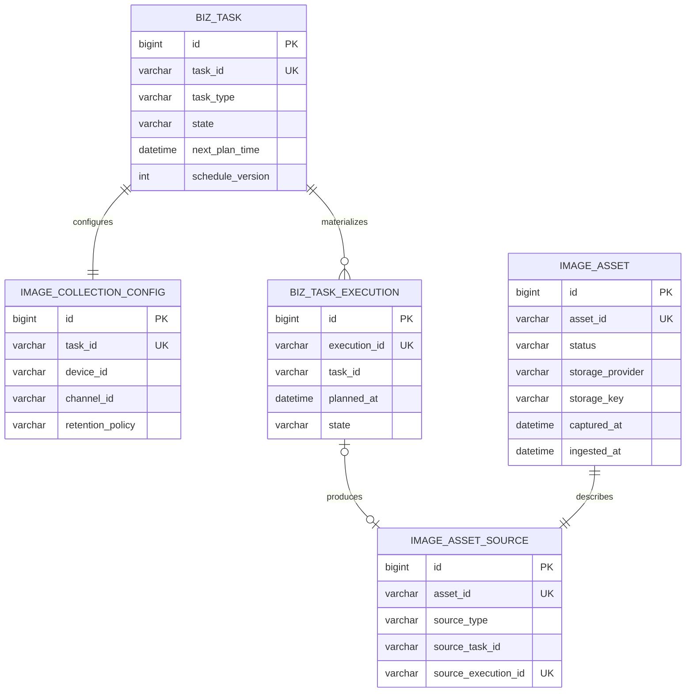
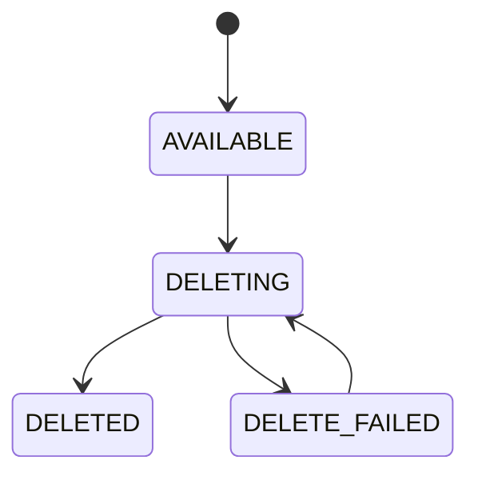
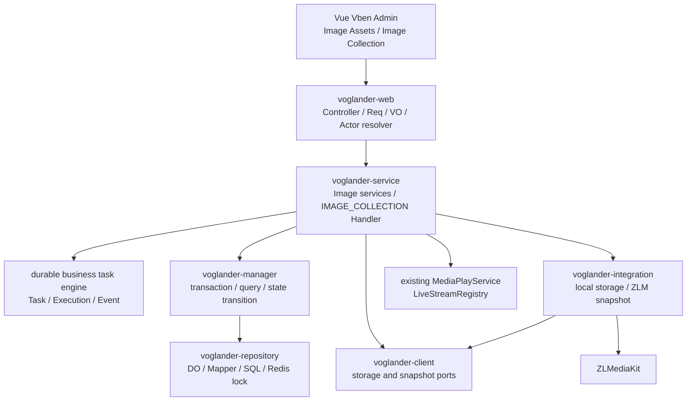
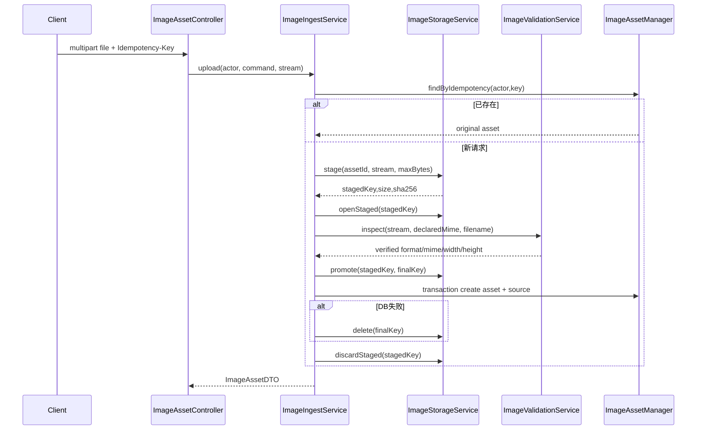

# Voglander 图像资产与采集完整详细设计

> 变更：`add-image-asset-collection`
> 上位设计：`docs/2026-07-14-voglander-image-asset-collection-design.md`
> 代码基线：`voglander` commit `96da3a0`，Spring Boot 3.5.3 / Java 17 / ZLM starter 1.0.11
> 前端基线：`vue-vben-admin/apps/web-antd`，Vue 3 / TypeScript / Vben 5.7 / Ant Design Vue
> 目标版本：1.0.9

## Context

Voglander 已有设备与通道目录、GB28181 直播编排、ZLMediaKit 节点选择、`MediaPlayService`、`LiveStreamRegistry`、Redis 分布式锁和 SSE，但当前截图只停留在 ZLM 临时能力层：没有稳定资产 ID、来源索引、受控内容接口、存储生命周期、采集任务或前端资产工作台。

本变更把“图像”作为来源无关的业务资产，而不是直播页面的一个临时 URL。用户上传与摄像机采集最终进入同一资产模型；采集意图、每个计划点的执行事实和成功产出的资产彼此独立。SkyEye 仍是独立 AI 平台，本变更不包含人脸检测、特征向量、相似度搜索或轨迹分析。

任务、执行、事件、调度、进度、重试、租约、恢复和统一任务中心由前置 `add-durable-business-task-engine` 提供。本变更注册 `IMAGE_COLLECTION` Handler 和 completion participant，只实现图像领域配置、截图和资产接入。

### 当前代码约束

- Maven 依赖方向为 `common → client → repository → manager → integration → service → web`，其中 service 可以调用 integration，integration 当前也依赖 manager。
- 现有 Java 包名使用 `io.github.lunasaw.voglander.intergration`（历史拼写），新增 Integration 类必须沿用该包名，避免同模块出现第二套根包。
- Manager DTO 当前位于 `voglander-manager/.../domaon/dto`（历史拼写），本变更遵循现状，不顺带重命名全仓库。
- Web 返回 `AjaxResult`，二进制内容接口除外；Web 时间字段为 Unix 毫秒，DO/DTO 使用 `LocalDateTime`。
- 所有序列化使用 FastJSON2；数据库只保存 JSON 文本、元数据和存储引用。
- SQLite 空库由 `SqliteSchemaInitializer` 执行全量脚本，已存在的 `app.db` 不会自动重跑全量脚本，因此本变更必须提供非破坏性增量迁移。
- 前端运行时路由来自后端菜单，静态路由仅用于开发、类型和组件发现；所有 API 类型必须以提交的 OpenAPI 文档为准。
- zlm starter 1.0.11 已提供 `ZlmRestService.getSnap(host, secret, SnapshotReq)`；该方法把 ZLM 返回的图片响应写到调用进程指定的本地 `savePath`。

### 参与者

- 平台管理员：配置存储、权限、容量与调度参数。
- 视频运营人员：上传图像、创建采集任务、检查执行和管理资产。
- 设备与媒体链路：提供目录事实、直播会话和截图源。
- 后续 SkyEye 服务：未来通过服务身份读取授权资产，本阶段不接入。

## Goals / Non-Goals

**Goals:**

- 建立上传与摄像机采集共用的稳定图像资产、来源和生命周期模型。
- 提供安全流式上传、预览、下载、删除、删除重试和来源追踪 API。
- 支持一个机位的单次采集和固定间隔定时采集。
- 多实例下不重复物化同一计划点；停机、暂停或过度延迟的计划点记录 `MISSED` 且不补拍。
- 复用现有设备目录、直播建流、会话引用计数、ZLM 节点和 SSE。
- 使数据库、文件系统和异步执行的失败都可补偿、可恢复、可观测。
- 交付与 Vben/Ant Design/VxeGrid/Drawer/权限/i18n 一致的两个前端页面。
- 同步 SQLite、MySQL、PostgreSQL 全量脚本、增量迁移、菜单与权限。
- 复用通用业务任务事实和控制 API，图像域不产生第二套任务状态源。

**Non-Goals:**

- 人脸/目标检测、特征提取、向量索引、相似度查询、搜索任务、轨迹和人工复核。
- 历史录像指定时刻抽帧、多机位批量任务、事件触发采集和视频片段资产。
- 第一阶段的 MinIO/S3 实现、自动过期策略编辑和普通用户自定义保留期限。
- 修改 SIP、GB28181、ONVIF 或 ZLM Hook 标准行为。
- 把存储目录暴露为 Web 静态目录，或把 ZLM 临时截图 URL 当作永久资产 URL。
- 全仓库通用 RBAC 注解框架、组织/设备 ACL 重构或现有历史包名修正。
- 实现通用任务三表、Scheduler、Dispatcher、Lease Recovery、任务中心或退役 `tb_export_task`；这些属于前置变更。

## Decisions

### 1. 采用“通用任务事实 + 图像领域事实”组合模型

本变更新增三张图像领域表，并以前置 `add-durable-business-task-engine` 的任务、执行、事件三表作为唯一任务事实：



选择理由：

- 资产只表示已成功接入且可管理的图像，失败不会污染资产库。
- 来源独立后，上传、摄像机和未来外部导入可以共用资产查询与内容接口。
- 通用任务表达用户意图和计划，通用执行表达每个计划时间点的不可变事实；图像域不复制状态、计数、租约或游标。
- 图像配置只保存机位和图像策略，通过 `task_id` 与通用任务一对一。
- 来源使用通用 `execution_id` 唯一关联资产，保证一个成功执行最多登记一项资产。

未选方案：

- 把截图字段直接加到 `tb_device_channel`：无法表达历史、多来源和生命周期。
- 为图像再建专属任务/执行表：会与通用任务内核产生双状态源和重复恢复逻辑。
- 失败也创建 `FAILED` 资产：会把“没有图像”伪装成图像对象。

### 2. 业务 ID 由应用生成，数据库主键仅供内部关联

- `assetId = img_ + 32位无横线UUID`
- `taskId = btask_ + 32位无横线UUID`（由通用任务内核生成）
- `executionId = bexec_ + 32位无横线UUID`（由通用任务内核生成）

所有外部 API 和存储键使用业务 ID，不暴露自增主键。UUID 在写存储前生成，允许最终存储键和数据库事实共享同一稳定 ID。数据库 `BIGINT` 主键继续使用 `IdType.AUTO`，符合三种数据库现状。

### 3. 完整逻辑表设计

#### 3.1 `tb_image_asset`

| 字段 | 逻辑类型 | 空值/默认 | 说明 |
| --- | --- | --- | --- |
| `id` | BIGINT | PK，自增 | 内部主键 |
| `create_time` / `update_time` | DATETIME/TIMESTAMP | 非空 | 应用显式写入；MySQL 可同时保留默认值 |
| `asset_id` | VARCHAR(64) | 非空、唯一 | 对外稳定 ID |
| `asset_name` | VARCHAR(255) | 非空 | 展示名称，不参与路径 |
| `status` | VARCHAR(32) | `AVAILABLE` | `AVAILABLE/DELETING/DELETED/DELETE_FAILED` |
| `storage_provider` | VARCHAR(32) | 非空 | 第一阶段 `LOCAL` |
| `storage_bucket` | VARCHAR(128) | 可空 | 对象存储预留 |
| `storage_key` | VARCHAR(512) | 非空 | provider 内部相对键 |
| `storage_node_id` | VARCHAR(128) | 可空 | 节点本地存储诊断/路由预留；共享存储为空 |
| `content_type` | VARCHAR(64) | 非空 | 服务端验证值 |
| `image_format` | VARCHAR(32) | 非空 | `JPEG/PNG/WEBP` |
| `file_size` | BIGINT | 非空 | 字节数 |
| `width` / `height` | INTEGER | 非空 | 验证后的像素 |
| `checksum_algorithm` | VARCHAR(32) | `SHA256` | 固定算法 |
| `checksum` | VARCHAR(128) | 非空 | 小写十六进制 |
| `captured_at` | DATETIME/TIMESTAMP | 非空 | 图像实际产生时间 |
| `ingested_at` | DATETIME/TIMESTAMP | 非空 | 数据库登记完成前的接入时间 |
| `owner_type` | VARCHAR(32) | 非空 | `USER/SYSTEM/SERVICE` |
| `owner_id` | VARCHAR(64) | 非空 | JWT userId 字符串或服务身份 |
| `organization_id` | VARCHAR(64) | 可空 | ACL 演进预留 |
| `idempotency_key` | VARCHAR(128) | 可空 | 上传幂等键 |
| `retention_policy` | VARCHAR(64) | `PERMANENT` | 第一阶段只允许该值 |
| `expires_at` | DATETIME/TIMESTAMP | 可空 | 第一阶段恒空 |
| `deleted_at` | DATETIME/TIMESTAMP | 可空 | 实际删除完成时间 |
| `delete_reason` | VARCHAR(255) | 可空 | 脱敏原因 |
| `failure_code` | VARCHAR(64) | 可空 | 删除失败码 |
| `failure_message` | VARCHAR(512) | 可空 | 脱敏摘要 |
| `version` | INTEGER | 0 | 乐观锁 |

索引：

- `uk_image_asset_asset_id(asset_id)`
- `uk_image_asset_idempotency(owner_type, owner_id, idempotency_key)`；空键允许多行
- `idx_image_asset_status_created(status, create_time)`
- `idx_image_asset_captured(captured_at, asset_id)`
- `idx_image_asset_owner(owner_type, owner_id, create_time)`
- `idx_image_asset_checksum(checksum)`，只做诊断，不自动内容去重

#### 3.2 `tb_image_asset_source`

| 字段 | 类型 | 说明 |
| --- | --- | --- |
| `id` | BIGINT PK | 内部主键 |
| `create_time` | DATETIME/TIMESTAMP | 创建时间 |
| `asset_id` | VARCHAR(64) UNIQUE | 与资产业务 ID 一对一 |
| `source_type` | VARCHAR(32) | `USER_UPLOAD/CAMERA_CAPTURE/EXTERNAL_IMPORT` |
| `source_system` | VARCHAR(64) | `VOGLANDER_WEB/VOGLANDER_CAPTURE/...` |
| `source_entity_type` | VARCHAR(32) | `USER/CAMERA/EXTERNAL_OBJECT` |
| `source_entity_id` | VARCHAR(128) | 用户或规范化机位标识 |
| `source_task_id` | VARCHAR(64) | 摄像机来源使用 |
| `source_execution_id` | VARCHAR(64) UNIQUE NULL | 一个执行最多产出一项资产 |
| `original_filename` | VARCHAR(255) | 仅上传使用，已净化 |
| `source_metadata` | TEXT | FastJSON2 JSON 快照 |

索引：来源类型与时间、来源实体与时间、任务 ID、执行 ID。不开数据库物理外键，延续仓库现状并避免跨数据库级联差异；Manager 事务和唯一约束保证语义关联。

#### 3.3 `tb_image_collection_config`

| 字段 | 类型 | 说明 |
| --- | --- | --- |
| `id` | BIGINT PK | 内部主键 |
| `task_id` | VARCHAR(64) UNIQUE | 对应通用 `IMAGE_COLLECTION` 任务 |
| `device_id` / `channel_id` | VARCHAR(64) | 明确机位身份 |
| `device_name_snapshot` / `channel_name_snapshot` | VARCHAR(255) | 创建时展示快照 |
| `retention_policy` | VARCHAR(64) | 第一阶段 `PERMANENT` |
| `capture_options` | TEXT | 版本化 FastJSON2 JSON，禁止 secret/path |
| `create_time` / `update_time` | DATETIME/TIMESTAMP | 审计时间 |
| `version` | INTEGER | 乐观锁 |

约束和索引：`UNIQUE(task_id)`、`INDEX(device_id,channel_id,create_time)`。任务名称、模式、计划、状态、进度、计数、owner、幂等键、重试、租约和失败字段全部位于通用任务三表，配置表不得影子复制。

### 4. 状态机采用数据库条件更新，不依赖内存状态

#### 4.1 资产状态



内容读取只允许 `AVAILABLE`。删除接口重复命中 `DELETED` 返回成功；`DELETING` 返回已受理；`DELETE_FAILED` 只有 retry 命令可以重新进入 `DELETING`。

#### 4.2 图像采集任务与执行状态

图像采集完全使用 `durable-business-task` 定义的任务和执行状态机、合法转换、计数、进度、暂停/恢复/取消、人工重试、`MISSED`、租约和终态聚合。图像模块只声明 Handler capability 并处理协作取消，不定义第二套枚举或更新 SQL。

通用任务终态与图像结果的关系：`COMPLETED/PARTIAL_COMPLETED` 可关联一个或多个资产；`FAILED/MISSED/CANCELLED` execution 不创建资产。人工 retry 由通用内核创建新的 ONCE `IMAGE_COLLECTION` task，并通过 origin ID 保留历史。

### 5. 分层与组件落位



#### 5.1 `voglander-common`

- `constant/image/ImageConstant.java`：图像权限码、资产事件 topic、每机位 guard 前缀和资产 ID 前缀。
- `enums/image/ImageAssetStatusEnum.java`
- `ImageAssetSourceTypeEnum.java`
- `ImageStorageProviderEnum.java`
- `ImageCollectionModeEnum.java`
- `ImageFormatEnum.java`
- `ServiceExceptionEnum` 增加图像域稳定错误码。

图像枚举以字符串落库；任务/执行状态枚举直接使用通用任务模块。Web VO 返回稳定 code，不从后端返回中文状态名。

#### 5.2 `voglander-client`

稳定 provider port：

```java
public interface ImageStorageService {
    StagedImage stage(ImageStageCommand command, InputStream content);
    InputStream openStaged(String stagingKey);
    StoredImage promote(ImagePromoteCommand command);
    ImageContent open(String storageKey);
    boolean delete(String storageKey);
    boolean exists(String storageKey);
    void discardStaged(String stagingKey);
}

public interface MediaSnapshotAdapter {
    SnapshotContent capture(MediaSnapshotCommand command);
}
```

`stage` 必须完成硬字节限制与 SHA-256；`promote` 只接受服务生成的最终键；`delete` 对不存在返回成功。`SnapshotContent` 实现 `AutoCloseable`，持有临时文件输入流/引用，由调用方在 try-with-resources 中关闭并触发删除。

#### 5.3 `voglander-repository`

- 三个 DO：`ImageAssetDO`、`ImageAssetSourceDO`、`ImageCollectionConfigDO`。
- 三个 Mapper；图像组合查询放对应 Mapper XML，任务扫描、claim、租约和计数 SQL 由通用任务变更提供。
- Mapper XML 必须参数化，禁止拼接用户输入；分页排序字段固定在代码中。
- `SqliteImageSchemaMigrator` 执行一次性 `1.0.9-image-asset-collection` 增量迁移并记录迁移键。

#### 5.4 `voglander-manager`

DTO 与 Assembler 位于现有 `manager/domaon/dto/image` 和 `manager/assembler/image`。

| Manager | 主要公开方法 | 事务边界 |
| --- | --- | --- |
| `ImageAssetManager` | `createWithSource`, `getByAssetId`, `getPage`, `getStatistics`, `markDeleting`, `markDeleted`, `markDeleteFailed` | 资产+来源、删除状态 |
| `ImageCollectionConfigManager` | `create`, `getByTaskId`, `getEnrichedPage`, `getEnrichedDetail` | 配置+通用任务关联 |
| `ImageCollectionCompletionParticipant` | `completeSuccess` | 资产+来源，并参与通用执行完成事务 |

Manager 公开方法不返回 DO。状态更新必须带允许的源状态和 `version`；唯一键冲突转换为“已由其他节点处理”，不当成系统异常。

#### 5.5 `voglander-service`

| 组件 | 职责 |
| --- | --- |
| `ImageAssetApplicationService` | 查询、详情、内容元数据、统计 |
| `ImageIngestService` | 上传/截图的 stage→inspect→promote→登记编排 |
| `ImageValidationService` | MIME、签名、ImageIO reader、格式、像素和解码探测 |
| `ImageAssetLifecycleService` | 删除、删除重试与补偿 |
| `ImageCollectionApplicationService` | 领域创建、机位查询和通用任务 enriched 查询门面 |
| `ImageCollectionTaskHandler` | 机位校验、stream lease、snapshot、接入、错误分类和结果转换 |
| `ImageCollectionCompletionParticipant` | 在通用完成事务内登记资产与来源 |
| `CaptureStreamLeaseService` | 对称调用 `startLive/stopLive`，提供 stream/node/url lease |
| `ImageStorageReconciler` | staging、孤儿对象、缺失对象报告 |
| `ImageAccessService` | actor 权限和资源可见范围 |

#### 5.6 `voglander-integration`

- `intergration/wrapper/image/storage/LocalImageStorageService.java`
- `intergration/wrapper/image/snapshot/ZlmMediaSnapshotAdapter.java`
- `intergration/wrapper/image/config/ImageIntegrationConfig.java`

Adapter 只包装文件系统/ZLM 与异常，不写资产或通用任务状态。

#### 5.7 `voglander-web`

- `ImageAssetController`
- `ImageCollectionTaskController`
- 对应 `req/vo/resp/assembler`
- 通用任务控制、执行历史和事件时间线复用 `BusinessTaskController/BusinessTaskExecutionController`
- `ImageActorResolver` 从 Bearer token 解析 actor；请求体中的 owner 字段一律忽略/禁止。
- 二进制接口返回 `ResponseEntity<StreamingResponseBody>`，不包装 `AjaxResult`。

### 6. 上传与统一接入流水线



#### 6.1 验证顺序

1. 读取 multipart 元信息，仅用于快速拒绝和日志，不作为事实。
2. `stage` 以计数流限制 20 MiB（可配），边写边计算 SHA-256；超过上限立即中断。
3. 读取前 32 字节识别 JPEG/PNG/WebP 签名。
4. 使用 ImageIO reader 读取真实格式、宽高和帧数；`width * height` 使用 `long` 防溢出，默认上限 40,000,000。
5. 在受信任 reader 下做受限采样解码探测，拒绝损坏或无法解码的内容。
6. WebP 通过 `com.twelvemonkeys.imageio:imageio-webp` 插件注册；版本统一由根 POM 管理并在依赖门控中检查许可证/CVE。
7. `contentType` 由格式映射得到，绝不直接保存请求头值。

原文件名处理：取 basename、移除控制字符和 CR/LF、Unicode 正规化、最大 255 字符；只保存于来源展示。`assetName` 为空时使用净化文件名，无可用名称时使用 `assetId`。

#### 6.2 本地存储布局

```text
${voglander.image.storage.local.root}/
├── .staging/
│   └── {workerNode}/
│       └── {uuid}.part
└── images/
    └── 2026/07/14/
        └── {assetId}.{jpg|png|webp}
```

安全规则：

- root 启动时转 canonical path 并检查可写，禁止位于 classpath 静态目录。
- 所有 key 先 `Path.normalize()`，再验证 `resolved.startsWith(root)`。
- 对父目录逐级检查符号链接；目标使用 `CREATE_NEW`，不覆盖已有对象。
- staging 与 final 位于同一文件系统，优先 `ATOMIC_MOVE`；不支持时退化为 move 并在日志/指标标记。
- 读取和删除再次执行 root containment 检查，不能信任数据库里的 key。
- staging 默认 1 小时过期；清理任务每 15 分钟运行。

### 7. 摄像机截图与媒体引用

采集不直接检查 Registry 后绕过 `MediaPlayService`。它总是调用 `startLive`：已有流会增加一个引用，新流会建立并增加一个引用；只要调用成功，`finally` 就调用一次 `stopLive(streamId)`。

`CaptureStreamLeaseService.acquire(deviceId, channelId)`：

1. 调用 `MediaPlayService.startLive`。
2. 从 `LiveStreamRegistry.getSession(streamId)` 读取 `nodeServerId`；若缺失则失败并释放引用。
3. URL 优先级由配置 `rtsp,httpFlv,hls` 决定，默认 RTSP。
4. 返回 `CaptureStreamLease(streamId,nodeServerId,snapshotUrl)`；`close()` 原子防重复并调用 `stopLive`。

`ZlmMediaSnapshotAdapter.capture`：

1. 通过 `NodeService.getAvailableNode(nodeServerId)` 取正确 ZLM host/secret。
2. 在应用临时目录生成不存在的唯一 `.jpg` 路径。
3. 构造 `SnapshotReq(url, timeoutSec=15, expireSec=0, savePath)`。
4. 调用 `ZlmRestService.getSnap`，验证返回路径与期望 canonical path 相同、文件存在且大小大于 0。
5. 返回可关闭的临时内容；所有失败和 close 均删除临时文件。

`expireSec=0` 避免相邻计划点被 ZLM 缓存成同一历史图片。适配器输出仍需经过统一图像验证和存储接入。

### 8. 通用任务接入与 IMAGE_COLLECTION Handler

#### 8.1 计划创建

- `ONCE`：Image ApplicationService 在同一事务写 `tb_image_collection_config` 并调用通用 `BizTaskCreateService` 创建 ONCE task/first execution。
- `SCHEDULED`：图像域先验证机位、最小间隔、最大时长和数量，再创建通用 FIXED_RATE task；cursor、plannedCount 和 scheduleVersion 由通用内核维护。
- 图像 payload 只保存 `configId/taskId` 和 payloadVersion，设备/channel 展示快照保存在 config 表；禁止 secret、URL 和路径。
- owner、幂等、任务名称、模式、计划和状态只保存一次，位于通用任务表。

#### 8.2 Handler 执行

通用 Dispatcher 完成扫描、队列背压、CAS claim、lease、heartbeat、deadline、重试和取消后调用 `ImageCollectionTaskHandler.execute(context,payload)`：

1. 通过 taskId 读取 image config 并复核 payload version。
2. 重验 device/channel 存在、归属、权限和在线状态。
3. 获取每机位并发 guard。
4. acquire `CaptureStreamLease`，调用 ZLM snapshot。
5. 通过统一 validation/storage pipeline stage、inspect、promote。
6. 返回包含资产元数据、来源快照和 provider 补偿引用的 `TaskExecutionResult`。

Handler 在每个外部阶段间检查通用 cancellation token；所有流和直播引用在 finally 关闭。异常通过 image error classifier 返回 retryable/permanent 决策，实际 backoff/attempt/deadline 由通用内核执行。

#### 8.3 暂停、恢复、取消、错过和人工重试

这些行为完全使用通用任务状态机和 API。`MISSED/CANCELLED` 在 claim 前完成时不调用 Handler；运行中取消由 token 协作。人工 retry 创建新的 ONCE `IMAGE_COLLECTION` task/config，保存 originTaskId/originExecutionId，不改历史执行。

### 9. 成功完成的跨领域事务

`ImageCollectionCompletionParticipant` 由通用 Worker 在核心 execution 完成事务内调用，并且只能执行数据库写入：

1. 幂等插入 `tb_image_asset`。
2. 幂等插入 `tb_image_asset_source`，`source_execution_id` 使用通用 executionId 且唯一。
3. 返回 assetId/result summary，由通用内核执行 `RUNNING → SUCCEEDED`、任务计数/进度/终态和事件写入。

存储 promotion 在事务前完成。事务失败后 Worker 调用 image compensation 删除正式对象；删除失败记录 `image_storage_orphan_total` 并进入 reconciliation。重复完成先按 sourceExecutionId 查询原资产，从而在 at-least-once 恢复中最多登记一项资产。

### 10. API 契约

JSON API 继续使用 `AjaxResult<T>{code,msg,data}`；分页统一 `?page=1&size=20` 加 POST body；二进制接口使用真实 HTTP 状态与响应体。

#### 10.1 图像资产

| 方法 | 路径 | 权限 | 响应/说明 |
| --- | --- | --- | --- |
| `GET` | `/api/v1/images/constraints` | `Image:Asset:Query` | 格式、大小、像素限制 |
| `GET` | `/api/v1/images/statistics` | `Image:Asset:Query` | 四项可见范围统计 |
| `POST` | `/api/v1/images/uploads` | `Image:Asset:Upload` | multipart `file,assetName?,capturedTime?` |
| `POST` | `/api/v1/images/getPage` | `Image:Asset:Query` | 分页查询 |
| `GET` | `/api/v1/images/{assetId}` | `Image:Asset:Query` | 元数据+来源 |
| `GET` | `/api/v1/images/{assetId}/content` | `Image:Asset:View` | inline 二进制 |
| `GET` | `/api/v1/images/{assetId}/download` | `Image:Asset:Download` | attachment 二进制 |
| `DELETE` | `/api/v1/images/{assetId}` | `Image:Asset:Delete` | body 可含 `reason`，幂等 |
| `POST` | `/api/v1/images/{assetId}/delete:retry` | `Image:Asset:Delete` | 重试删除失败 |

`ImageAssetPageReq` 字段：

```json
{
  "assetId": null,
  "assetName": null,
  "sourceType": null,
  "deviceId": null,
  "channelId": null,
  "sourceTaskId": null,
  "sourceExecutionId": null,
  "ownerId": null,
  "status": "AVAILABLE",
  "capturedStartTime": null,
  "capturedEndTime": null,
  "createStartTime": null,
  "createEndTime": null,
  "includeDeleted": false
}
```

`ImageAssetVO` 返回：`assetId,assetName,status,contentType,imageFormat,fileSize,width,height,checksumAlgorithm,checksum,capturedAt,ingestedAt,ownerType,ownerId,retentionPolicy,expiresAt,deletedAt,deleteReason,failureCode,failureMessage,createTime,updateTime,source`。不返回 `storageProvider/storageBucket/storageKey/storageNodeId`。

内容响应：

- `ETag: "sha256:{checksum}"`
- `Cache-Control: private, max-age=300`
- `X-Content-Type-Options: nosniff`
- inline/attachment `Content-Disposition` 使用 RFC 5987 安全文件名
- `If-None-Match` 命中时在打开 storage stream 前返回 304

#### 10.2 采集任务

| 方法 | 路径 | 权限 |
| --- | --- | --- |
| `GET` | `/api/v1/image-collection-tasks/constraints` | `Image:Collection:Query` |
| `POST` | `/api/v1/image-collection-tasks` | `Image:Collection:Create` |
| `POST` | `/api/v1/image-collection-tasks/getPage` | `Image:Collection:Query` |
| `GET` | `/api/v1/image-collection-tasks/{taskId}` | `Image:Collection:Query` |

图像 API 负责领域创建和按 device/channel enriched 查询。暂停、恢复、取消、人工 retry、通用任务详情、执行历史和事件时间线使用 `/api/v1/business-tasks/*` 与 `/api/v1/business-task-executions/*`，不在图像 Controller 重复状态推进接口。改期由图像领域校验机位不可变和图像 constraints 后调用通用内部 reschedule command。

创建请求：

```json
{
  "taskName": "东门每五分钟采集",
  "collectionMode": "SCHEDULED",
  "deviceId": "34020000001320000001",
  "channelId": "34020000001320000002",
  "scheduleStartTime": 1784023200000,
  "scheduleEndTime": 1784052000000,
  "intervalSeconds": 300,
  "retentionPolicy": "PERMANENT"
}
```

`ONCE` 禁止携带 schedule 三字段；`SCHEDULED` 三字段必填并映射为通用 `FIXED_RATE`。返回 `ImageCollectionCreateResp{taskId,executionId?,state,plannedCount,nextPlanTime}`。

任务分页条件：taskId/name、mode、state、device/channel、owner、创建/计划范围。VO 由通用任务 DTO 与 image config 组合，返回机位快照、计划、进度、计数和最近状态，但不返回 payload、锁或 claim 信息。

#### 10.3 执行与结果

执行分页、详情、事件和 retry 使用通用任务 API。图像页面根据通用 executionId 查询 `tb_image_asset_source.source_execution_id` 并展示 assetId/preview 链接；通用执行 VO 通过 resultRef 返回 `IMAGE_ASSET/{assetId}`，前端 `IMAGE_COLLECTION` type registry 负责路由，不在通用 API 暴露 storage 字段。

#### 10.4 幂等键

- 上传和创建任务接受 `Idempotency-Key`，长度 1–128，仅可见 ASCII；前端始终发送。
- 同一 `ownerType+ownerId+taskType+key` 重复任务请求返回原通用任务；上传仍按 owner+key 去重。
- 未携带 key 时为兼容调用生成一次性内部键，不保证网络重试去重；日志标记缺失。
- 通用任务控制和资产删除按目标状态幂等。
- Redis 仅减少竞争，不是幂等事实源。

### 11. 错误模型与 HTTP 状态

新增错误码使用 710000 段，`GlobalExceptionHandler` 只为这些新码增加 HTTP 映射，不改变既有业务码行为。

| 错误码 | HTTP | 自动重试 | 含义 |
| --- | --- | --- | --- |
| `IMAGE_FILE_TYPE_UNSUPPORTED` | 400 | 否 | 格式不允许 |
| `IMAGE_FILE_TOO_LARGE` | 413 | 否 | 字节超限 |
| `IMAGE_DECODE_FAILED` | 400 | 否 | 无法解码 |
| `IMAGE_PIXEL_LIMIT_EXCEEDED` | 400 | 否 | 像素超限 |
| `IMAGE_ASSET_NOT_FOUND` | 404 | 否 | 资产不存在/不可见 |
| `IMAGE_ASSET_STATE_CONFLICT` | 409 | 否 | 资产状态不允许 |
| `IMAGE_STORAGE_WRITE_FAILED` | 503 | 是 | 存储写入失败 |
| `IMAGE_STORAGE_READ_FAILED` | 503 | 是 | 存储读取失败 |
| `IMAGE_STORAGE_DELETE_FAILED` | 503 | 是 | 删除失败 |
| `IMAGE_COLLECTION_SCHEDULE_INVALID` | 400 | 否 | 计划非法 |
| `IMAGE_COLLECTION_LIMIT_EXCEEDED` | 400 | 否 | 计划数/范围超限 |
| `IMAGE_CAMERA_NOT_FOUND` | 404 | 否 | 设备/通道不存在 |
| `IMAGE_CAMERA_OFFLINE` | 409 | 是 | 当前离线 |
| `IMAGE_STREAM_ESTABLISH_TIMEOUT` | 504 | 是 | 建流超时 |
| `IMAGE_SNAPSHOT_FAILED` | 502 | 是 | ZLM 截图失败 |
| `IMAGE_PERMISSION_DENIED` | 403 | 否 | 后端权限拒绝 |

任务不存在、状态冲突、MISSED、claim/lease、attempt 和队列错误使用 720000 通用任务错误码；图像域只定义机位、截图、验证和存储错误。

错误消息写入 execution 前通过 `ImageFailureSanitizer` 去除绝对路径、URL query、ZLM secret、token、堆栈和超过 512 字符的内容。

### 12. 服务端权限与资源范围

权限码与菜单按钮一一对应：

| 资产页 | 采集页 |
| --- | --- |
| `Image:Asset:Query` | `Image:Collection:Query` |
| `Image:Asset:View` | `Image:Collection:Create` |
| `Image:Asset:Upload` | `Image:Collection:Control` |
| `Image:Asset:Download` |  |
| `Image:Asset:Delete` |  |

`ImageActorResolver` 提取 JWT userId；`ImageAccessService` 调用现有 `AuthService.getUserPermissions` 做服务端检查。每个入口先检查动作权限，再查询资源；无权资源统一表现为 404，避免 ID 枚举。

图像创建/enriched 查询检查对应 Image 权限；调用统一任务查询/控制 API 还需 `Task:Query/Task:Control`。管理员角色同时获得两组权限，普通角色按“可看图像任务”和“可控制全局任务”的职责分别授权。

当前产品没有组织/设备 ACL 的权威模型，因此 1.0.9 的默认 `ImageResourceAccessPolicy` 定义为“获得对应 Image 权限即具有该模块全局范围”，`ownerId/organizationId` 先用于审计和未来过滤。接口预留 `ImageAccessScope`，后续 ACL 只替换 policy 和 Manager 查询条件，不修改 Controller、VO 或存储层。该限制必须在发布说明中明确，不能宣称已经实现组织隔离。

### 13. 前端详细设计

#### 13.1 信息架构与视觉原则

使用“证据库 / 采集控制台”风格，延续现有设备页的数据密度、等宽标识和状态标签，但不复制装饰性雷达动画。视觉只使用 Vben/Ant Design 主题 token；亮暗主题分别验证对比度。状态不能只靠颜色，必须同时显示图标或文字。

```text
图像管理（700）
├── 图像资产（701） /image/assets
└── 图像采集（702） /image/collection
```

页面组件：

```text
src/api/image/
├── types.ts
├── asset.ts
└── collection.ts
src/views/image/assets/
├── list.vue
├── data.ts
├── components/asset-gallery.vue
├── components/asset-card.vue
├── composables/use-asset-previews.ts
└── modules/asset-detail.vue
    modules/upload-drawer.vue
src/views/image/collection/
├── list.vue
├── data.ts
├── components/device-channel-selector.vue
├── modules/task-form-drawer.vue
├── modules/task-detail-drawer.vue
└── modules/execution-drawer.vue
src/router/routes/modules/image.ts
src/locales/langs/{zh-CN,en-US}/image.json
```

#### 13.2 图像资产页

```text
┌──────────────────────────────────────────────────────────────┐
│ 图像资产   [总数] [可用] [今日新增] [删除失败]                │
├──────────────────────────────────────────────────────────────┤
│ Schema filters: 关键词 来源 设备/通道 任务 状态 时间  [查询] │
├──────────────────────────────────────────────────────────────┤
│ [上传] [批量删除] [刷新]                 [图库 | 列表]         │
├──────────────────────────────────────────────────────────────┤
│ Gallery: 预留比例缩略图 + 状态 + 来源 + 拍摄时间 + 尺寸       │
│ 或 VxeGrid: 完整元数据、横向滚动、固定操作列                  │
└──────────────────────────────────────────────────────────────┘
```

- 总览卡来自 `/statistics`，与当前查询权限范围一致；不以当前页推算全局数。
- gallery 默认每页 24，table 默认 20；切换视图保留同一 query/page/selection。
- 查询 URL 同步 `deviceId,channelId,sourceTaskId,sourceExecutionId`，支持设备页和任务页深链。
- `asset-card` 使用固定 `aspect-ratio` 预留空间，避免图片加载 CLS；缩略图 alt 为“资产名 + 拍摄时间”。
- `use-asset-previews` 限制并发 6，维护 `assetId → objectUrl/refCount`；查询替换、卡片卸载和页面卸载都精确 revoke。
- 详情 Drawer 建议 720px、窄屏 92vw，按“预览 / 基础信息 / 来源链路 / 生命周期”分组。
- 上传 Drawer 建议 520px；一个主按钮，提交时禁用关闭和重复提交，进度来自 `onUploadProgress`，失败聚焦首个错误。
- 删除使用明确资产名的二次确认；`DELETE_FAILED` 只显示重试删除，不显示内容操作。

#### 13.3 图像采集页

```text
┌──────────────────────────────────────────────────────────────┐
│ 图像采集  [创建采集任务] [刷新]                              │
├──────────────────────────────────────────────────────────────┤
│ filters: 任务/机位 模式 状态 时间                            │
├──────────────────────────────────────────────────────────────┤
│ VxeGrid: 机位 | 模式 | 状态 | 计划 | 成功/失败/错过 | 下一次 │
│          actions: 暂停/恢复/取消/改期/执行/资产               │
└──────────────────────────────────────────────────────────────┘
```

创建 Drawer：

- 顶部使用 `ONCE/SCHEDULED` segmented control，不把两种模式拆成两个页面。
- 桌面宽屏左右布局：左侧 320px 懒加载机位选择器，右侧表单；小于 768px 改为纵向。
- 设备查询复用 `/device/getPage`，展开设备后调用 `/deviceChannel/getPage`；只允许选中 channel。
- 从 `/device/channel/:deviceId` 跳转时通过 query 预选明确 `deviceId/channelId`，仍向后端校验。
- 定时表单显示 constraints、inclusive planned count、first/last time；在 blur/submit 校验，不在每次键击时制造错误噪声。
- 预计数量使用纯函数 `calculatePlannedCount(startMs,endMs,intervalSeconds)` 并做 long 安全范围检查；后端结果是最终事实。

任务操作矩阵由 `data.ts` 纯函数 `getTaskActions(state,capabilities,imagePermissions,taskPermissions)` 产生并单测，能力和状态来自通用任务 API。执行 Drawer 使用通用 execution/event API，按 resultRef 补充图像资产链接；manual retry 文案明确“创建当前时刻的新单次采集”。

#### 13.4 API 与文件流

- 图像创建/enriched 查询使用 `src/api/image/collection.ts`；状态控制、执行和事件复用 `src/api/task/*`，不得复制通用 endpoint。
- JSON 使用现有 `requestClient`。
- 上传使用 `requestClient.upload`，header 写 `Idempotency-Key`，每次“新提交”生成一个 UUID；网络未知重试沿用该 key。
- 预览/下载使用 `requestClient.download(...,{responseReturn:'body'})`；下载在 click handler 中创建临时 `<a>`，结束立即 revoke。
- 若下载需要读取 `Content-Disposition`，调用 `responseReturn:'raw'`；不得通过 `window.open` 绕过 Authorization。
- 所有 Blob 请求失败显示可恢复状态和 retry，不展示破图图标。

#### 13.5 SSE

订阅：`image.asset.created`、`image.asset.deleted` 以及通用 `business.task.state`、`business.task.progress`、`business.task.execution-state`。事件只携带 ID、state、timestamp 和必要关联键，不携带完整资产、payload 或路径。

前端在 300ms 窗口内合并同类事件：当前页相关时重新 query；断线恢复始终全量查询。详情 Drawer 打开时只刷新对应详情。事件不得直接覆盖完整行，避免漏字段和乱序。

#### 13.6 可访问性与响应式

- 所有按钮点击区域至少 44px，图标按钮有 `aria-label` 和 Tooltip。
- 卡片可以键盘聚焦，Enter 打开详情，Space 切换选择。
- Ant Image 不是唯一预览入口；错误、loading、状态都提供文本。
- focus ring 不移除；Drawer 打开聚焦标题，关闭回到触发按钮。
- 表单 label 永久可见，错误靠近字段并使用 `role=alert`。
- 轻微过渡限制在 150–250ms，只动画 opacity/transform，并尊重 `prefers-reduced-motion`。
- VxeGrid 每列明确 width/minWidth，启用 `scrollX/scrollY`，操作列 fixed right。
- 375px、768px、1024px、1440px 验证；图库 1/2/3/4+ 列逐级适配，无页面级水平滚动。

### 14. 菜单、权限与 i18n

数据库菜单使用未占用的 700 段：

| ID | parent | 类型 | menuCode | path/component | permission |
| --- | --- | --- | --- | --- | --- |
| 700 | 0 | 目录 | `Image` | `/image` | 空 |
| 701 | 700 | 页面 | `ImageAssets` | `/image/assets` → `/image/assets/list` | `Image:Asset:Query` |
| 702 | 700 | 页面 | `ImageCollection` | `/image/collection` → `/image/collection/list` | `Image:Collection:Query` |
| 70101–70105 | 701 | 按钮 | View/Upload/Download/Delete | 空 | 对应资产权限 |
| 70201–70202 | 702 | 按钮 | Create/Control | 空 | 对应采集权限 |

管理员角色 1 获得全部新 ID。SQLite 使用 `INSERT OR IGNORE`，MySQL 使用 `ON DUPLICATE KEY UPDATE`，PostgreSQL 使用 `ON CONFLICT(id) DO UPDATE`。三份 i18n 菜单 title 与前端 `image.json` key 完全一致。

### 15. 配置

```yaml
voglander:
  image:
    enabled: true
    upload:
      max-file-size: 20MB
      max-pixels: 40000000
      allowed-formats: jpeg,png,webp
      validation-concurrency: 2
    storage:
      provider: local
      shared: false
      local:
        root: ${VOGLANDER_IMAGE_ROOT:./data/image-assets}
        staging-ttl: 1h
    snapshot:
      timeout-seconds: 15
      url-priority: rtsp,httpFlv,hls
    collection:
      min-interval-seconds: 30
      max-duration-days: 7
      max-planned-count: 10000
      per-camera-concurrency: 1
```

使用 `@ConfigurationProperties(prefix="voglander.image")` 加 `@Validated`：root 空、上限非正、图像最小间隔小于安全值等配置在启动期失败。`enabled=false` 时不注册图像 Controller、storage writer 或 `IMAGE_COLLECTION` Handler；通用任务内核和已有 DB 表不受影响。调度、分发、lease、attempt、executor 和 progress 配置统一位于 `voglander.task.*`。

多节点生产必须把 `storage.shared=true` 且 root 指向共享文件系统，或在后续切换对象存储。检测到多节点标识而 local+non-shared 时禁止启动 image writer；单机开发允许。

### 16. 可观测性与审计

指标：

- `image_asset_total{source,status}`
- `image_upload_total{result,failure_code}` / `image_upload_bytes_total`
- `image_collection_handler_total{result,failure_code}`
- `image_collection_handler_duration_seconds{result}`
- `image_snapshot_duration_seconds{node}`
- `image_storage_operation_duration_seconds{operation,provider}`
- `image_storage_orphan_total{kind}`

任务/执行数量、scheduler lag、队列、重试和 lease recovery 指标由通用任务内核提供，图像域不重复注册。

结构化日志上下文：`traceId,actorId,taskId,executionId,assetId,deviceId,channelId,mediaNodeId,workerNode`。禁止图片内容、Base64、JWT、ZLM secret、带 query 的内部 URL 和绝对路径。

reconciler 分三类：

- 过期 staging：自动删除。
- final object 无 DB 资产：超过 24 小时后自动删除前先 report；生产默认 report-only。
- `AVAILABLE` 资产缺对象：只告警，不自动改状态或删行。

### 17. 数据库迁移与发布

#### 17.1 全量脚本

同步修改：

- `sql/voglander.sql`
- `sql/voglander-sqlite.sql`
- `sql/voglander-postgresql.sql`

三张图像领域表建在菜单种子之前或统一可重复段中。前置任务引擎完成后，组合后的 SQLite 业务表数从原 17（含将删除的 export 表）变为 22：通用任务净增 2、图像净增 3；完整性测试必须按两个 migration key 分别验证，不能只靠总数。

#### 17.2 增量脚本

新增：

- `sql/migration/1.0.9-image-asset-collection-mysql.sql`
- `sql/migration/1.0.9-image-asset-collection-sqlite.sql`
- `sql/migration/1.0.9-image-asset-collection-postgresql.sql`

SQLite `SqliteImageSchemaMigrator` 在通用任务 migrator 后运行：检查 `add-durable-business-task-engine` migration key 和 `IMAGE_COLLECTION` Handler 依赖，再执行只含三张图像表 `CREATE TABLE/INDEX IF NOT EXISTS` 与幂等菜单插入的脚本，验证三表/关键索引后写 image migration key。图像迁移禁止 DROP；`tb_export_task` 删除只属于前置变更。

MySQL/PostgreSQL 由 DBA 在部署应用前运行对应脚本；脚本执行后用提供的验证 SQL 检查表、索引和菜单。全量脚本用于新环境。

#### 17.3 发布顺序

1. 备份数据库和现有 `app.db`。
2. 创建持久存储 root，设置应用用户权限和容量告警。
3. 先完成 `add-durable-business-task-engine` 的三数据库迁移、API、任务中心和无 Handler 验收。
4. 非 SQLite 执行 image 增量 SQL；SQLite 启动时在 core migration 后自动执行。
5. 先以 `voglander.image.enabled=false` 部署后端，验证三张领域表和依赖健康检查。
6. 开启 image API/Handler，但保持通用 task scheduler disabled，验证上传、预览、删除和 ONCE 受理契约。
7. 验证一条真实在线通道的 startLive→getSnap→release→asset completion participant。
8. 开启通用 scheduler，小范围验证一次和定时任务，再发布前端页面与权限。

### 18. 回滚

- 前端可独立回滚；后端表与资产不受影响。
- 后端回滚时先禁止新建 IMAGE_COLLECTION task，再关闭 image Handler，等待通用 RUNNING execution 结束或按通用租约恢复策略终止；不删除三张图像表和文件。
- 数据库迁移是向前兼容的纯新增，不执行自动 down migration；回滚版本会忽略新表。
- 如果上传已产生资产，禁止删除表回滚。需要彻底清理时必须先导出清单、删除 provider 对象、验证无引用，再由 DBA 人工删除表。
- ZLM 链路未修改，关闭图像能力不会影响直播、回放、SIP 或 Hook。

### 19. 测试设计

所有 Java 测试位于 `voglander-web/src/test/java/io/github/lunasaw/voglander`。

#### 19.1 后端测试层次

- Schema：三张图像表、唯一键、索引、与通用三表的业务 ID 关联、SQLite 增量迁移幂等与已有数据保留。
- Manager：资产+来源事务、config+通用 task 创建事务、completion participant 与通用执行完成事务、分页组合和固定排序。
- Storage：路径穿越、符号链接、原子 move fallback、超限中断、checksum、幂等删除、staging sweep。
- Validation：JPEG/PNG/WebP、伪 MIME、损坏文件、超字节、超像素、维度乘法溢出、文件名净化。
- Collection：ONCE 异步受理、已有流复用、新建流、所有 finally 释放、失败无资产。
- Task integration：Handler 注册、payload version、capability、通用 cursor/MISSED/暂停/取消/人工 retry 契约，不重复测试内核内部实现。
- Web：Req 校验、权限 403、时间转换、VO 无 storage key、内容 headers/304、client abort 关闭流。
- SSE/metrics：事务完成后发布，断线不影响事实。

单元测试使用 `@MockitoBean`；异步/HTTP/SpringBootTest 不依赖 `@Transactional` 回滚，使用唯一键并显式清理。

#### 19.2 前端测试

- API URL、method、query/body/header 和 AjaxResult 解包。
- 时间范围到毫秒字段转换。
- planned count 边界与非法值。
- task action 状态/权限矩阵。
- gallery/table 共享查询状态。
- Blob create/revoke 一一对应、并发预览上限、失败 retry。
- upload idempotency key 在未知结果重试时复用。
- route query 深链和返回时状态恢复。
- 中英文 key 对称、无硬编码用户文本。
- 375/768/1024/1440 视觉回归与键盘导航。

#### 19.3 E2E

1. 上传真实三种格式并预览/下载/删除。
2. 在线 GB28181 通道单次采集成功，资产来源可回溯。
3. 离线通道产生 FAILED execution，无资产。
4. 定时任务产生多张资产，时间线不漂移。
5. 停应用越过计划点，重启后产生 MISSED 且没有补拍图。
6. 两节点竞争同一计划点，只有一条 execution 和一项 asset。
7. 模拟 DB 失败验证 final object 补偿；模拟删除失败验证 `DELETE_FAILED` 和 retry。

### 20. 精确文件影响清单

后端主要新增/修改位置：

```text
pom.xml                                           # WebP ImageIO 版本/依赖管理
voglander-common/.../constant/image/*
voglander-common/.../enums/image/*
voglander-common/.../exception/ServiceExceptionEnum.java
voglander-client/.../domain/image/*
voglander-client/.../service/image/{ImageStorageService,MediaSnapshotAdapter}.java
voglander-repository/.../entity/Image*.java
voglander-repository/.../mapper/Image*.java
voglander-repository/src/main/resources/mapper/Image*.xml
voglander-repository/.../config/SqliteImageSchemaMigrator.java
voglander-manager/.../domaon/dto/image/*
voglander-manager/.../assembler/image/*
voglander-manager/.../service/Image*.java
voglander-manager/.../service/impl/Image*.java
voglander-manager/.../manager/Image*.java
voglander-integration/.../intergration/wrapper/image/*
voglander-service/.../service/image/*
voglander-web/.../web/api/image/*
voglander-web/.../web/exception/GlobalExceptionHandler.java
voglander-*/src/main/resources/application-*.yml
sql/voglander*.sql
sql/migration/1.0.9-image-asset-collection-*.sql
api/voglander-api.md
```

前端主要新增/修改位置：

```text
apps/web-antd/src/api/image/*
apps/web-antd/src/views/image/assets/*
apps/web-antd/src/views/image/collection/*
apps/web-antd/src/router/routes/modules/image.ts
apps/web-antd/src/locales/langs/zh-CN/image.json
apps/web-antd/src/locales/langs/en-US/image.json
apps/web-antd/src/views/device/channel/{list.vue,data.ts}
apps/web-antd/src/api/__tests__/image.test.ts
apps/web-antd/src/views/image/**/__tests__/*
apps/web-antd/api/voglander-api.md
```

## Risks / Trade-offs

- **[本地存储在多节点不可共享]** → 单机开发允许；生产启动校验要求共享文件系统，后续通过既有 port 增加 MinIO/S3。
- **[定时采集频繁建流造成 SIP/ZLM 压力]** → 直播引用复用、最小间隔、每机位短锁、有界线程池、队列和容量指标。
- **[ZLM getSnap 对某些 URL/编码不稳定]** → 阶段 0 用真实流验证 URL 优先级、超时和临时文件行为，adapter 可配置 fallback。
- **[WebP reader 引入额外依赖]** → 根 POM 锁版本、依赖许可证/CVE 门控、格式级单测和生产镜像验证。
- **[文件与数据库无法原子提交]** → staging/promotion、DB 失败补偿、孤儿指标和 reconciliation。
- **[进程崩溃导致 at-least-once 截图]** → execution unique、source execution unique、claim lease；最多一项登记资产，孤儿对象可治理。
- **[大量 MISSED 记录导致恢复长事务]** → catchup 分批，每批 100，cursor 持久化，每点仍可审计。
- **[默认永久保存耗尽磁盘]** → 容量告警、统计、管理员删除、试点配额；自动 retention 另立变更。
- **[现有 RBAC 没有组织/设备范围]** → 1.0.9 明确为模块级全局权限，保留 access-policy 扩展点，不虚假承诺隔离。
- **[预览大量原图消耗带宽和浏览器内存]** → 当前页懒加载、并发 6、固定 page size、Blob 精确回收；后续增加缩略图派生能力。
- **[全量 SQL 与增量 SQL 漂移]** → schema constraint tests 同时解析/运行两类脚本，migration key 和三方言验证纳入门控。

## Migration Plan

实施按“迁移与契约 → 存储与上传 → 资产 API/UI → 单次采集 → 调度与控制 → 加固”推进。每一阶段均可独立关闭 feature flag；数据库只做加法。详细可执行步骤见同变更的 `tasks.md`。

## Open Questions

没有阻塞实施的产品问题。以下已采用明确默认值，并在阶段 0 用真实环境验证而不是留作运行时猜测：

- ZLM 截图 URL 默认优先 RTSP，失败按 `httpFlv,hls` 配置顺序尝试；POC 固化可用顺序。
- 第一阶段多节点生产只认可共享本地文件系统，不实现 node-local 读取路由。
- 1.0.9 权限范围为模块级全局 RBAC；组织/设备 ACL 是独立后续变更。
- 全图预览暂不生成缩略图；通过分页、懒加载和并发限制控制资源，派生缩略图后续设计。
