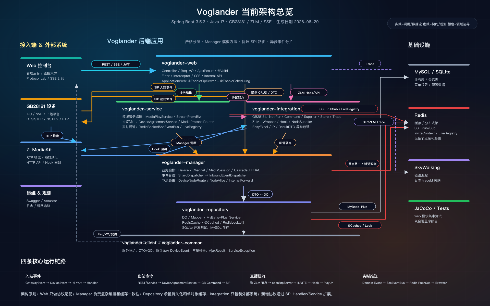
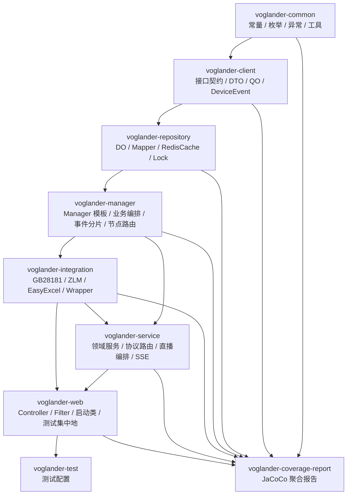
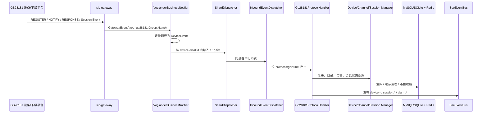
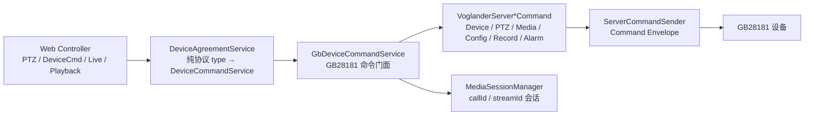
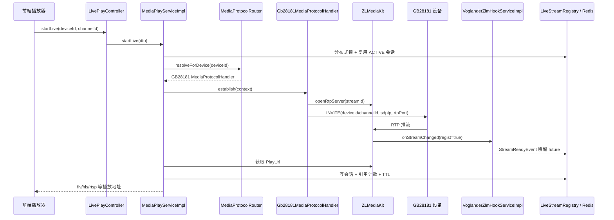
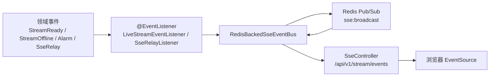

# Voglander 当前架构梳理

> 生成日期：2026-06-29  
> 代码基线：当前工作区源码与根 `pom.xml`  
> 技术基线：Spring Boot 3.5.3 / Java 17 / MyBatis-Plus 3.5.5 / sip-gateway 1.8.6 / ZLM starter 1.0.11

## 一张图看懂

源文件：

- `voglander-architecture-overview.svg`：推荐用于文档、PR、飞书/语雀粘贴，清晰可缩放。
- `voglander-architecture-overview.png`：推荐用于直接预览或截图分享。
- `voglander-system-architecture.dot`：Graphviz 源文件，便于继续生成自动布局版本。

## 架构定位

Voglander 是一个以视频设备接入和媒体流编排为核心的后端平台。整体采用多模块 Maven 工程，运行入口集中在 `voglander-web`，核心能力由 `service / manager / integration / repository` 分层承载。

关键能力可以归纳为四条主线：

| 主线 | 入口 | 核心组件 | 结果 |
| --- | --- | --- | --- |
| 设备入站事件 | GB28181 SIP 网关回调 | `VoglanderBusinessNotifier` → `ShardDispatcher` → `InboundEventDispatcher` → `Gb28181ProtocolHandler` | 注册、心跳、目录、告警、会话状态落库 |
| 平台出站命令 | REST 或业务服务 | `DeviceAgreementService` → `GbDeviceCommandService` → `VoglanderServer*Command` | PTZ、目录查询、INVITE、BYE、配置等 SIP 指令下发 |
| 直播建流 | `/api/v1/live/start` | `MediaPlayService` → `MediaProtocolRouter` → `Gb28181MediaProtocolHandler` → ZLM | 开 RTP 端口、发 INVITE、等待 Hook、返回播放地址 |
| 实时推送 | 领域事件 / Hook / 协议事件 | `SseEventBus` → Redis Pub/Sub → `SseController` | 跨节点实时推送设备、直播、告警、会话事件 |

## Maven 模块关系

> 注：这里按“被依赖 → 依赖方”的方向画，表达上层依赖下层；实际业务回调中 `integration` 会调用 `manager` 完成状态落库。

## 分层职责

| 层 | 模块 | 主要职责 | 关键约束 |
| --- | --- | --- | --- |
| Web | `voglander-web` | REST 入口、参数校验、Req/VO 转换、SSE 订阅、过滤器/拦截器 | 入参用 `*Req`，返回 `AjaxResult`，不直接暴露 DO |
| Service | `voglander-service` | 领域编排、直播建流、协议服务路由、SSE 总线、流业务 | 面向领域流程，复杂逻辑委托 Manager 或 Integration |
| Manager | `voglander-manager` | 业务模板方法、DTO/DO 转换、多服务协调、事件分片、节点亲和路由 | 对外 DTO，统一缓存清理和模板入口 |
| Repository | `voglander-repository` | DO、Mapper、MyBatis-Plus、Redis 缓存、分布式锁 | 单对象缓存优先放 Repository，复杂编排不上移到 Mapper |
| Integration | `voglander-integration` | GB28181、ZLM、EasyExcel 等外部系统包装 | 只做外部系统适配、校验、异常包装，业务状态交给 Manager/Service |
| Common/Client | `voglander-common` / `voglander-client` | 跨层契约、事件模型、DTO/QO、常量枚举、异常 | 保持协议无关和依赖底层化 |

## 设备入站事件链路

### 入站链路设计点

- `VoglanderBusinessNotifier` 是接入 `sip-gateway` 业务层的统一入口，使用 `@Async("sipNotifierExecutor")` 避免阻塞 SIP 线程。
- `ShardDispatcher` 默认 16 分片，按 `deviceId` 优先、`correlationId/callId` 兜底，保证同设备/同会话事件串行。
- `InboundEventDispatcher` 只按 `protocol` 路由，新增协议只需增加 `ProtocolEventHandler` 实现。
- `Gb28181ProtocolHandler` 内部再按 `group/name` 处理生命周期、通知、响应、会话事件。

## 平台出站命令链路

### 出站链路设计点

- `DeviceAgreementService` 构造期收集所有 `DeviceCommandService`，按纯协议 type 建路由表，不再硬编码协议分支。
- `GbDeviceCommandService` 承接 GB28181 门面，负责前端 PTZ 词表翻译、播放/回放/配置/查询等命令委托。
- 媒体类命令通过 `VoglanderServerMediaCommand` 发 INVITE/BYE，并通过 `MediaSessionManager` 维护 `callId` 会话状态。

## 直播建流链路

### 直播链路设计点

- `MediaPlayServiceImpl` 只做媒体编排，不再直接写死 GB28181 细节。
- `MediaProtocolRouter` 按设备协议选择 `MediaProtocolHandler`，目前落地 `Gb28181MediaProtocolHandler`。
- GB28181 建流模型是“ZLM 先开 RTP 端口，平台再发 INVITE，让设备向 ZLM 推 RTP”。
- ZLM `onStreamChanged` Hook 负责唤醒首播等待 future，并同步 stream/session 状态。
- `LiveStreamRegistry` 与 Redis 负责多路复用、引用计数、保活、延迟回收。

## SSE 实时推送链路

### SSE 设计点

- 浏览器通过一条 `EventSource` 长连接订阅多个 topic。
- `RedisBackedSseEventBus` 本地直发 + Redis 广播，支持多节点扇出。
- `originId` 防止本节点 Redis 回环重复投递。
- 15s 心跳维持连接，连接异常自动回收。

## 数据与状态

| 状态类型 | 位置 | 说明 |
| --- | --- | --- |
| 设备/通道/会话/菜单/权限 | MySQL / SQLite | MyBatis-Plus 基础 CRUD，开发默认 SQLite，生产可切 MySQL |
| 单对象缓存 | Redis + `@Cached` | Repository 层单对象 DB 查询缓存 |
| 分布式锁 | RedisLockUtil | 直播首播、关流去重、关键并发流程 |
| INVITE 上下文 | `RedisInviteContextStore` | 多节点时以 `sip:invite:ctx:{callId}` 支撑回包路由 |
| 直播运行态 | `LiveStreamRegistry` + Redis | streamId 会话、引用计数、future、TTL、pending close |
| 设备节点亲和 | Redis `dev:node:*` / `node:alive:*` | 支持多节点命令转发和节点存活判断 |

## 架构原则

1. **分层边界清晰**：Web 只做协议适配和展示模型转换；Manager 负责编排；Repository 负责持久化；Integration 负责外部系统包装。
2. **协议扩展走 SPI**：入站通过 `ProtocolEventHandler`，出站通过 `DeviceCommandService`，媒体通过 `MediaProtocolHandler`。
3. **同设备事件串行**：入站事件分片避免 SIP 线程阻塞，同时保证同设备状态变更顺序。
4. **会话以 `callId` 为核心**：GB28181 INVITE、ACK、BYE、MediaStatus 事件围绕 `MediaSessionManager` 更新状态机。
5. **实时状态事件化**：ZLM Hook、协议事件、业务事件统一转 SSE，实现前端毫秒级感知。
6. **缓存一致性集中处理**：Manager 模板入口统一做校验、日志和缓存清理，避免散落 DB 操作。

## 重点源码入口

| 领域 | 入口文件 |
| --- | --- |
| 应用启动 | `voglander-web/src/main/java/io/github/lunasaw/voglander/web/ApplicationWeb.java` |
| 入站统一回调 | `voglander-integration/src/main/java/io/github/lunasaw/voglander/intergration/wrapper/gb28181/notifier/VoglanderBusinessNotifier.java` |
| 事件分片 | `voglander-manager/src/main/java/io/github/lunasaw/voglander/manager/event/ShardDispatcher.java` |
| 协议入站路由 | `voglander-manager/src/main/java/io/github/lunasaw/voglander/manager/event/InboundEventDispatcher.java` |
| GB28181 事件处理 | `voglander-integration/src/main/java/io/github/lunasaw/voglander/intergration/wrapper/gb28181/handler/Gb28181ProtocolHandler.java` |
| 出站协议路由 | `voglander-service/src/main/java/io/github/lunasaw/voglander/service/command/DeviceAgreementService.java` |
| GB28181 命令门面 | `voglander-service/src/main/java/io/github/lunasaw/voglander/service/command/impl/GbDeviceCommandService.java` |
| 直播编排 | `voglander-service/src/main/java/io/github/lunasaw/voglander/service/live/impl/MediaPlayServiceImpl.java` |
| 媒体协议路由 | `voglander-service/src/main/java/io/github/lunasaw/voglander/service/live/protocol/MediaProtocolRouter.java` |
| GB28181 建流处理 | `voglander-service/src/main/java/io/github/lunasaw/voglander/service/live/protocol/impl/Gb28181MediaProtocolHandler.java` |
| ZLM Hook | `voglander-integration/src/main/java/io/github/lunasaw/voglander/intergration/wrapper/zlm/impl/VoglanderZlmHookServiceImpl.java` |
| SSE 总线 | `voglander-service/src/main/java/io/github/lunasaw/voglander/service/sse/RedisBackedSseEventBus.java` |
| SSE 入口 | `voglander-web/src/main/java/io/github/lunasaw/voglander/web/api/sse/controller/SseController.java` |
| 节点亲和路由 | `voglander-manager/src/main/java/io/github/lunasaw/voglander/manager/routing/DeviceNodeRouteService.java` |
