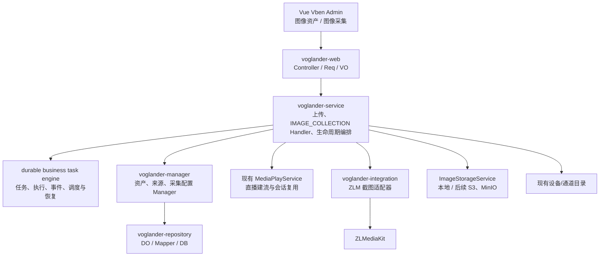
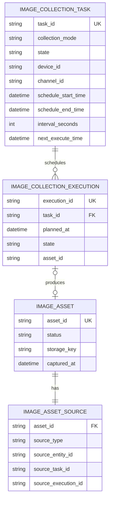
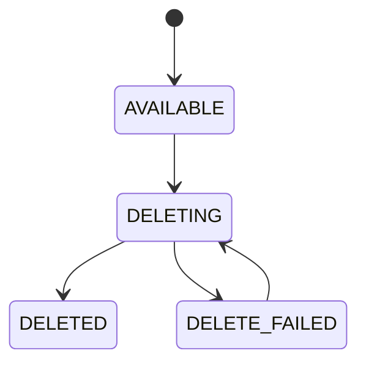
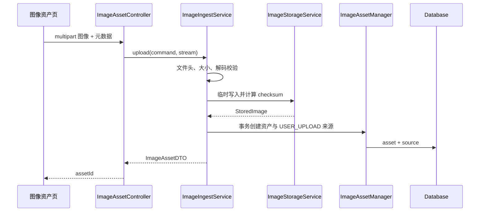
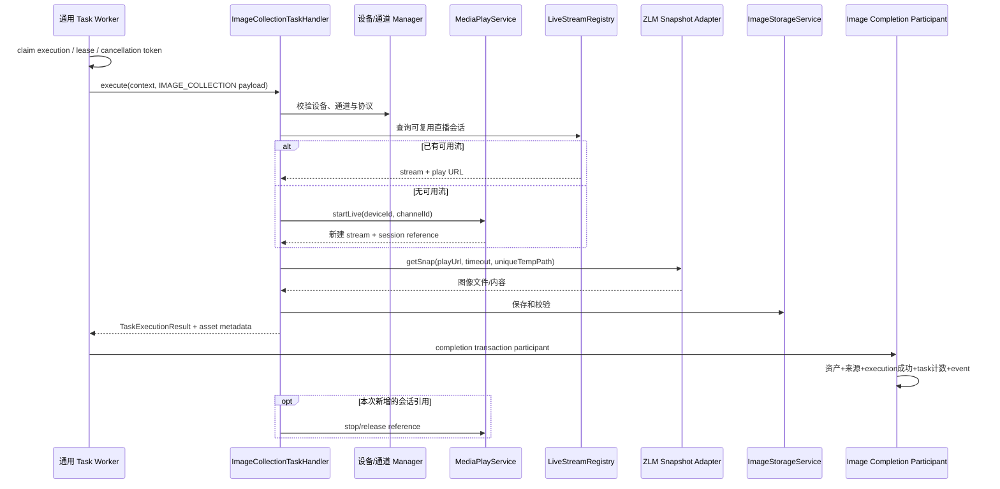

# Voglander 图像资产与采集基础能力设计

> 日期：2026-07-14
>
> 状态：设计已确认，待书面规格复核
>
> 适用仓库：`voglander`、`vue-vben-admin/apps/web-antd`
>
> 上位设计：[SkyEye 人脸可视化搜索平台标准设计](superpowers/specs/2026-07-14-skyeye-face-search-platform-design.md)

## 1. 摘要

本设计在 Voglander 中建设通用图像基础能力，使平台能够统一接入、保存、索引、预览和删除用户上传图像与摄像机采集图像，并为后续 SkyEye 等独立 AI 平台提供稳定的图像查询基础。

2026-07-14 更新：任务、执行、事件、调度、重试、租约、进度、恢复和统一任务中心由 `add-durable-business-task-engine` 提供。本设计只注册 `IMAGE_COLLECTION` Handler、图像 completion participant 和领域配置，不再建设图像专属任务引擎。

第一阶段保持 SkyEye 与 Voglander 独立。Voglander 不实现人脸检测、特征提取、向量检索、搜索任务、轨迹分析或人工复核，只承担以下职责：

1. 统一图像资产索引。
2. 用户图像上传与受控读取。
3. 摄像机单次采集。
4. 摄像机定时采集。
5. 图像元数据、存储引用、来源追踪和删除生命周期。
6. 复用设备管理目录选择采集机位。

前端拆分为两个页面：

- **图像资产**：查询、预览、上传、下载、删除和来源追踪。
- **图像采集**：从现有设备/通道目录选择机位，创建单次或定时采集任务，查看执行记录和采集结果。

图像资产与采集任务严格分离。采集成功才创建资产；采集失败、取消或错过只保留执行记录，不制造失败资产或伪造历史图像。

## 2. 已确认决策

1. SkyEye 继续作为独立平台，Voglander 只建设视频与图像底座。
2. 第一阶段优先建设图像可视化、存储引用、元数据、查询和生命周期基础。
3. 图像模型必须来源无关，支持用户上传、摄像机采集和后续外部导入。
4. 第一阶段所有图像默认永久保存；保留期限策略后续实现，但数据模型和接口预留策略字段。
5. 前端使用两个页面：图像资产、图像采集。
6. 摄像机采集目标复用设备管理的设备/通道目录，不复制第二套设备目录。
7. 采集分为 `ONCE` 单次采集和 `SCHEDULED` 定时采集。
8. 定时采集由机位、开始时间、结束时间和采集间隔定义。
9. 服务停机、任务暂停或调度延迟造成的过期采集点不补采，记录为 `MISSED`。
10. 前端遵循现有 Vue Vben Admin 架构，使用 `Page`、Vben Schema Form、VxeGrid、Ant Design Vue、connected Drawer、`useAccess` 和 i18n。
11. 第一阶段使用存储抽象，默认提供本地文件存储实现，后续可以增加 MinIO/S3 实现。
12. 数据库只保存元数据和存储引用，不保存 Base64 或图像二进制。
13. 直接废弃 `tb_export_task` 及旧 API 的破坏性变更归属于通用任务引擎方案，不在图像域重复处理。

## 3. 背景与现状

### 3.1 可复用能力

Voglander 当前已具备：

- GB28181 设备和通道接入。
- 设备、通道在线状态与目录维护。
- 直播和回放编排。
- ZLMediaKit 节点管理与媒体 Hook。
- `LiveStreamRegistry` 会话复用、引用计数和延迟回收。
- 设备节点亲和和多节点命令转发。
- JWT 用户认证、菜单权限与 `TraceFilter`。
- SSE 实时状态通知。
- SQLite、MySQL、PostgreSQL 初始化脚本。

ZLM 上游依赖已经提供 `ZlmRestService.getSnap` 和 `/zlm/api/snapshot`，因此第一阶段无需重新发明截图协议。Voglander 需要在此基础上增加业务编排、图像存储、资产登记和权限控制，不能将 ZLM 的临时截图 URL 直接作为长期资产 URL。

### 3.2 当前缺口

- 没有通用图像资产表和稳定 `assetId`。
- 没有来源无关的上传/采集接入模型。
- 没有采集任务、时间点执行记录和错过语义。
- 没有受控图像存储抽象。
- 没有统一图像查询和授权内容读取 API。
- 没有图像资产可视化页面。
- ZLM 临时截图文件没有进入 Voglander 资产生命周期。
- 现有 SSE 只适合即时界面通知，不承担可靠调度或任务事实存储。

## 4. 目标与非目标

### 4.1 第一阶段目标

- 上传 JPEG、PNG、WebP 等允许格式并创建图像资产。
- 通过设备/通道目录选择一个机位并立即截图。
- 为一个机位配置开始时间、结束时间和采集间隔。
- 持久化每个计划时间点的执行结果。
- 成功采集后创建图像资产并保留设备/通道快照。
- 按来源、机位、任务、状态和时间查询图像。
- 受控预览和下载图像，不暴露绝对路径或永久公开 URL。
- 手动删除资产并清理存储对象。
- 多节点部署下不重复执行同一采集点。
- 服务恢复后跳过错过的时间点并记录 `MISSED`。
- 前端与现有 Vben Admin 技术和交互模式一致。

### 4.2 非目标

- 不做人脸检测、目标检测或图像内容理解。
- 不提取或保存特征向量。
- 不提供以图搜图或相似度查询。
- 不实现 SkyEye 搜索任务和轨迹。
- 不修改 GB28181、SIP 或 ONVIF 标准行为。
- 不在 SIP notifier、ZLM Hook 或直播建流线程中同步保存图像。
- 第一阶段不实现自动过期策略和保留策略管理页面。
- 第一阶段不实现批量机位采集；一个任务绑定一个机位。
- 第一阶段不实现历史录像指定时刻抽帧。
- 第一阶段不复制设备、通道或组织目录。
- 第一阶段不把本地存储目录暴露成公共静态目录。

## 5. 术语与边界

| 术语 | 定义 |
| --- | --- |
| 图像资产 `ImageAsset` | 已成功接入并可追踪的图像对象，与来源类型无关 |
| 资产来源 `ImageAssetSource` | 描述资产来自用户上传、摄像机采集或外部系统，并保存来源快照 |
| 采集任务 | `taskType=IMAGE_COLLECTION` 的通用业务任务，表达一次采集意图或定时计划 |
| 采集执行 | 通用业务任务执行事实，一个具体计划时间点对应一条 execution |
| 采集配置 `ImageCollectionConfig` | 与通用 taskId 一对一的图像领域配置，只保存机位快照和图像策略 |
| 机位 | 一个可采集画面的设备通道；后续使用稳定 `cameraId`，第一阶段保留 `deviceId + channelId` 显式关系 |
| 存储键 `storageKey` | 存储适配器内部定位图像的相对键，不是绝对路径或公开 URL |
| 计划时间 `plannedAt` | 定时计划定义的理论执行时间 |
| 拍摄时间 `capturedAt` | 实际得到图像内容的时间，不能被 `plannedAt` 替代 |

## 6. 总体架构



### 6.1 分层职责

| 模块 | 职责 | 禁止事项 |
| --- | --- | --- |
| `voglander-web` | 参数校验、Req/DTO 与 DTO/VO 转换、文件流响应 | 不直接访问 Mapper、文件系统或 ZLM |
| `voglander-service` | 上传接入、图像 Handler、媒体会话和存储编排 | 不复制通用调度/租约，不保存 Repository DO |
| `voglander-manager` | 图像 DTO/DO、配置/资产查询、completion participant | 公开接口不返回 DO，不实现通用任务状态转换 |
| `voglander-repository` | 图像资产、来源、任务和执行记录持久化 | 不承载采集调度和媒体业务 |
| `voglander-integration` | ZLM 截图和具体存储提供方适配、异常包装 | 不决定资产状态或任务生命周期 |
| `voglander-client` | 版本化 DTO、命令、查询和 SPI 契约 | 不依赖 Web 模型或 Repository DO |
| `voglander-common` | 枚举、错误码、常量和通用校验 | 不引入媒体或业务编排 |

### 6.2 关键架构原则

1. 资产与任务分离。
2. 设备目录只做机位事实源和目标索引。
3. ZLM 截图结果必须进入 Voglander 存储与资产登记流程。
4. 文件存储和数据库无法共享事务，必须使用临时对象和补偿删除。
5. `plannedAt`、`capturedAt`、`ingestedAt`、`createTime` 语义分离。
6. 所有异步事实落库，SSE 只作为界面增量通知。
7. 同一机位的建流可复用，单次执行和资产仍保持独立。

## 7. 前端可视化方案

### 7.1 技术约束

实现目标为 `vue-vben-admin/apps/web-antd`：

- 页面容器使用 `Page`。
- 查询表单使用 `useVbenForm` 或 `useVbenVxeGrid` 的 schema form。
- 元数据列表使用 `useVbenVxeGrid`。
- 图库使用业务自定义组件，但复用 Ant Design Vue 的 Checkbox、Image、Badge、Pagination、Empty、Skeleton 和 Result。
- 详情、上传和任务表单使用 `useVbenDrawer` connected component。
- 删除确认使用 Ant Design Vue `Modal.confirm` 或现有操作列 Popconfirm。
- 权限使用 `useAccess().hasAccessByCodes`。
- 所有文本进入 i18n，遵循现有 `module.entity.action` 命名。
- API 必须以后端 OpenAPI 为准，禁止前端发明字段。

### 7.2 路由和菜单

建议在“视频资源”或现有“媒体管理”一级菜单下增加：

```text
图像管理
├── 图像资产  /image/assets
└── 图像采集  /image/collection
```

建议权限码：

| 权限码 | 用途 |
| --- | --- |
| `Image:Asset:Query` | 查询资产与读取缩略信息 |
| `Image:Asset:View` | 预览图像内容 |
| `Image:Asset:Upload` | 上传图像 |
| `Image:Asset:Download` | 下载原图 |
| `Image:Asset:Delete` | 删除图像 |
| `Image:Collection:Query` | 查询采集任务和执行记录 |
| `Image:Collection:Create` | 创建单次或定时采集任务 |
| `Image:Collection:Control` | 暂停、恢复和取消任务 |

菜单记录必须同步维护 MySQL、SQLite 两份既有初始化菜单段及 PostgreSQL 脚本，并使现有开发 `app.db` 即时生效。实施该页面时应使用仓库的 `add-menu-page` 流程。

### 7.3 图像资产页面

页面职责：统一索引和管理所有成功接入的图像。

#### 页面区块

1. 顶部态势卡：资产总数、可用数、今日新增、删除失败数。
2. Schema 查询区：名称/ID、来源、设备、通道、任务、所有者、状态、拍摄时间、创建时间。
3. 工具栏：上传、批量选择、删除、刷新、网格/列表切换。
4. 网格视图：缩略图、来源、名称、尺寸、拍摄时间、状态。
5. 列表视图：VxeGrid 展示完整元数据，适合精确管理和导出前的检查。
6. 详情 Drawer：大图、基础元数据、存储信息、来源链路、生命周期和操作。

#### 来源跳转

- 摄像机采集资产：可跳转采集任务、执行记录和设备通道。
- 用户上传资产：显示上传者、原始文件名和上传时间。
- 设备/通道页面：增加“查看图像”动作，携带 `deviceId/channelId` 跳转资产页。

### 7.4 图像采集页面

页面职责：创建和观察采集任务，不承担长期资产管理。

#### 设备目录

- 复用现有设备和通道 API。
- 支持设备懒加载通道、名称/编码查询和在线状态。
- 不创建 `tb_image_camera` 或图像专用摄像机目录。
- 也允许从设备通道列表点击“图像采集”进入本页并预选机位。

#### 页签

1. **单次采集**：选择一个机位，立即创建一次执行。
2. **定时采集**：选择一个机位，设置开始时间、结束时间和间隔。

#### 定时表单即时反馈

- 展示预计采集数量。
- 展示系统最小间隔和最大范围。
- 展示首次执行时间和最后计划时间。
- 时间或间隔非法时禁止提交。

预计数量：

```text
floor((endTime - startTime) / interval) + 1
```

该公式只用于计划预估；最终统计以执行记录为准。

#### 任务列表

- 模式、机位、状态、计划区间、间隔。
- 成功、失败、错过和总计划数。
- 下一次执行时间、最近执行时间。
- 暂停、恢复、取消、查看执行、查看资产。

## 8. 领域模型



### 8.1 `tb_image_asset`

统一图像资产主表，不绑定摄像机。

| 字段 | 逻辑类型 | 约束/说明 |
| --- | --- | --- |
| `id` | BIGINT | 主键 |
| `asset_id` | VARCHAR(64) | 对外稳定 ID，唯一 |
| `asset_name` | VARCHAR(255) | 展示名称 |
| `status` | VARCHAR(32) | 资产生命周期状态 |
| `storage_provider` | VARCHAR(32) | `LOCAL`、后续 `S3/MINIO` |
| `storage_bucket` | VARCHAR(128) | 本地实现可空 |
| `storage_key` | VARCHAR(512) | 内部相对键，禁止绝对路径 |
| `content_type` | VARCHAR(64) | 如 `image/jpeg` |
| `image_format` | VARCHAR(32) | `JPEG/PNG/WEBP` |
| `file_size` | BIGINT | 字节数 |
| `width` | INTEGER | 像素 |
| `height` | INTEGER | 像素 |
| `checksum_algorithm` | VARCHAR(32) | 第一阶段 `SHA256` |
| `checksum` | VARCHAR(128) | 内容校验值 |
| `captured_at` | DATETIME | 图像实际产生时间 |
| `ingested_at` | DATETIME | 完成资产接入时间 |
| `owner_type` | VARCHAR(32) | `USER/SYSTEM/SERVICE` |
| `owner_id` | VARCHAR(64) | 所有者 ID |
| `organization_id` | VARCHAR(64) | 组织隔离预留 |
| `idempotency_key` | VARCHAR(128) | 上传请求幂等键；摄像机资产为空 |
| `retention_policy` | VARCHAR(64) | 第一阶段固定 `PERMANENT` |
| `expires_at` | DATETIME | 第一阶段为空 |
| `deleted_at` | DATETIME | 实际删除完成时间 |
| `delete_reason` | VARCHAR(255) | 删除原因 |
| `failure_code` | VARCHAR(64) | 删除失败时使用 |
| `failure_message` | VARCHAR(512) | 脱敏错误摘要 |
| `version` | INTEGER | 乐观锁 |
| `create_time` | DATETIME | 创建时间 |
| `update_time` | DATETIME | 更新时间 |

索引：

- `UNIQUE(asset_id)`
- `INDEX(status, create_time)`
- `INDEX(captured_at, asset_id)`
- `INDEX(owner_id, create_time)`
- `UNIQUE(owner_id, idempotency_key)`，只对非空上传幂等键生效，三种数据库分别实现/验证
- `INDEX(checksum)`，只用于运维核验，第一阶段不自动按 checksum 去重

资产状态：



只有成功接入的图像进入资产主表。上传或采集失败不创建 `FAILED` 资产。

### 8.2 `tb_image_asset_source`

| 字段 | 逻辑类型 | 约束/说明 |
| --- | --- | --- |
| `id` | BIGINT | 主键 |
| `asset_id` | VARCHAR(64) | 唯一外键语义，一项资产一条主来源 |
| `source_type` | VARCHAR(32) | `USER_UPLOAD/CAMERA_CAPTURE/EXTERNAL_IMPORT` |
| `source_system` | VARCHAR(64) | `VOGLANDER_WEB/VOGLANDER_CAPTURE/...` |
| `source_entity_type` | VARCHAR(32) | `USER/CAMERA/EXTERNAL_OBJECT` |
| `source_entity_id` | VARCHAR(128) | 用户 ID、稳定机位 ID或外部对象 ID |
| `source_task_id` | VARCHAR(64) | 摄像机采集时使用 |
| `source_execution_id` | VARCHAR(64) | 摄像机采集时使用 |
| `original_filename` | VARCHAR(255) | 用户上传时的脱敏文件名 |
| `source_metadata` | TEXT/JSON | 来源事实快照，统一以 FastJSON2 处理 |
| `create_time` | DATETIME | 创建时间 |

索引：

- `UNIQUE(asset_id)`
- `INDEX(source_type, create_time)`
- `INDEX(source_entity_type, source_entity_id, create_time)`
- `INDEX(source_task_id)`
- `UNIQUE(source_execution_id)`，空值行为需按三种数据库分别验证

摄像机来源快照示例：

```json
{
  "cameraId": "camera_001",
  "deviceId": "34020000001320000001",
  "channelId": "34020000001320000002",
  "deviceName": "东门设备",
  "channelName": "东门主通道",
  "protocol": "gb28181",
  "mediaNodeId": "zlm-node-1",
  "streamId": "stream-001"
}
```

### 8.3 `tb_image_collection_config`

| 字段 | 逻辑类型 | 约束/说明 |
| --- | --- | --- |
| `id` | BIGINT | 内部主键 |
| `task_id` | VARCHAR(64) | 通用 `IMAGE_COLLECTION` taskId，唯一 |
| `device_id` / `channel_id` | VARCHAR(64) | 明确机位事实 |
| `device_name_snapshot` / `channel_name_snapshot` | VARCHAR(255) | 创建时展示快照 |
| `retention_policy` | VARCHAR(64) | 第一阶段 `PERMANENT` |
| `capture_options` | TEXT | 版本化 FastJSON2 JSON，不含 secret/path |
| `version` | INTEGER | 乐观锁 |
| `create_time` / `update_time` | DATETIME | 审计时间 |

约束：`UNIQUE(task_id)`、`INDEX(device_id,channel_id,create_time)`。名称、模式、计划、状态、进度、计数、owner、幂等、重试和租约均保存于通用任务三表，配置表不得复制。

### 8.4 通用任务、执行和事件

本设计不再新增 `tb_image_collection_task` 或 `tb_image_collection_execution`。任务、执行和审计事件分别使用 `tb_biz_task`、`tb_biz_task_execution`、`tb_biz_task_event`；来源表以通用 executionId 唯一关联资产。

## 9. 通用状态机与图像 Handler

### 9.1 创建与调度

- ONCE 创建 image config 和一个通用 ONCE task/first execution。
- SCHEDULED 先通过图像最小间隔/范围校验，再映射为通用 FIXED_RATE。
- cursor、MISSED、暂停、恢复、取消、终态和人工 retry 完全由通用内核处理。

### 9.2 IMAGE_COLLECTION Handler

通用 Worker claim 后调用 Handler。Handler 负责读取 config、复验机位、取得直播引用、截图、验证、存储和错误分类；通用内核负责队列、CAS、租约、attempt、deadline、backoff、进度和事件。Handler 在阶段边界检查 cancellation token，并在 finally 精确释放媒体引用和临时文件。

### 9.3 原子完成

Handler 返回图像结果后，`ImageCollectionCompletionParticipant` 在通用完成事务内幂等插入资产和来源；随后内核更新 execution SUCCEEDED、task 计数/进度/终态与 success event。任一步失败整体回滚，Worker 在事务外补偿已 promotion 的存储对象。

## 10. 调度设计

### 10.1 基础约束

第一阶段建议默认值，可通过配置调整：

| 配置 | 默认值 | 说明 |
| --- | --- | --- |
| 最小采集间隔 | 30 秒 | 防止错误配置压垮媒体服务 |
| 单任务最长区间 | 7 天 | 控制计划规模 |
| 单任务最大计划数 | 10,000 | 创建时校验 |
| 允许调度延迟 | 30 秒 | 超出后记 `MISSED` |
| 单次执行最大重试 | 2 次 | 仅对明确可重试错误 |
| 调度扫描周期 | 5 秒 | 扫描到期任务 |
| 调度批量 | 100 | 每轮上限 |

### 10.2 固定时间基准

下一计划点必须使用：

```text
nextPlannedAt = previousPlannedAt + interval
```

禁止使用：

```text
nextPlannedAt = now + interval
```

否则执行延迟会不断累积，造成计划漂移。

### 10.3 多节点防重

1. 按 `state + next_execute_time` 查询到期任务。
2. 获取 `image:collection:task:{taskId}` 分布式锁。
3. 锁内重新读取任务并校验版本和 `nextExecuteTime`。
4. 使用 `UNIQUE(task_id, schedule_version, planned_at)` 创建执行记录。
5. 唯一冲突表示其他节点已创建，当前节点跳过。
6. 推进 `nextExecuteTime` 和任务版本。
7. 提交事务后，将 `PENDING` 执行交给独立执行线程池。

分布式锁降低竞争，数据库唯一约束提供最终正确性。不能只依赖进程内锁或定时器本地状态。

### 10.4 服务恢复与错过处理

服务恢复时：

1. 读取 `nextExecuteTime`。
2. 若 `now - nextExecuteTime` 超过允许延迟窗口，该计划点为 `MISSED`。
3. 根据固定时间基准计算未来第一个计划点。
4. 对错过区间生成可审计记录；若数量过大，可按批次写入，但每个计划点仍需具备唯一事实。
5. 不调用截图接口，不创建资产。
6. 从未来第一个计划点继续。

暂停期间的时间点同样记录 `MISSED`，或者在暂停动作时预先推进到恢复后的第一个未来点。第一阶段统一采用“恢复时补写 `MISSED`”，便于统计计划覆盖率。

### 10.5 修改语义

第一阶段不允许直接修改运行中计划的机位。时间范围或间隔变更采用：

1. 暂停任务。
2. 校验新计划。
3. `scheduleVersion + 1`。
4. 从新版本的首个未来计划点继续。
5. 已执行记录保持原版本，不被重写。

## 11. 图像存储设计

### 11.1 存储接口

建议在稳定下层契约中定义：

```java
public interface ImageStorageService {
    StoredImage save(ImageSaveCommand command);
    ImageContent load(String storageKey);
    void delete(String storageKey);
    boolean exists(String storageKey);
}
```

第一阶段实现 `LocalImageStorageService`，后续扩展 `S3ImageStorageService` 或 `MinioImageStorageService`。

### 11.2 本地目录

```text
{root}/
└── images/
    └── 2026/
        └── 07/
            └── 14/
                └── {assetId}.jpg
```

- 数据库只保存 `images/2026/07/14/{assetId}.jpg`。
- 根目录来自配置，不进入源码。
- 根目录不位于 Web 静态资源目录。
- 存储键由服务生成，不使用原始文件名。
- 写入使用临时文件、校验、原子移动。
- 必须防止 `..`、绝对路径、符号链接逃逸和路径穿越。

### 11.3 文件与数据库一致性

上传或截图成功后的接入顺序：

1. 将内容写入临时存储键。
2. 校验 MIME、格式、宽高、大小和 SHA-256。
3. 移动为正式存储键。
4. 在一个数据库事务中写 `ImageAsset` 与 `ImageAssetSource`。
5. 数据库事务失败时补偿删除正式对象。
6. 补偿删除失败时记录告警和孤儿对象清理任务。

删除顺序：

1. `AVAILABLE → DELETING`。
2. 删除存储对象，操作必须幂等。
3. 成功后 `DELETING → DELETED`。
4. 失败后 `DELETING → DELETE_FAILED`，保留错误摘要并允许重试。

不能先物理删除数据库记录，否则存储删除失败后无法追踪孤儿对象。

### 11.4 第一阶段生命周期

- 所有资产写入 `retentionPolicy=PERMANENT`。
- `expiresAt=NULL`。
- 支持用户手动删除和管理员删除。
- 保留策略接口不对普通用户开放。
- 后续增加策略时无需迁移资产来源和存储模型。

## 12. 图像接入

### 12.1 用户上传



上传安全：

- 限制单文件大小和请求频率。
- MIME 声明与魔数双重验证。
- 实际解码验证宽高，防止伪装文件。
- 第一阶段允许 JPEG、PNG、WebP；禁止 SVG。
- 设置最大像素数量，防止解压炸弹。
- 日志不记录文件内容、Base64 或完整敏感文件名。
- 原始文件名只作展示，必须去路径并限制长度。

### 12.2 摄像机采集



关键约束：

- ZLM 返回的临时 URL/路径不是资产 URL。
- 截图适配器必须产生唯一临时路径，完成后清理。
- 设备离线、通道不存在或首播超时要返回稳定失败码。
- 不在 SIP notifier、ZLM Hook 或直播首播线程中执行图像存储。
- `capturedAt` 在截图实际成功时记录。
- 无论成功或失败，都要在 `finally` 中释放本次增加的媒体引用。
- 已有直播的其他消费者不受采集任务结束影响。

### 12.3 同机位并发

- 使用现有直播会话锁和引用计数合并建流。
- 可增加 `image:capture:camera:{cameraKey}` 机位级短锁限制并行截图。
- 多个执行可复用一个直播流，但每个执行生成独立图像与独立 assetId。
- 第一阶段不做相同时间点的内容级去重。

## 13. API 设计

所有时间 Web 字段遵循现有约定使用 Unix 毫秒；DO/DTO 内部使用 `LocalDateTime`。写接口支持 `Idempotency-Key`，响应继续使用现有 `AjaxResult` 并由 `TraceFilter` 返回 trace header。

### 13.1 图像资产

| 方法 | 路径 | 权限 | 用途 |
| --- | --- | --- | --- |
| `POST` | `/api/v1/images/uploads` | `Image:Asset:Upload` | multipart 上传图像 |
| `POST` | `/api/v1/images/getPage` | `Image:Asset:Query` | 分页查询资产 |
| `GET` | `/api/v1/images/{assetId}` | `Image:Asset:Query` | 查询元数据和来源 |
| `GET` | `/api/v1/images/{assetId}/content` | `Image:Asset:View` | 授权读取图像内容 |
| `GET` | `/api/v1/images/{assetId}/download` | `Image:Asset:Download` | 下载原图 |
| `DELETE` | `/api/v1/images/{assetId}` | `Image:Asset:Delete` | 幂等删除 |
| `POST` | `/api/v1/images/{assetId}/delete:retry` | `Image:Asset:Delete` | 重试删除失败资产 |

分页查询条件：

```json
{
  "assetId": null,
  "assetName": null,
  "sourceType": "CAMERA_CAPTURE",
  "deviceId": null,
  "channelId": null,
  "sourceTaskId": null,
  "sourceExecutionId": null,
  "ownerId": null,
  "status": "AVAILABLE",
  "capturedStartTime": null,
  "capturedEndTime": null,
  "createStartTime": null,
  "createEndTime": null
}
```

默认排序：`capturedAt DESC, assetId DESC`。删除记录默认不返回，管理员可显式查询。

图像内容响应：

- `Content-Type` 使用已验证 MIME。
- `ETag` 使用 checksum。
- `Cache-Control: private`。
- 预览使用 `Content-Disposition: inline`。
- 下载使用脱敏后的 `Content-Disposition: attachment`。
- 前端通过鉴权请求取得 Blob URL，使用后调用 `URL.revokeObjectURL`。

### 13.2 采集任务

| 方法 | 路径 | 权限 | 用途 |
| --- | --- | --- | --- |
| `POST` | `/api/v1/image-collection-tasks` | `Image:Collection:Create` | 创建单次或定时任务 |
| `POST` | `/api/v1/image-collection-tasks/getPage` | `Image:Collection:Query` | 分页查询任务 |
| `GET` | `/api/v1/image-collection-tasks/{taskId}` | `Image:Collection:Query` | 任务详情 |
| `POST` | `/api/v1/image-collection-tasks/{taskId}:pause` | `Image:Collection:Control` | 暂停定时任务 |
| `POST` | `/api/v1/image-collection-tasks/{taskId}:resume` | `Image:Collection:Control` | 恢复定时任务 |
| `POST` | `/api/v1/image-collection-tasks/{taskId}:cancel` | `Image:Collection:Control` | 取消任务 |
| `POST` | `/api/v1/image-collection-tasks/{taskId}:reschedule` | `Image:Collection:Control` | 产生新调度版本 |

单次采集请求：

```json
{
  "taskName": "东门立即截图",
  "collectionMode": "ONCE",
  "deviceId": "34020000001320000001",
  "channelId": "34020000001320000002",
  "retentionPolicy": "PERMANENT"
}
```

定时采集请求：

```json
{
  "taskName": "东门每五分钟采集",
  "collectionMode": "SCHEDULED",
  "deviceId": "34020000001320000001",
  "channelId": "34020000001320000002",
  "scheduleStartTime": 1784023200000,
  "scheduleEndTime": 1784052000000,
  "intervalSeconds": 300,
  "retentionPolicy": "PERMANENT"
}
```

### 13.3 执行记录

| 方法 | 路径 | 权限 | 用途 |
| --- | --- | --- | --- |
| `POST` | `/api/v1/image-collection-executions/getPage` | `Image:Collection:Query` | 查询执行记录 |
| `GET` | `/api/v1/image-collection-executions/{executionId}` | `Image:Collection:Query` | 执行详情 |
| `POST` | `/api/v1/image-collection-executions/{executionId}:retry` | `Image:Collection:Control` | 人工重试可重试失败，不适用于 `MISSED` |

### 13.4 幂等

- 上传：`Idempotency-Key + ownerId` 唯一，重复请求返回原 assetId。
- 创建任务：`Idempotency-Key + ownerId` 唯一，重复请求返回原 taskId。
- 暂停、恢复、取消：目标状态已满足时返回成功。
- 删除：`DELETED` 再次删除返回成功。
- 执行创建：数据库唯一约束防止重复计划点。

上传幂等键持久化在资产表，任务创建幂等键持久化在任务表。Redis 只允许作为查询加速，不能作为幂等事实源。未携带 `Idempotency-Key` 的写请求按现有客户端兼容策略执行，但前端和后续服务调用必须始终携带该请求头。

## 14. 设备目录集成

### 14.1 复用方式

图像采集页面读取现有设备分页与通道查询 API，前端组合为懒加载目录：

```text
设备节点
└── 通道节点（机位）
```

如果现有 API 无法满足懒加载和搜索，只在设备领域增加通用目录查询 DTO/API，不在图像领域新建目录表。

### 14.2 稳定身份演进

第一阶段创建任务必须显式传递 `deviceId + channelId`，禁止通过字符串拼接或前缀推断归属。数据模型预留 `cameraId`：

1. 资源目录完成前，`sourceEntityId` 使用规范化的内部机位键。
2. 资源目录完成后，新任务以 `cameraId` 为主，仍保存协议 ID 快照。
3. 历史任务不回写或重解释设备编码。

### 14.3 快照语义

任务和资产来源保存创建/采集时的设备与通道名称。设备后续改名、迁移或删除不修改历史资产来源快照。

## 15. 错误、重试与降级

### 15.1 稳定错误码

建议补充 `ServiceExceptionEnum`：

| 错误码 | HTTP | 可重试 | 场景 |
| --- | --- | --- | --- |
| `IMAGE_FILE_TYPE_UNSUPPORTED` | 400 | 否 | 不允许格式 |
| `IMAGE_FILE_TOO_LARGE` | 413 | 否 | 超出大小 |
| `IMAGE_DECODE_FAILED` | 400 | 否 | 文件不是有效图像 |
| `IMAGE_PIXEL_LIMIT_EXCEEDED` | 400 | 否 | 像素过大 |
| `IMAGE_ASSET_NOT_FOUND` | 404 | 否 | 资产不存在 |
| `IMAGE_STORAGE_WRITE_FAILED` | 503 | 是 | 存储写入失败 |
| `IMAGE_STORAGE_READ_FAILED` | 503 | 是 | 存储读取失败 |
| `IMAGE_STORAGE_DELETE_FAILED` | 503 | 是 | 存储删除失败 |
| `IMAGE_COLLECTION_TASK_NOT_FOUND` | 404 | 否 | 任务不存在 |
| `IMAGE_COLLECTION_STATE_CONFLICT` | 409 | 否 | 状态不允许该操作 |
| `IMAGE_COLLECTION_SCHEDULE_INVALID` | 400 | 否 | 时间范围或间隔非法 |
| `IMAGE_COLLECTION_LIMIT_EXCEEDED` | 400 | 否 | 预计数量超限 |
| `IMAGE_COLLECTION_EXECUTION_MISSED` | 409 | 否 | 错过点禁止重试为历史图像 |
| `IMAGE_CAMERA_NOT_FOUND` | 404 | 否 | 设备或通道不存在 |
| `IMAGE_CAMERA_OFFLINE` | 409 | 是 | 机位离线 |
| `IMAGE_STREAM_ESTABLISH_TIMEOUT` | 504 | 是 | 建流超时 |
| `IMAGE_SNAPSHOT_FAILED` | 502 | 是 | ZLM 截图失败 |

### 15.2 重试策略

- 设备离线：本次执行失败，不在同一时间点无限等待；下个计划点照常执行。
- 建流超时：指数退避，最多两次且不得跨越允许执行窗口。
- 存储短暂失败：有限重试，成功前不创建资产。
- 参数、格式、权限错误：不可重试。
- `MISSED`：不可重试；用户可主动创建新的单次任务，但其 `capturedAt` 是新时间。
- 删除失败：进入 `DELETE_FAILED`，支持后台和人工重试。

### 15.3 部分完成

定时任务单点失败不终止整个任务。页面持续显示：

```text
plannedCount / successCount / failedCount / missedCount
```

不能把包含失败或错过的任务显示为完全完成。

## 16. 安全与权限

- 上传、预览、下载、删除和采集分别授权。
- 查询需按所有者/组织和设备权限过滤，不能只隐藏前端按钮。
- 内容读取前再次校验资产访问权限。
- 存储根目录不公开映射。
- 不在响应中返回 `storageKey`、绝对路径、ZLM secret 或永久内部 URL。
- 日志不记录图像内容、Base64、完整签名 URL或敏感查询样本。
- `sourceMetadata` 输出前做字段白名单，不直接透传所有内部信息。
- 上传文件名不参与路径生成。
- 删除、下载、采集创建和任务控制记录操作者、traceId 和目标资源。
- 第一阶段可沿用现有 JWT；后续对 SkyEye 开放时增加服务身份，不复用用户浏览器 token。

## 17. 配置

建议配置结构：

```yaml
voglander:
  image:
    upload:
      max-file-size: 20MB
      max-pixels: 40000000
      allowed-formats: jpeg,png,webp
    storage:
      provider: local
      local:
        root: ${VOGLANDER_IMAGE_ROOT:./data/images}
    collection:
      scheduler-enabled: true
      scan-interval-ms: 5000
      batch-size: 100
      allowed-delay-seconds: 30
      min-interval-seconds: 30
      max-duration-days: 7
      max-planned-count: 10000
      max-attempts: 2
      executor-core-size: 4
      executor-max-size: 16
```

生产环境必须将本地根目录放在持久卷，并设置磁盘容量告警。多实例使用本地存储时无法在任意节点读取同一资产，因此：

- 单机/开发环境可使用 `LOCAL`。
- 多节点生产必须使用共享文件系统或 S3/MinIO 类对象存储。
- 若暂时使用节点本地盘，资产必须保存 `storageNodeId` 并路由读取；本设计不推荐将其作为长期生产方案。

## 18. 可观测性

### 18.1 指标

- `image_asset_total{source,status}`
- `image_upload_total{result}`
- `image_upload_bytes_total`
- `image_collection_task_total{mode,state}`
- `image_collection_execution_total{state,failure_code}`
- `image_collection_execution_duration_seconds`
- `image_snapshot_duration_seconds`
- `image_storage_operation_duration_seconds{operation,provider}`
- `image_storage_delete_failed_total`
- `image_scheduler_lag_seconds`
- `image_collection_missed_total`

### 18.2 日志上下文

关键日志统一带：

```text
traceId, taskId, executionId, assetId, deviceId, channelId, mediaNodeId
```

不得记录图片内容、向量、完整文件路径或 secret。

### 18.3 SSE

前端可订阅以下即时事件：

- `image.asset.created`
- `image.asset.deleted`
- `business.task.state`
- `business.task.progress`
- `business.task.execution-state`

SSE 用于刷新当前页，不作为任务事实源。断线后页面必须重新查询任务和资产快照。

## 19. 模块改动规划

以下为实施规划阶段的包级建议，最终文件清单应在 TDD 实施计划中逐项确认。

### 19.1 `voglander-common`

- 图像来源、资产状态、采集模式、存储类型枚举；任务/执行状态复用通用模块。
- 图像错误码和每机位 guard 常量；任务错误码和锁复用通用模块。

### 19.2 `voglander-client`

- `ImageAssetDTO`、`ImageAssetSourceDTO`。
- `ImageCollectionConfigDTO`、enriched task query DTO 和 `IMAGE_COLLECTION` payload/result。
- 上传、采集创建和领域查询 command/query DTO；状态控制/执行 DTO 复用通用模块。
- `ImageStorageService`、`MediaSnapshotAdapter` 等稳定 SPI。

### 19.3 `voglander-repository`

- 资产、来源、采集配置三张表的 DO、Mapper 和必要 XML。
- 图像组合分页查询；调度扫描和状态条件更新由通用任务 Repository 提供。
- 不缓存图像二进制。

### 19.4 `voglander-manager`

- `ImageAssetManager`。
- `ImageAssetSourceManager`。
- `ImageCollectionConfigManager`。
- `ImageCollectionCompletionParticipant`。
- Assembler 和条件化 LambdaQueryWrapper。
- 资产状态使用条件更新；任务状态使用通用 Manager。

### 19.5 `voglander-service`

- `ImageIngestService`：用户上传接入。
- `ImageCollectionApplicationService`：领域创建和 enriched 查询门面。
- `ImageCollectionTaskHandler`：单点截图、错误分类和协作取消。
- 通用 Scheduler/Dispatcher/Worker/Lease Recovery，不新增 image executor。
- `ImageAssetLifecycleService`：手动删除和删除重试。

### 19.6 `voglander-integration`

- `ZlmMediaSnapshotAdapter`：包装 `ZlmRestService.getSnap`。
- `LocalImageStorageService`。
- 通过统一 Wrapper 异常处理，不混入资产业务状态。

### 19.7 `voglander-web`

- 图像资产 Controller、Req、VO、Assembler。
- 图像采集创建/enriched 查询 Controller、Req、VO、Assembler；控制/执行复用通用 task API。
- 图像内容流响应和权限校验。
- OpenAPI 注解。

### 19.8 `sql/`

同步维护：

- `voglander.sql`
- `voglander-sqlite.sql`
- `voglander-postgresql.sql`

包含三张图像表、索引、菜单、按钮权限和角色授权；通用三表与 `tb_export_task` 删除由前置方案维护。

### 19.9 `vue-vben-admin/apps/web-antd`

建议新增：

```text
src/api/image/
src/views/image/assets/
  list.vue
  data.ts
  modules/asset-detail.vue
  modules/upload-drawer.vue
  components/asset-gallery.vue
src/views/image/collection/
  list.vue
  data.ts
  modules/task-drawer.vue
  modules/execution-drawer.vue
  components/device-channel-tree.vue
src/router/routes/modules/image.ts
src/locales/langs/{zh-CN,en-US}/image.json
```

具体命名以现有 API 代码生成和目录约定为准。

## 20. TDD 测试方案

所有 Java 测试放在：

```text
voglander-web/src/test/java/io/github/lunasaw/voglander
```

### 20.1 Repository/Manager

- 创建资产与来源同事务成功。
- 来源保存用户上传和摄像机快照。
- assetId、taskId、executionId 唯一约束。
- 同任务、版本、计划点不重复。
- 按来源、机位、任务和时间分页查询。
- 乐观锁和状态条件更新拒绝非法并发转换。
- SQLite、MySQL、PostgreSQL 索引和空值唯一行为验证。

### 20.2 上传服务

- JPEG、PNG、WebP 成功。
- 扩展名与魔数不一致失败。
- 非图像、超大文件、超大像素失败。
- 存储成功后数据库失败执行补偿删除。
- checksum、宽高、大小正确。
- 原始文件名无法路径穿越。
- 重复幂等键返回同一资产。

### 20.3 单次采集

- 已有直播会话时复用。
- 无会话时成功建流、截图、存储和登记。
- 执行成功关联唯一资产。
- 设备离线、通道不存在、建流超时和截图失败。
- 失败不创建资产。
- 所有分支释放本次增加的直播引用。
- 不关闭其他消费者仍在使用的直播。

### 20.4 定时调度

- 预计数量计算边界。
- 固定计划基准不漂移。
- 多节点竞争只创建一条执行。
- 服务恢复后过期点为 `MISSED`，不调用截图。
- 暂停、恢复、取消状态机。
- 单点失败后下个计划点继续。
- 全成功、部分成功、全失败的任务终态。
- 新调度版本不修改历史执行。

异步、定时和 HTTP 测试不得依赖 `@Transactional` 回滚，使用唯一业务键并显式清理。

### 20.5 生命周期

- 手动删除成功。
- 重复删除幂等。
- 存储不存在视为幂等成功。
- 删除失败进入 `DELETE_FAILED`。
- 重试成功进入 `DELETED`。
- 已删除资产不能读取内容。

### 20.6 Controller

- Req 校验、权限拒绝、DTO 转换和 Web 时间戳。
- 图像内容响应的 MIME、ETag、Cache-Control、Content-Disposition。
- storageKey 和绝对路径不出现在 VO。
- 非所有者/无设备权限用户不能读取或采集。

### 20.7 前端

- 查询条件到 API 参数映射。
- 图库/列表切换保持查询状态。
- Blob URL 创建和销毁。
- 上传校验和进度。
- 单次/定时表单条件校验。
- 预计数量计算。
- 状态按钮权限和状态条件。
- 从设备通道、任务和资产之间正确跳转。
- SSE 增量事件后刷新，断线重连后重新查询快照。

### 20.8 E2E

- 本地视频推流到 ZLM，Voglander 建流后真实截图。
- 上传真实图像并预览。
- 定时任务产生多张资产。
- 模拟设备离线产生失败执行，恢复后后续计划点成功。
- 停止应用越过计划点，重启后生成 `MISSED` 且不补拍。
- 删除资产后文件不可访问。

## 21. 验收标准

### 21.1 功能验收

- 用户可以上传允许格式的图像并在资产页预览。
- 用户可以从设备/通道目录选择机位并立即截图。
- 用户可以创建指定开始、结束和间隔的定时采集任务。
- 任务执行成功后资产页可按任务和机位查询图像。
- 采集失败只产生失败执行记录。
- 停机错过的采集点标记 `MISSED`，无补拍资产。
- 资产详情可追踪来源任务、执行和设备通道快照。
- 用户可以手动删除资产，删除失败可重试。

### 21.2 架构验收

- 未修改 GB28181/SIP 标准行为。
- SIP notifier、ZLM Hook 和直播建流线程不执行图像保存。
- 设备目录未复制到图像模块。
- Web 未直接访问 Mapper、文件系统或 ZLM。
- Manager API 未暴露 DO。
- 数据库无 Base64 或图像 BLOB。
- 前端使用现有 Vben/Ant Design/VxeGrid/Drawer/权限/i18n 模式。

### 21.3 可靠性验收

- 多节点并发不产生重复计划执行。
- 调度延迟不导致计划漂移。
- 任何失败不会生成伪历史图像。
- 文件与数据库失败具备补偿和可追踪状态。
- 图像内容接口不泄露存储路径。

### 21.4 构建门控

- 目标测试全部通过。
- `mvn clean compile` 通过。
- 受影响 Java 测试通过。
- 三种数据库脚本验证通过。
- `pnpm check:type` 或目标应用 typecheck 通过。
- `pnpm lint` 通过。
- `pnpm build:antd` 通过。
- 真实 ZLM 截图链路 E2E 通过。

## 22. 分阶段实施顺序

### 阶段 0：契约与可运行 POC

- 确认 ZLM `getSnap` 对现有直播 URL 的真实行为。
- 以一条在线 GB28181 通道完成手工建流和截图。
- 固化 OpenAPI、状态枚举、错误码和配置项。
- 定义成功与失败验收样本。

退出条件：真实截图文件可校验，临时文件可清理，未修改协议链路。

### 阶段 0：通用任务前置

- 完成 `add-durable-business-task-engine` 的三表、Handler SPI、任务中心、统一 API 和严格校验。
- 直接删除 `tb_export_task`、旧 ExportTask 代码和 API。
- 以无生产 Handler 状态验证 scheduler/dispatcher/lease 和回滚门禁。

退出条件：通用任务变更 apply-ready 且核心验收通过。

### 阶段 1：图像资产与本地存储

- 三种数据库脚本同步增加资产和来源表。
- 本地存储抽象。
- 上传、查询、预览、下载和删除 API。
- 图像资产前端页面。

退出条件：用户上传图像闭环通过，删除无孤儿文件。

### 阶段 2：单次采集

- 图像采集配置表和通用 ONCE task 接入。
- 设备目录选择。
- ZLM 截图适配。
- 媒体会话复用和释放。
- 单次采集前端流程。

退出条件：在线、离线、首播超时和截图失败场景均有真实证据。

### 阶段 3：定时采集

- 通用 FIXED_RATE 调度、多节点防重和执行线程池联调。
- 复用通用暂停、恢复、取消、新调度版本、`MISSED` 和恢复扫描。
- 定时采集页面和统计。

退出条件：无重复执行、无时间漂移、停机恢复不补拍。

### 阶段 4：安全、运维与加固

- 完整权限和审计。
- 指标、告警、孤儿文件扫描和容量监控。
- 压测与故障注入。
- 多节点对象存储适配 POC。

退出条件：满足生产试点门控。

### 后续阶段

- 生命周期策略配置与自动过期。
- MinIO/S3。
- 历史录像按时间点截图。
- 多机位批量采集。
- 稳定 `cameraId` 资源目录。
- 服务身份和 SkyEye 薄桥接。

## 23. 风险与缓解

| 风险 | 影响 | 缓解措施 |
| --- | --- | --- |
| 本地存储在多节点不可共享 | 任意节点无法读取资产 | 开发使用本地；生产使用共享存储/对象存储 |
| 定时采集造成频繁建流 | 设备、SIP 和 ZLM 压力 | 复用直播、最小间隔、机位级并发限制、容量指标 |
| ZLM 截图临时文件残留 | 磁盘泄漏 | 唯一临时目录、finally 清理、孤儿扫描 |
| 文件成功而数据库失败 | 孤儿对象 | 正式写入后事务登记，失败补偿删除 |
| 多节点重复调度 | 重复截图和资产 | 分布式锁 + 唯一约束 + 条件状态更新 |
| 系统停机后补拍产生伪历史 | 时间语义错误 | 统一 `MISSED`，禁止补拍和重试错过点 |
| 设备改名或删除后来源漂移 | 历史不可追溯 | 保存设备/通道来源快照 |
| 上传恶意或超大图像 | 内存/CPU/安全风险 | 魔数、解码、像素、大小、格式和限流校验 |
| 默认永久保存造成磁盘增长 | 容量耗尽 | 容量监控、管理员删除、尽快进入生命周期策略阶段 |

## 24. 对抗式自审核

### 架构

- [x] 图像业务未进入 SIP、GB28181 或 ZLM Hook 线程。
- [x] Web、Service、Manager、Repository、Integration 职责分离。
- [x] Manager 对外使用 DTO，不暴露 DO。
- [x] 设备目录复用，不通过编码前缀推断归属。
- [x] 资产、任务和执行事实分离。

### 数据

- [x] 上传与摄像机采集使用统一资产模型。
- [x] 失败任务不创建失败资产。
- [x] 计划时间和拍摄时间分离。
- [x] 来源快照防止历史漂移。
- [x] 数据库不保存图像二进制。
- [x] 三种数据库脚本均纳入范围。

### 调度

- [x] 单次和定时任务语义完整。
- [x] 固定计划基准避免漂移。
- [x] 多节点具备最终防重约束。
- [x] 错过点记录 `MISSED`，不补拍。
- [x] 单点失败不终止后续计划点。

### 安全与生命周期

- [x] 图像内容访问经过后端权限校验。
- [x] 不暴露绝对路径和永久公开 URL。
- [x] 上传具备格式、像素、大小和路径安全设计。
- [x] 第一阶段永久保存与后续策略边界明确。
- [x] 手动删除具备失败可追踪和重试语义。

### 前端

- [x] 两页面职责清晰。
- [x] 适配现有 `apps/web-antd` 架构。
- [x] 设备目录不重复建设。
- [x] 图库与 VxeGrid 各自承担适合的展示场景。
- [x] 权限、i18n、Drawer 和 API 契约沿用现有模式。

## 25. 设计完成条件

本设计满足进入详细实施计划的条件：

- 第一阶段目标、非目标和 SkyEye 边界已经确认。
- 两页面信息架构已经确认。
- 用户上传、单次采集和定时采集语义已经确认。
- 停机恢复 `MISSED`、不补拍语义已经确认。
- 数据模型、状态机、存储、媒体链路、API 和错误语义完整。
- Java 与 Vue Vben Admin 分层落位明确。
- 测试、验收、风险和实施阶段已定义。

下一步应先复核本书面规格；确认无修改后，再编写红—绿—重构的详细实施计划。实施计划需要按“资产与存储 → 上传 → 单次采集 → 定时采集 → 前端 → 加固”的依赖顺序拆分，并为每一阶段列出精确文件、测试和命令。
