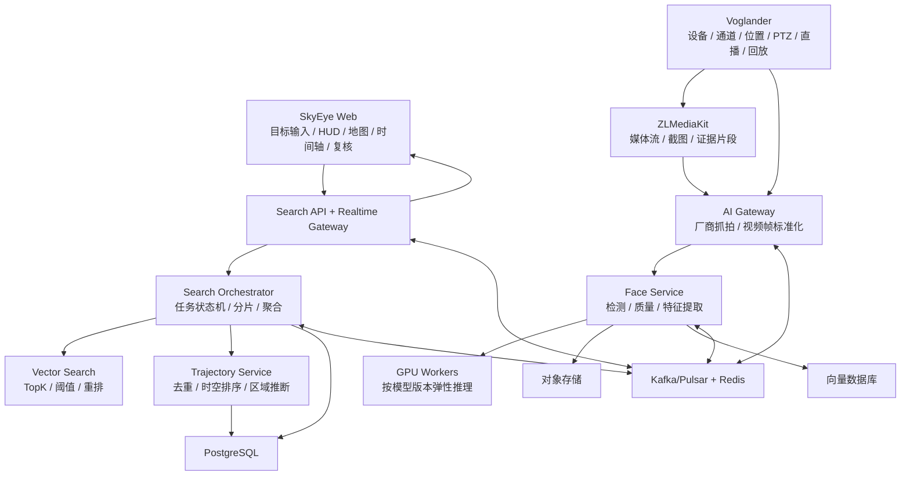
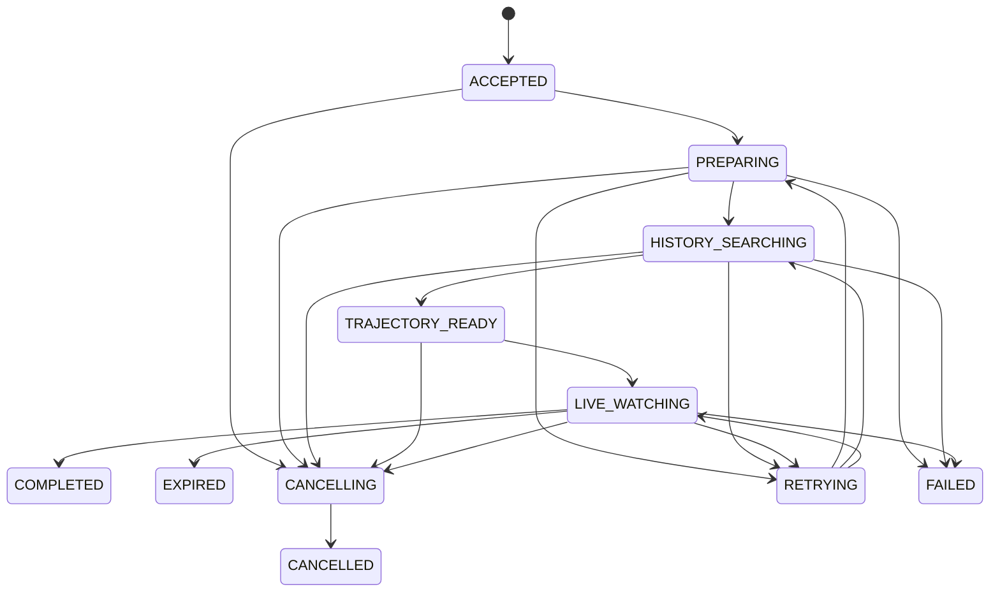

# SkyEye 人脸可视化搜索平台标准设计

> 日期：2026-07-14
>
> 状态：设计已确认，待用户复核书面规格
>
> 适用范围：Voglander 视频平台与独立 AI 检索平台的集成及新平台建设

## 1. 背景

Voglander 已具备 GB28181 设备和通道接入、设备位置、直播与回放编排、PTZ、告警、ZLMediaKit 媒体服务以及 SSE 实时通知能力。项目当前不具备人脸检测、特征提取、向量检索、历史轨迹或实时人脸布控能力。

本设计定义一套不绑定摄像机厂商、算法厂商、向量数据库或单一部署形态的 SkyEye 人脸搜索标准。用户输入一张目标人脸后，系统先检索历史观察记录并生成时空轨迹，再进入实时布控；新命中通过地图、时间轴和视频证据实时呈现。

## 2. 已确认决策

1. 产品同时支持历史检索和实时布控，首选 `HYBRID` 混合搜索模式。
2. 不假设摄像机具备人脸抓拍能力。厂商抓拍、普通视频分析和其他数据源统一由 AI Gateway 标准化。
3. Voglander 保持视频接入底座定位；AI 推理和检索建设为独立平台，不放入 GB28181/SIP 处理链路。
4. 数据平面云优先，同时保留公有云、混合云和私有化部署能力；当前不以政企内网为首要约束。
5. 视觉采用蓝青全息 HUD 方向。动画必须反映真实任务状态，不能伪造扫描进度或命中。
6. 电影级搜索动效研究独立排期，在功能闭环后开展，不复制受版权保护的具体画面。

## 3. 目标与非目标

### 3.1 目标

- 输入一张人脸，创建历史、实时或混合搜索任务。
- 从大规模人脸观察数据中返回相似命中、证据和摄像机位置。
- 按时间和空间生成可修订的目标轨迹与候选区域。
- 历史搜索完成后无缝进入实时布控，新命中秒级推送。
- 统一资源、数据、API、事件、错误、安全、容量和验收标准。
- 支持替换人脸模型、消息系统、对象存储、向量数据库和地图供应商。
- 复用 Voglander 的设备、通道、位置、媒体、告警和实时推送基础。

### 3.2 非目标

- 本阶段不实现人脸算法或生产代码。
- 不在本阶段选择最终摄像机、人脸模型或云厂商。
- 不把相似命中自动认定为身份确认。
- 不在本阶段制作电影级最终动效。
- 不修改 GB28181、SIP、ONVIF 或 ZLM 标准协议行为。
- 不承诺脱离真实模型基准测试的 GPU 数量或准确率。

## 4. 架构方案

### 4.1 总体分层



### 4.2 组件职责

| 组件 | 职责 | 依赖 |
| --- | --- | --- |
| SkyEye Web | 目标上传、搜索范围、HUD、地图、轨迹、证据和复核 | Search API、Realtime Gateway、地图 SDK |
| Search API | 命令接收、查询快照、授权、幂等入口 | Orchestrator、PostgreSQL、对象授权服务 |
| Realtime Gateway | 按用户和任务推送增量事件，支持游标恢复 | 事件总线、Redis、Search API |
| Search Orchestrator | 管理任务状态、历史分片、实时布控、超时、取消和结果聚合 | Vector Search、Trajectory Service、事件总线 |
| Face Service | 人脸检测、质量评估、特征提取与模型空间管理 | GPU Workers、对象存储、向量数据库 |
| Vector Search | TopK、阈值过滤、元数据过滤和可选重排 | 向量数据库 |
| Trajectory Service | 命中去重、时空排序、轨迹版本和目标区域推断 | PostgreSQL、摄像机空间数据 |
| AI Gateway | 将厂商抓拍、视频帧和离线导入统一为标准抓拍事件 | Voglander、ZLM、外部厂商适配器 |
| Voglander | 设备和通道事实源、直播/回放/PTZ、位置和告警 | 现有模块与协议栈 |

### 4.3 Voglander 集成边界

- `voglander-integration` 只承载 SkyEye 外部适配器、事件发布和异常包装，不实现 AI 业务。
- `voglander-client` 可提供版本化契约 DTO 或独立 SDK；跨服务契约不得使用 Repository DO。
- `voglander-service` 仅负责需要 Voglander 媒体能力的领域编排，例如申请截图、直播或证据片段。
- `voglander-manager` 继续负责设备、通道、位置等内部协调和缓存一致性。
- `voglander-web` 只提供必要的 Voglander API，不代理大文件和特征向量。
- 位置与告警继续沿用现有分片事件顺序；SkyEye 事件不能阻塞 SIP notifier、ZLM Hook 或直播建流线程。
- AI 平台不可根据设备或通道 ID 字符串前缀推断归属，必须使用 Catalog/数据库中的显式关系。

## 5. 核心数据契约

### 5.1 核心实体

| 实体 | 关键字段 | 说明 |
| --- | --- | --- |
| `CameraResource` | `cameraId, deviceId, channelId, name, geoPoint, regionCode, status` | SkyEye 使用的摄像机资源快照；来源可为 Voglander |
| `CaptureAsset` | `captureId, cameraId, capturedAt, ingestedAt, objectUri, mediaType, checksum, retentionClass` | 一次抓拍或抽帧对象 |
| `FaceObservation` | `observationId, captureId, faceBox, quality, pose, cropObjectUri, processedAt` | 图像中的单个人脸观察 |
| `FaceFeature` | `featureId, observationId, embeddingSpaceId, vectorRef, createdAt` | 内部特征记录；不通过公开 API 返回向量 |
| `SearchSubject` | `subjectId, queryImageUri, queryFeatureId, legalBasis, retentionPolicyId, expiresAt` | 一次查询使用的目标样本 |
| `SearchTask` | `taskId, mode, timeRange, geoScope, threshold, state, phase, resumeState, coverage, resultCompleteness, progress` | 历史、实时或混合搜索任务 |
| `SearchHit` | `hitId, taskId, observationId, similarity, rank, cameraSnapshot, reviewStatus` | 一次相似命中和摄像机事实快照 |
| `Trajectory` | `trajectoryId, taskId, confidence, generatedAt, revision` | 可修订的轨迹聚合 |
| `TrackPoint` | `hitId, capturedAt, geoPoint, cameraId, sequence, reviewStatus` | 轨迹中的有序节点 |
| `EvidenceAsset` | `evidenceId, hitId, objectUri, mediaType, checksum, startsAt, endsAt` | 命中的场景图或证据视频片段 |
| `AuditRecord` | `auditId, actorId, action, purpose, resource, occurredAt, traceId` | 追加式审计记录 |

### 5.2 字段标准

#### 时间

- 跨服务协议统一使用带 `Z` 或明确时区偏移的 UTC RFC 3339 字符串。
- Web 可同时返回 Unix 毫秒字段；Voglander 内部继续使用 `LocalDateTime`，VO 字段遵循现有 `*Time` 约定。
- 必须区分 `capturedAt`、`ingestedAt`、`processedAt` 和事件 `time`，禁止用处理时间覆盖拍摄时间。

#### 坐标

- 事实坐标统一存储为 WGS-84，经纬度使用十进制度数。
- 输入必须声明 `coordinateSystem`；缺失时拒绝写入，不能猜测。
- GCJ-02、BD-09 等转换只在展示适配层进行，不覆盖事实坐标。
- `SearchHit` 保存命中时的摄像机位置快照，避免点位后续移动导致历史证据漂移。

#### 模型空间

- `embeddingSpaceId` 唯一标识 `provider/model/version/dimension/normalization`。
- 不同 `embeddingSpaceId` 的向量禁止直接比较。
- 模型升级采用新空间双写、回填或重新提取；不得静默覆盖旧向量。
- 任务创建后固定查询特征空间和阈值，防止运行中配置变化改变结果语义。

#### 分数

- `quality`、`similarity` 和 `trajectoryConfidence` 都使用 `[0.0, 1.0]`，但字段和语义必须分离。
- API 不使用“百分比字符串”作为事实值；百分比只属于 UI 格式化。
- 阈值必须由独立验证集确定，并随任务保存。

#### 媒体与特征

- 服务间仅传 `objectUri + checksum`，不在 API 或事件中放 Base64、大二进制或永久公网 URL。
- 授权服务按请求签发短时访问 URL。
- 向量不通过面向用户的公开 API 返回，不写日志。

#### 身份语义

- 命中初始状态为 `UNREVIEWED`。
- 人工复核只能转换为 `CONFIRMED` 或 `REJECTED`，并记录操作者、时间、理由和原状态。
- UI 必须持续显示“相似命中不代表身份确认”。

## 6. API 标准

使用 OpenAPI 3.1 描述同步 API。所有写接口支持 `Idempotency-Key`，所有响应返回 `traceId`。

| 方法 | 路径 | 用途 |
| --- | --- | --- |
| `POST` | `/v1/search-subjects` | 登记查询目标；先使用预签名 URL 上传查询图片 |
| `POST` | `/v1/search-tasks` | 创建 `HISTORY`、`LIVE` 或 `HYBRID` 任务 |
| `GET` | `/v1/search-tasks/{taskId}` | 获取任务快照、阶段、覆盖率、进度和错误摘要 |
| `GET` | `/v1/search-tasks/{taskId}/hits` | 游标分页读取命中，支持时间、区域和复核状态过滤 |
| `GET` | `/v1/search-tasks/{taskId}/trajectory` | 获取指定 revision 或最新轨迹快照 |
| `POST` | `/v1/search-tasks/{taskId}:cancel` | 幂等取消任务并回收临时资源 |
| `POST` | `/v1/search-hits/{hitId}:review` | 确认或排除命中 |
| `POST` | `/v1/media-objects:authorize` | 对授权对象签发短时访问 URL |

### 6.1 创建混合任务示例

```json
{
  "subjectId": "01K3SUBJECT8F",
  "mode": "HYBRID",
  "history": {
    "startTime": "2026-07-13T00:00:00Z",
    "endTime": "2026-07-14T02:00:00Z"
  },
  "geoScope": {
    "regionCodes": ["330100"]
  },
  "threshold": 0.86,
  "liveExpiresAt": "2026-07-14T10:00:00Z"
}
```

### 6.2 错误响应

错误遵循 RFC 9457 Problem Details，扩展字段固定为：

```json
{
  "type": "https://errors.skyeye.example/model-space-incompatible",
  "title": "Model space incompatible",
  "status": 409,
  "code": "SKYEYE_MODEL_SPACE_INCOMPATIBLE",
  "detail": "Query and target index use different embedding spaces.",
  "traceId": "00-abcd-ef01-01",
  "retryable": false,
  "details": {
    "querySpace": "vendor/model/3.2/512/l2",
    "indexSpace": "vendor/model/3.1/512/l2"
  }
}
```

## 7. 事件标准

### 7.1 协议

- 使用 AsyncAPI 3.0 描述消息主题和载荷。
- 事件封装遵循 CloudEvents 1.0 JSON 格式。
- 事件 type 使用反向域名前缀和版本，例如 `com.example.skyeye.search.hit-created.v1`。
- 消息采用至少一次投递；消费者按 `eventId + handlerVersion` 幂等去重。
- 消费者完成数据库提交或幂等外部写入后再确认消息。
- 破坏性变更发布新事件版本并与旧版本并行迁移，禁止原地改变 v1 语义。

### 7.2 核心事件

下表使用事件 type 的业务后缀；线上完整 type 统一增加组织反向域名前缀，例如表中的 `search.hit-created.v1` 发布为 `com.example.skyeye.search.hit-created.v1`。

| 事件 | 生产者 | 消费者 | 用途 |
| --- | --- | --- | --- |
| `capture.ingested.v1` | AI Gateway | Face Service | 抓拍对象已可读取 |
| `face.observed.v1` | Face Service | 特征任务、数据治理 | 人脸检测和质量结果 |
| `face.feature-created.v1` | Face Service | 实时匹配、索引监控 | 特征写入指定模型空间 |
| `search.progress.v1` | Orchestrator | Realtime Gateway | 真实阶段、分片和计数进度 |
| `search.hit-created.v1` | Vector Search/Orchestrator | 轨迹、UI、审计 | 历史或实时命中 |
| `trajectory.updated.v1` | Trajectory Service | Realtime Gateway | 新 revision 的轨迹快照 |
| `search.task-state-changed.v1` | Orchestrator | UI、运维、审计 | 状态转换和失败摘要 |

事件只携带对象引用和最小必要元数据，不携带原始人脸图片或向量。

## 8. 混合搜索流程

### 8.1 任务状态机



每次状态转换使用乐观版本号，写入状态历史并发布事件。前端 HUD 只能映射持久化状态和真实计数。

- `HISTORY` 任务使用 `ACCEPTED → PREPARING → HISTORY_SEARCHING → TRAJECTORY_READY → COMPLETED`。
- `LIVE` 任务使用 `ACCEPTED → PREPARING → LIVE_WATCHING → COMPLETED/EXPIRED`。
- `HYBRID` 任务使用图中的完整路径。
- 进入 `RETRYING` 前保存 `resumeState`，恢复后只能返回该状态，不能由调用方任意指定。
- `PARTIAL` 不是任务状态，而是 `resultCompleteness` 的取值；任务仍按状态机结束，同时报告未覆盖分片和覆盖率。

### 8.2 历史检索

1. Web 通过预签名 URL 上传查询图片，再创建 `SearchSubject`。
2. Face Service 检测、质量评估并在指定 `embeddingSpaceId` 提取查询特征。
3. Orchestrator 按时间、区域和模型空间拆分历史检索。
4. Vector Search 返回候选 TopK；可选重排服务输出最终相似度。
5. Orchestrator 固化 `SearchHit`、摄像机位置快照和阈值快照。
6. Trajectory Service 去重、时空排序并生成轨迹 revision。
7. UI 显示实际覆盖率、搜索记录数、命中和证据，不将部分结果标成完成。

### 8.3 实时布控

1. 历史轨迹可用后，`HYBRID` 任务进入 `LIVE_WATCHING`。
2. 新抓拍经 AI Gateway、Face Service 和指定模型空间进入实时匹配。
3. 达到任务阈值时产生 `SearchHit`，写入数据库后发布命中事件。
4. Realtime Gateway 向有权限的任务订阅者推送增量命中。
5. Trajectory Service 生成新 revision，更新候选区域和最后出现时间。
6. 用户查看证据、调用 Voglander 直播能力并完成人工复核。
7. 任务取消、到期或完成后停止布控并按策略删除查询样本和临时特征。

## 9. SkyEye 工作台标准

### 9.1 布局

- 左侧：查询人脸、质量分、模型版本、时间范围、区域范围和布控状态。
- 中央：深色地图、摄像机覆盖、命中脉冲、候选区域和轨迹线。
- 右侧：按时间增量出现的命中流、相似度、复核状态和证据入口。
- 底部：历史至实时的时间轴，可选择轨迹节点查看证据片段。
- 顶部：任务 ID、真实阶段、覆盖率、搜索计数和最后事件时间。

### 9.2 动效语义

| 动效 | 数据来源 | 禁止行为 |
| --- | --- | --- |
| 人脸扫描线 | `PREPARING` 与特征提取状态 | 固定时长假进度 |
| 地图扫描波 | 正在处理的真实分片或区域 | 扫描未纳入任务的区域 |
| 摄像机脉冲 | `search.hit-created.v1` | 无命中时随机闪烁 |
| 轨迹连线 | `trajectory.updated.v1` | 用动画补造不存在的路径 |
| 红/橙锁定 | 高相似命中且尚未复核 | 表达“身份已确认” |
| 绿色确认 | 人工 `CONFIRMED` 事件 | 算法自动切换为确认 |

界面需支持减少动态效果的系统偏好；重要状态不能只用颜色表达。电影级参考研究作为后续视觉专项输出动效语言、时长、缓动、音效和无障碍降级规范。

## 10. 安全与数据治理

- 使用 OAuth 2.1/OIDC 认证。
- 授权同时约束租户、用户角色、区域、摄像机、任务和资源动作。
- 人脸原图、裁剪图、向量、命中和审计采用分级权限。
- 对象存储使用私有桶、服务端 KMS 加密和短时签名 URL。
- 数据传输使用 TLS；服务身份使用短期凭据。
- 日志、指标和 trace 不记录图片、向量、签名 URL 或完整敏感查询条件。
- 每次搜索记录用途、操作者、范围、阈值、模型空间和结果处理过程。
- 查询样本默认在任务结束后保留 24 小时，随后删除原图、查询特征和临时缓存；部署方可通过已审批的 `retentionPolicyId` 缩短或延长，但不能省略策略。
- 删除使用可追踪的异步工作流，覆盖对象存储、向量库、数据库和缓存，并记录删除证明。
- 相似命中默认未复核；可能产生现实影响的操作必须经过人工确认。
- 标准支持不同部署形态，但实施方必须满足部署地区适用的人脸数据、隐私和生物识别法规。

## 11. 异常、重试与降级

| 场景 | 标准行为 |
| --- | --- |
| 查询图片无人脸或质量不足 | 拒绝创建可搜索任务，返回姿态、清晰度或遮挡等可解释原因 |
| 模型空间不兼容 | 返回 409，禁止隐式转换或跨空间比较 |
| 历史分片部分超时 | 设置 `resultCompleteness=PARTIAL`，显示覆盖率和失败分片；按任务策略重试或以部分结果继续生成轨迹 |
| 摄像机离线 | 实时覆盖图显示缺口，不将离线区域计入已覆盖比例 |
| 对象丢失或校验失败 | 保留元数据，证据标记不可用并触发修复/隔离事件 |
| 消息重复 | 按事件 ID 幂等，不生成重复观察、命中或轨迹节点 |
| 向量数据库不可用 | 任务进入 `RETRYING`，不降级为未验证的本地相似计算 |
| GPU Worker 失败 | 消息重新入队并限制重试次数，超过阈值进入死信和任务错误摘要 |
| 前端连接断开 | 重连后先读取任务快照，再使用事件游标恢复增量 |
| 用户取消任务 | 幂等转入 `CANCELLING`，停止新工作并完成资源回收后进入 `CANCELLED` |

## 12. 云资源与容量标准

### 12.1 推荐资源类型

| 能力 | 推荐 | 约束 |
| --- | --- | --- |
| 对象存储 | S3 兼容托管服务 | KMS、私有桶、生命周期、校验和 |
| 结构化数据 | PostgreSQL | 任务、观察元数据、命中、轨迹、复核和审计 |
| 向量数据 | Milvus/Qdrant；小规模可用 pgvector | 按模型空间隔离、备份和恢复演练 |
| 消息 | 托管 Kafka/Pulsar | 至少一次、Schema Registry、死信主题 |
| 实时状态 | Redis | 只保存可重建状态和短期缓存 |
| 推理 | Kubernetes GPU Worker | 模型独立部署、自动扩容、N+1 冗余 |
| API/Web | 容器服务与静态资源 CDN | 敏感媒体不进入公共 CDN 缓存 |

### 12.2 容量公式

- 推理 FPS：`活跃通道数 × 每通道分析 FPS`。
- GPU 数量：`ceil(推理 FPS ÷ 单 GPU 实测 FPS × 1.3) + 冗余容量`。
- 全量视频日数据量：`码率 Mbps × 10.8 GB × 通道数`。
- 基础向量体积：`观察数 × 向量维度 × 4 字节`；向量索引和元数据通常再需要约 1.5～3 倍空间，以选定引擎基准为准。
- 对象存储：`场景图 + 人脸裁剪图 + 证据片段` 的日增量乘以保留天数和副本/纠删码开销。
- 云端视频入口带宽：`同时上传通道数 × 平均码率`。若带宽成本过高，部署边缘 AI Gateway，只上传抓拍和证据引用。

技术验证以 50 路、每路 2 FPS，即 100 FPS 推理负载为基准。GPU 数量必须在选定分辨率、模型、精度、batch 和端到端预处理条件下压测后确定。

## 13. 可观测性与 SLO

### 13.1 核心指标

- 每阶段任务数量、时长、成功率、重试率和取消率。
- 抓拍到观察、观察到特征、特征到实时命中的端到端延迟。
- 历史检索记录数、覆盖率、TopK 延迟和部分失败率。
- GPU 利用率、显存、队列深度、模型版本和推理吞吐。
- 向量库查询 P50/P95/P99、索引增长和分片健康。
- 事件积压、重复消费、死信数量和消费延迟。
- 签名 URL、证据查看、人工复核和删除任务审计指标。

### 13.2 首期建议 SLO

- 搜索任务创建 API P95 小于 500 ms，不含文件上传。
- 实时抓拍已进入 AI Gateway 后，命中事件端到端 P95 不超过 3 秒。
- 任务进度状态在内部状态变化后 2 秒内到达在线客户端。
- 核心 API 月可用性目标 99.9%。
- 历史检索性能以千万级观察数据建立基准，必须同时报告响应时间、覆盖率和实际检索数，不能只报告耗时。

## 14. 测试与验收

### 14.1 契约测试

- OpenAPI、AsyncAPI 和 JSON Schema 自动校验。
- 提供者/消费者契约测试覆盖所有版本化事件。
- CI 阻止删除必填字段、改变字段语义或复用旧版本事件名。

### 14.2 算法验收

- 使用与训练数据隔离的验证集。
- 对不同光照、姿态、遮挡、年龄跨度、分辨率和摄像机类型分别报告 ROC、FAR、FRR、Recall@K。
- 阈值依据业务风险和验证曲线确定，不用单一“准确率”代替。
- 验证模型升级前后的空间隔离、双写和回滚。

### 14.3 功能验收

完整跑通：

1. 上传目标人脸。
2. 质量校验和特征提取。
3. 历史检索和真实覆盖率展示。
4. 生成地图轨迹和证据时间轴。
5. 自动转入实时布控。
6. 新命中在地图和列表中增量出现。
7. 查看直播/证据并完成人工复核。
8. 取消或等待任务到期。
9. 按策略删除查询样本并验证审计记录。

### 14.4 性能与可靠性验收

- 以 50 路 × 2 FPS 运行技术验证压测，并记录端到端延迟和资源利用率。
- 以千万级观察数据测试历史 TopK 与过滤查询。
- 注入消息重复、乱序、GPU 重启、向量库短暂不可用、对象丢失和 WebSocket/SSE 重连。
- 验证任何故障不会产生重复命中、虚假完成或跨模型空间比较。
- 安全测试覆盖越权、签名 URL 泄露、上传恶意文件、日志敏感数据和删除不彻底。

### 14.5 Voglander 验收门控

若后续在当前仓库实现桥接代码，遵循现有 TDD 和测试位置约束：

- 测试统一放在 `voglander-web/src/test/java/io/github/lunasaw/voglander`。
- Controller/Service 使用 JUnit 5 + Mockito 单元测试。
- Manager/Repository 使用 `@SpringBootTest` + `BaseTest`。
- 消息、异步、Hook 和 HTTP 测试不用 `@Transactional`，以唯一键隔离并显式清理。
- 验收至少包含目标模块测试、`mvn clean compile` 和受影响集成链路测试。

## 15. 团队与阶段

### 15.1 人员建议

可用 MVP 建议 7～9 人：

- Java/Voglander 后端 2 人。
- AI/Python 推理与检索 2 人。
- 前端可视化 2 人。
- 云平台/数据工程 1 人。
- 测试工程师 1 人。
- 产品、UI 和安全评审按阶段参与。

### 15.2 阶段划分

| 阶段 | 建议周期 | 交付物 |
| --- | --- | --- |
| 标准与技术 POC | 3～4 周 | 契约 v1、50 路基准、模型/向量库验证、云成本基线 |
| MVP | 12～16 周 | 混合搜索闭环、工作台、证据复核、安全审计和基础运维 |
| 试点加固 | 6～10 周 | 扩容、容灾、数据治理、算法阈值、故障演练和运营指标 |
| 视觉专项 | 功能闭环后独立排期 | 电影/游戏 HUD 公开案例研究、动效语言和无障碍规范 |

## 16. 实施顺序

后续实施计划应按以下依赖顺序拆分，并分别设置人工确认点：

1. 契约仓库：OpenAPI、AsyncAPI、JSON Schema 和错误码。
2. 云数据平面：对象存储、PostgreSQL、消息、Redis、向量库。
3. AI 数据链：AI Gateway、Face Service、模型空间和索引。
4. 搜索领域：Orchestrator、Vector Search、Trajectory Service。
5. Voglander 薄桥接：设备/通道/位置同步、媒体截图与直播证据入口。
6. SkyEye Web：目标输入、HUD、地图、命中流、轨迹和复核。
7. 安全、审计、删除、压测、故障演练和 SLO。
8. 电影级动效视觉专项。

每一阶段都必须先定义验收数据和失败条件，再以红—绿—重构方式实现。协议与媒体线程不得被 AI 处理阻塞。

## 17. 设计完成条件

本设计满足以下完成条件：

- 架构、数据、API、事件、任务状态机和 UI 流程已经用户逐节确认。
- 部署形态为云优先但不绑定云厂商。
- 历史和实时搜索统一在混合任务中表达。
- 错误、重试、部分结果、人工复核和删除语义明确。
- 容量使用公式和实测基准，不作未经测试的 GPU 承诺。
- 电影级动效明确延期为独立专项，不影响功能标准。
- 后续实现必须另行编写详细实施计划，并再次确认范围后开始。
