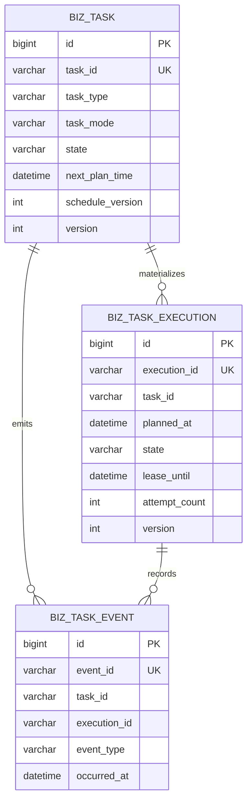
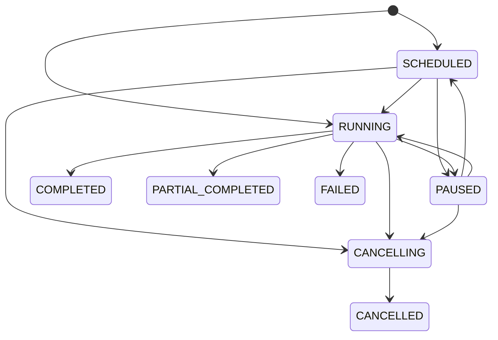
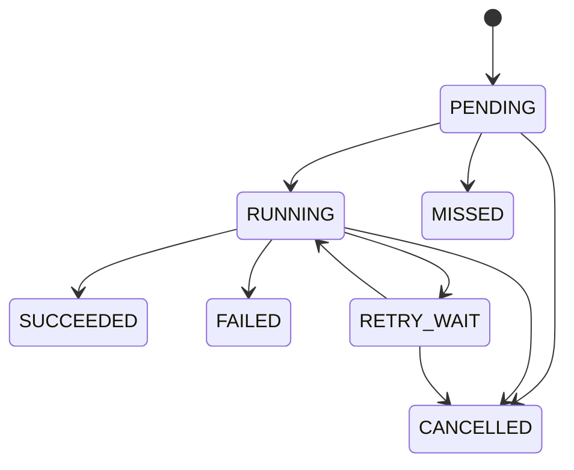

## Context

Voglander 当前的 `tb_export_task` 只是导出结果记录：状态只有 `PROCESSING/FINISHED/ERROR`，字段与文件导出耦合，状态更新没有合法转换、乐观锁、执行事实、进度序列、租约或重启恢复。与此同时，`add-image-asset-collection` 原设计准备单独建设任务、执行、Scheduler、Dispatcher 和 Lease Recovery；后续批量导入、AI 分析等长任务仍会重复同一套基础设施。

本变更把“业务长任务”定义为：由业务请求触发、执行时间可能超过一次 HTTP 请求、需要用户查询或控制、必须在进程重启后恢复，并且需要持久化结果或失败事实的工作。节点心跳、SSE 心跳、会话 GC、SIP 保活、订阅刷新等技术定时器继续使用 `@Scheduled` 或协议组件自己的调度器。

当前开发 SQLite 的 `tb_export_task` 为 0 行，前端运行时代码没有调用旧 `/api/v1/exportTask/*`，只有后端旧 Controller、SQL 和生成文档。因此选择直接退役，不建设兼容层。生产环境仍必须在删除前执行备份和空表门禁。

### Stakeholders

- 业务开发者：通过稳定 SPI 接入图像采集、导出、导入和 AI 分析，不重复实现状态推进。
- 平台用户：在统一任务中心查询进度、执行历史、错误和结果，并执行允许的控制动作。
- 运维人员：观察队列、延迟、租约、重试、失败和积压，安全发布破坏性旧表删除。
- 任务内核维护者：维护通用事实、状态机和恢复，不理解业务 payload 的字段语义。

## Goals / Non-Goals

**Goals:**

- 建立任务、执行、事件三张跨业务事实表和稳定业务 ID。
- 支持立即、指定时刻和固定间隔三类长任务计划，不引入 DAG 工作流。
- 提供多节点防重、持久队列、租约领取、自动重试、超时、暂停、恢复、取消和崩溃恢复。
- 统一任务级汇总进度与执行级细粒度进度，并保证进度单调、可限流、可审计。
- 通过 `LongTaskHandler` 隔离业务验证、执行、重试分类、结果和补偿。
- 提供统一查询/控制 API、任务中心、SSE、权限、指标和结构化审计。
- 彻底删除 `tb_export_task` 及其全链路代码和 API，不迁移历史数据。
- 让图像采集变更只实现领域 Handler 和扩展配置，不再自建任务引擎。

**Non-Goals:**

- DAG、条件分支、人工审批、子流程编排和 BPMN。
- 分布式事务或 exactly-once 外部副作用；内核提供 at-least-once 执行与幂等事实。
- 接管协议计时器、节点心跳、缓存清理和其他系统维护任务。
- 允许客户端直接提交任意 `taskType + payload`；任务只能由受信任的领域服务创建。
- 第一阶段支持 Cron 表达式、任务依赖、跨任务资源配额或用户自定义优先级。
- 迁移 `tb_export_task` 历史记录或保留旧 API 兼容。

## Decisions

### 1. 使用“任务、执行、事件”三事实模型



- `tb_biz_task` 表达用户意图、调度游标、总体状态和汇总。
- `tb_biz_task_execution` 表达一个计划点的执行事实；自动重试是同一 execution 的多次 attempt。
- `tb_biz_task_event` 只追加状态、进度、控制和失败事件，提供每次 attempt 的审计，不参与调度真值判断。
- 领域数据保存在领域扩展表；核心表只保存版本化 payload 快照和稳定结果引用，不把所有业务字段塞入通用列。

未选方案：扩展 `tb_export_task` 会延续导出耦合；每种业务独立建任务表会复制恢复逻辑；完整工作流引擎超出当前需求。

### 2. 业务 ID 与关联规则

- `taskId = btask_ + 32位无横线UUID`
- `executionId = bexec_ + 32位无横线UUID`
- `eventId = bevt_ + 32位无横线UUID`
- 外部 API、日志、SSE 和领域扩展表只引用业务 ID，不暴露自增主键。
- 不建立数据库物理外键，延续现有三数据库模式；Manager 事务、唯一约束和集成测试保证关联。
- `taskType` 使用大写下划线稳定码，例如 `IMAGE_COLLECTION`、`DATA_EXPORT`、`DATA_IMPORT`、`AI_ANALYSIS`，禁止使用 Java 类名。

### 3. `tb_biz_task` 完整逻辑字段

| 字段组 | 字段 | 说明 |
| --- | --- | --- |
| 主键 | `id, task_id` | 自增内部主键、稳定业务 ID |
| 展示 | `task_type, task_name, description` | 类型、名称和脱敏说明 |
| 调度 | `task_mode, schedule_start_time, schedule_end_time, interval_seconds, next_plan_time, schedule_version` | `ONCE/AT_TIME/FIXED_RATE` 与固定游标 |
| 状态 | `state, priority, last_execution_id, last_execute_time, completed_time` | priority 第一阶段由 Handler 元数据决定 |
| 统计 | `planned_count, success_count, failed_count, missed_count, cancelled_count` | 执行终态汇总 |
| 进度 | `progress_current, progress_total, progress_message, progress_revision` | 非负、单调、带修订号 |
| 业务 | `biz_key, subject_type, subject_id, payload, payload_version` | payload 为 FastJSON2 JSON 快照 |
| 结果 | `result_ref_type, result_ref_id, result_summary` | 结果引用与小型脱敏 JSON 摘要 |
| 最近失败 | `last_failure_code, last_failure_message` | 稳定码与脱敏摘要 |
| 来源 | `origin_task_id, origin_execution_id` | 人工重试或派生任务来源 |
| 所有权 | `owner_type, owner_id, organization_id, idempotency_key` | actor 与未来 ACL 扩展 |
| 并发 | `version, create_time, update_time` | 条件更新和审计时间 |

约束与索引：

- `UNIQUE(task_id)`
- `UNIQUE(owner_type, owner_id, task_type, idempotency_key)`；空 key 允许多行
- `INDEX(state, next_plan_time)`
- `INDEX(task_type, state, create_time)`
- `INDEX(owner_type, owner_id, create_time)`
- `INDEX(biz_key, task_type)`
- `INDEX(subject_type, subject_id, create_time)`

`payload` 创建后不可修改；改期只改变通用计划字段并增加 `scheduleVersion`。敏感凭据、图片内容、Base64、绝对路径和 ZLM secret 禁止进入 payload/result/event。

### 4. `tb_biz_task_execution` 完整逻辑字段

| 字段组 | 字段 | 说明 |
| --- | --- | --- |
| 主键 | `id, execution_id, task_id` | 执行与所属任务 |
| 计划 | `schedule_version, planned_at, deadline_at` | 计划版本和允许窗口 |
| 状态 | `state, attempt_count, max_attempts, next_attempt_time` | 自动重试不改 execution ID |
| 时间 | `started_at, heartbeat_at, finished_at` | 首次开始、最近心跳、终止 |
| 租约 | `claim_token, worker_node, lease_until` | 多节点领取和恢复 |
| 进度 | `progress_current, progress_total, progress_message, progress_revision` | 当前执行进度 |
| 结果 | `result_ref_type, result_ref_id, result_summary` | 业务结果引用 |
| 失败 | `failure_code, failure_message, retryable` | 稳定错误事实 |
| 来源 | `retry_origin_execution_id` | 人工重试来源 |
| 并发 | `version, create_time, update_time` | CAS 与时间 |

约束与索引：

- `UNIQUE(execution_id)`
- `UNIQUE(task_id, schedule_version, planned_at)`
- `INDEX(task_id, planned_at)`
- `INDEX(state, next_attempt_time)`
- `INDEX(state, lease_until)`
- `INDEX(retry_origin_execution_id)`

### 5. `tb_biz_task_event` 完整逻辑字段

字段为 `id,event_id,task_id,execution_id,event_type,from_state,to_state,attempt_no,progress_current,progress_total,progress_message,failure_code,failure_message,actor_type,actor_id,worker_node,trace_id,dedupe_key,event_data,occurred_at,create_time`。

- `UNIQUE(event_id)`；可选 `UNIQUE(task_id,dedupe_key)` 防止事务重放产生重复领域事件。
- `INDEX(task_id,occurred_at)`、`INDEX(execution_id,occurred_at)`、`INDEX(event_type,occurred_at)`。
- 事件只追加，普通 API 不提供更新或删除。
- `event_data` 只允许有限脱敏诊断 JSON，默认最大 8 KiB。

### 6. 任务和执行状态机

任务状态：



- `ONCE` 立即任务创建为 `RUNNING` 并生成一个 `PENDING` execution。
- `AT_TIME/FIXED_RATE` 首点在未来时为 `SCHEDULED`，物化到期点后为 `RUNNING`。
- `PAUSED` 不物化或领取新执行；恢复时过期计划点逐项记为 `MISSED`。
- `CANCELLING` 停止新计划点，取消未开始 execution，运行中的 Handler 通过 cancellation token 协作结束。
- 终态不回退。人工重试创建新的 `ONCE` task，并记录 origin，而不是复活旧终态。

执行状态：



所有转换由 Manager 使用 `WHERE state IN (...) AND version=?` 条件更新。只有影响一行时才能更新计数并追加事件，同一事务提交，避免重复回调或租约恢复二次计数。

### 7. 调度、分发、租约与重试

`BizTaskScheduler` 每 5 秒扫描 `SCHEDULED/RUNNING` 且 `next_plan_time<=now` 的任务：

1. 获取 `biz:task:schedule:{taskId}` Redis 短锁。
2. 事务内重读 task/version。
3. 按固定 cursor 逐点 `insertIfAbsent` execution。
4. 超过 allowed delay 的点直接写 `MISSED`；可执行点写 `PENDING`。
5. 以 `cursor+interval` 推进，禁止使用 `now+interval` 造成漂移。
6. 每批最多 100 点，长停机分批恢复。

`BizTaskDispatcher` 每秒扫描 `PENDING/RETRY_WAIT AND next_attempt_time<=now`，把 execution ID 提交到有界线程池。队列满时数据库事实保持待执行，下轮继续，禁止 CallerRuns 或丢弃。

Worker 获取 execution 短锁并 CAS claim：写 `claimToken/workerNode/leaseUntil`、增加 `attemptCount`，再调用 Handler。运行期间 TaskContext 以配置周期续租和检测取消；Handler 阻塞超时仍由 lease recovery 接管。

自动重试仅在 Handler 的 `RetryDecision` 为 retryable、attempt 未耗尽且 deadline 允许时执行，采用有上限的指数退避并写 `RETRY_WAIT`。租约过期时同样依据剩余次数/窗口恢复到 `RETRY_WAIT` 或标记 `FAILED`。

### 8. 进度模型

- Handler 通过 `LongTaskContext.reportProgress(current,total,message)` 报告，不直接更新 Mapper。
- `current/total` 必须非负；total 为 0 表示不可量化，前端显示不确定进度。
- 同一 execution 的 `progressRevision` 严格递增，current 不得回退，total 一旦非零不得缩小。
- 内核默认按 500ms 或 1% 变化限流写库；终态、阶段变化和错误立即落库。
- ONCE/AT_TIME 任务级进度镜像当前 execution；FIXED_RATE 任务优先展示 `terminalCount/plannedCount`，并单独返回 active execution 进度。
- 进度消息最大 512 字符并脱敏；不允许把日志堆栈当进度。
- 进度事务提交后发布 SSE，断线后查询数据库可恢复完整状态。

### 9. `LongTaskHandler` SPI

```java
public interface LongTaskHandler {
    String taskType();
    int payloadVersion();
    TaskCapabilities capabilities();
    void validate(TaskCreateContext context, JSONObject payload);
    TaskExecutionResult execute(LongTaskContext context, JSONObject payload) throws Exception;
    RetryDecision classify(Throwable throwable, TaskAttemptContext context);
    default TaskCompletionParticipant completionParticipant() { return TaskCompletionParticipant.noop(); }
}
```

- Handler 注册表在启动时拒绝重复 `taskType`、空类型或不支持的 payloadVersion。
- 领域 Controller/ApplicationService 先完成请求校验和权限，再调用内部 `BizTaskCreateService`；不暴露任意类型创建 API。
- 内核反序列化只到 FastJSON2 `JSONObject` 或 client 模块 command，Handler 再转换为自己的版本化类型。
- Handler 返回 `TaskExecutionResult`，包含稳定 result reference、小型 summary 和完成所需的脱敏领域数据；不能返回 DO、文件流或外部 secret。
- 可选 `TaskCompletionParticipant` 由内核在 execution 完成事务内调用，只允许同数据源、幂等的领域数据库写入，不得执行网络、文件或媒体 I/O。participant 成功后内核才写 execution/task/event 终态；任一步失败整体回滚。
- Handler 可提供事务失败后的外部资源 compensation，Worker 在事务外调用；补偿必须幂等并产生诊断指标。
- Handler 不得直接写三张核心表；进度、心跳和取消均通过受控 TaskContext。
- `capabilities` 声明 pause/cancel/manualRetry/progress/reschedule，后端和前端根据同一事实决定动作。

### 10. 分层与组件落位

| 模块 | 组件 |
| --- | --- |
| `voglander-common` | Task/Execution/Event 枚举、错误码、常量、ID 生成规则 |
| `voglander-client` | Handler、TaskContext、create/result/retry/capability 契约，不依赖 Repository/Web |
| `voglander-repository` | 三个 DO/Mapper/XML、三方言 schema/migration、条件扫描和更新 SQL |
| `voglander-manager` | DTO/Assembler、BizTaskManager、ExecutionManager、EventManager、CompletionManager 事务 |
| `voglander-service` | create/query/control、Scheduler、Dispatcher、Worker、LeaseRecovery、HandlerRegistry |
| `voglander-web` | task/execution Controller、Req/VO/Assembler、权限和 SSE |
| 领域模块 | 各 `LongTaskHandler` 与业务扩展表，不复制核心状态机 |

`CompletionManager` 的成功顺序固定为：调用领域 completion participant → 更新 execution SUCCEEDED/resultRef → 更新 task 计数/进度/终态 → 追加 event。四步使用同一 Spring 事务；失败时 Worker 调用 Handler compensation，并根据错误分类进入 retry 或 FAILED。

### 11. API 契约

统一 API 只负责查询和控制；任务创建由各领域 API 完成：

| 方法 | 路径 | 权限 | 说明 |
| --- | --- | --- | --- |
| `GET` | `/api/v1/business-tasks/constraints` | `Task:Query` | 状态、类型、限制和动作能力 |
| `POST` | `/api/v1/business-tasks/getPage` | `Task:Query` | 统一任务分页 |
| `GET` | `/api/v1/business-tasks/{taskId}` | `Task:Query` | 任务详情、汇总和 active execution |
| `POST` | `/api/v1/business-tasks/{taskId}:pause` | `Task:Control` | 幂等暂停 |
| `POST` | `/api/v1/business-tasks/{taskId}:resume` | `Task:Control` | 幂等恢复 |
| `POST` | `/api/v1/business-tasks/{taskId}:cancel` | `Task:Control` | 幂等取消 |
| `POST` | `/api/v1/business-tasks/{taskId}:retry` | `Task:Control` | 创建新 ONCE 任务 |
| `POST` | `/api/v1/business-task-executions/getPage` | `Task:Query` | 执行分页 |
| `GET` | `/api/v1/business-task-executions/{executionId}` | `Task:Query` | 执行详情与事件时间线 |

VO 时间全部为 Unix 毫秒；状态和 taskType 返回稳定 code；不返回 payload、claimToken、storage key、绝对路径或内部异常堆栈。详情可返回经 Handler 提供者脱敏后的 `businessSummary` 和稳定 `resultRef`。

### 12. 前端任务中心

```text
任务中心
├── 统计：运行中 / 等待中 / 今日完成 / 失败
├── 筛选：任务 ID、类型、状态、名称、发起人、创建时间
├── VxeGrid：名称 | 类型 | 状态 | 进度 | 计划 | 最近执行 | 发起人 | 创建时间
└── 详情 Drawer
    ├── 概览与总体进度
    ├── 业务摘要和结果跳转
    ├── 执行历史
    └── 事件时间线与失败诊断
```

- 前端维护 `taskType -> label/icon/detailRoute/resultRenderer` 注册表，未知类型使用通用回退，不因新 Handler 崩溃。
- 操作矩阵由 `state + capabilities + permissions` 纯函数生成并单测，点击时再次校验权限和最新状态。
- SSE 在 300ms 内合并刷新，不能直接以事件覆盖完整行。
- 进度同时显示数字和文字，不只依赖颜色；不可量化任务使用 Spin/状态文本。
- 新增 `src/api/task/*`、`src/views/task/center/*`、路由、中文/英文 i18n 和 API 单测。

### 13. 权限、审计和可观测性

- 第一阶段使用模块级全局 `Task:Query`、`Task:Control`；owner/org 字段为后续 ACL 预留。
- 资源越权统一返回 404，缺模块权限返回 403。
- 控制命令记录 actor、taskId、executionId、前后状态、traceId，不记录 payload 或 secret。
- SSE topic：`business.task.state`、`business.task.progress`、`business.task.execution-state`。
- 指标：task/execution 总量、调度 lag、队列深度、执行时长、重试、租约恢复、进度写入限流和 Handler 失败；tag 不含 taskId。

### 14. `tb_export_task` 直接退役

删除范围：三方言全量脚本、增量数据库对象、`ExportTaskDO/Mapper/XML/Service/Manager/Assembler/DTO`、导出任务枚举、Web Controller/Req/VO/Assembler、测试清理器、API 文档和前端镜像文档。

不做：旧数据转换、双写、旧接口转发、兼容查询或 deprecated 周期。未来导出能力以新的领域 API 创建 `DATA_EXPORT` 任务，并使用独立导出详情表。

发布门禁：

1. 备份目标数据库。
2. 执行 `SELECT COUNT(*) FROM tb_export_task`。
3. 为 0 时直接执行 `DROP TABLE IF EXISTS`。
4. 非 0 时默认终止迁移；只有发布负责人确认无需保留并提供显式 destructive flag 才能删除。
5. 验证旧 API 返回 404、三张核心表和索引存在。

### 15. 配置默认值

```yaml
voglander:
  task:
    enabled: true
    scheduler-enabled: true
    scan-interval-ms: 5000
    dispatch-interval-ms: 1000
    recovery-interval-ms: 30000
    batch-size: 100
    catchup-batch-size: 100
    allowed-delay-seconds: 30
    execution-lease-seconds: 90
    heartbeat-interval-seconds: 20
    default-max-attempts: 2
    retry-initial-delay-seconds: 2
    retry-max-delay-seconds: 30
    executor-core-size: 4
    executor-max-size: 16
    executor-queue-capacity: 500
    progress-min-interval-ms: 500
    event-retention-days: 90
```

配置通过 `@ConfigurationProperties` 和 `@Validated` 在启动时校验。lease 必须大于 heartbeat 和 Handler 最小超时；core 不得大于 max；所有容量为正。

## Risks / Trade-offs

- **[通用模型被业务字段污染]** → 核心只保存版本化 payload/结果引用，领域查询字段进入扩展表。
- **[at-least-once 导致外部副作用重复]** → execution/claim 唯一事实、Handler 幂等键和领域唯一约束；不宣称 exactly-once。
- **[固定间隔计划产生大量 MISSED]** → 最大 planned count、catchup 分批和事件保留策略。
- **[进度高频更新压垮 SQLite]** → 单调修订、500ms/1% 限流和有界事件写入。
- **[Handler 阻塞无法及时取消]** → cooperative token、超时、租约和线程池隔离；不使用不安全 Thread.stop。
- **[旧表删除不可逆]** → 备份、空表门禁、显式 destructive flag；回滚旧二进制需要恢复备份。
- **[任务中心暴露领域敏感数据]** → 通用 VO 不返回 payload，业务摘要必须显式白名单并做权限校验。
- **[通用内核范围膨胀成工作流引擎]** → 第一阶段仅 ONCE/AT_TIME/FIXED_RATE 和单 Handler，不支持 DAG/Cron/子任务依赖。

## Migration Plan

1. 合并并验证三方言全量/增量脚本和旧表空表门禁。
2. 部署三张核心表、枚举、SPI、Repository/Manager，暂不启用 Dispatcher。
3. 部署统一查询 API、任务中心和可观测性，以无任务状态验证。
4. 部署 Scheduler/Dispatcher/Worker/Recovery 和测试 Handler，完成重启、多节点、队列满和租约故障测试。
5. 由 `add-image-asset-collection` 注册首个生产 Handler，先开 ONCE，再小范围开启 FIXED_RATE。
6. 删除旧 ExportTask 全链路代码和 OpenAPI，执行 `tb_export_task` 删除门禁。
7. 监控 24 小时队列、lag、retry、lease recovery 和 SQLite write latency 后扩大使用。

回滚：先禁用 task scheduler/dispatcher，等待或取消运行执行；新表和事实保留。新二进制可回滚到不读取新表的版本，但由于旧表/API 已删除，回滚到依赖 `tb_export_task` 的版本必须同时从发布前备份恢复数据库，禁止自动重建空表伪装数据完整。

## Open Questions

无阻塞设计问题。第一阶段固定采用模块级全局权限、90 天事件保留、ONCE/AT_TIME/FIXED_RATE 三种模式和人工重试创建新任务；Cron、组织 ACL、子任务依赖与自动归档另立变更。
